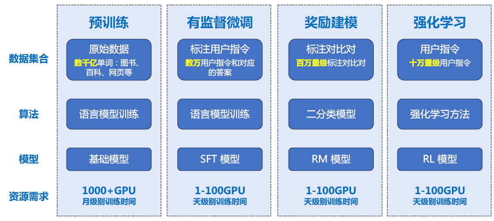
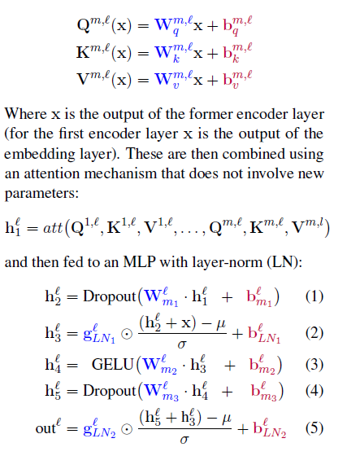

## 1 目录


[TOC]


## 2 大模型基础

### 2.1 构建框架




### 2.2 预训练

(Generative Pre-Training), 由多层Transformer 组成的单向语言模型，主要分为输入层，编码层和输出层三部分。


### 2.3 有监督微调

有监督微调（Supervised Finetuning, SFT）又称指令微调（Instruction Tuning），是指在已经训练好的语言模型的基础上，通过使用有标注的特定任务数据进行进一步的微调，从而使得模型具备遵循指令的能力。经过海量数据预训练后的语言模型虽然具备了大量的“知识”，但是由于其训练时的目标仅是进行下一个词的预测，此时的模型还不能够理解并遵循人类自然语言形式的指令。


微调技术综述：


	Scaling Down to Scale Up: A Guide to Parameter-Efficient Fine-Tuning

	https://arxiv.org/pdf/2303.15647.pdf


#### 2.3.1 BitFit


	只调节神经网络的bias参数





论文：


	BitFit: Simple Parameter-efficient Fine-tuning for Transformer-based Masked Language-models
	https://arxiv.org/pdf/2106.10199v2.pdf


代码：

```
for name, param in model.named_parameters():
	if "bias" not in name:
		param.requires_grad = False
```
#### 2.3.2 Prompt-Tuning


论文：

	The Power of Scale for Parameter-Efficient Prompt Tuning
	https://arxiv.org/pdf/2104.08691.pdf

算法原理：

$$

\hat{Y}=argmax_YPr_{\theta, {\theta}_p}(Y|[P;X])

$$

- ${\theta}$  model parameters, ${\theta_p}$ prompt 参数

- $Y$ output, a sequence of tokens

- $X$ input, a sequence of tokens

- $P$ prompt, a series of tokens prepended to the input 

当输入是$n$ 个tokens, 表示为${x_1, x_2,...,x_n}$, 模型会将这些input通过embedding层转换为一个矩阵$X_e \in R^{n \times e}$, 这里的$e$ 是embedding space 维度。同时, $P_e \in R^{p \times e}$, 这里的$p$ 是prompt的长度。将两者拼接起来，得到$[P_e;X_e] \in R^{(p+n)\times e}$。训练时，只更新$\theta_p$.

Design Decision:
- random
- embedding from model's vocabulary
- embeddings that enumerate the output classes

代码：
```
from peft import PromptTuningConfig, get_peft_model, TaskType, PromptTuningInit

# Soft Prompt
# config = PromptTuningConfig(task_type=TaskType.CAUSAL_LM, num_virtual_tokens=10)
# config
# Hard Prompt
config = PromptTuningConfig(
	task_type=TaskType.CAUSAL_LM, 
	prompt_tuning_init=PromptTuningInit.TEXT, 
	prompt_tuning_init_text="下面是一段人与机器人的对话。",                       num_virtual_tokens=len(tokenizer("下面是一段人与机器人的对话。")["input_ids"]),  
	tokenizer_name_or_path="Langboat/bloom-1b4-zh")

model = get_peft_model(model, config)

# inference
from peft import PeftModel
peft_model = PeftModel.from_pretrained(model=model, model_id="./chatbot/checkpoint-500/")
peft_model = peft_model.cuda()
ipt = tokenizer("Human: {}\n{}".format("考试有哪些技巧？", "").strip() + "\n\nAssistant: ", return_tensors="pt").to(peft_model.device)
print(tokenizer.decode(peft_model.generate(**ipt, max_length=128, do_sample=True)[0], skip_special_tokens=True))

```

#### 2.3.3 P-Tuning

论文：

	

	GPT Understands, Too

	https://arxiv.org/pdf/2103.10385.pdf

	P-Tuning v2: Prompt Tuning Can Be Comparable to Fine-tuning Universally Across Scales and Tasks

	https://arxiv.org/pdf/2110.07602.pdf


#### 2.3.4 Prefix-Tuning
论文：

	Prefix-Tuning: Optimizing Continuous Prompts for Generation
	https://arxiv.org/pdf/2101.00190.pdf
原理：


#### 2.3.5 Lora


论文：


	LORA: LOW-RANK ADAPTATION OF LARGE LANGUAGE MODELS

	https://arxiv.org/pdf/2106.09685.pdf


#### 2.3.6 IA3


	Few-Shot Parameter-Efficient Fine-Tuning is Better and Cheaper than In-Context Learning

	https://arxiv.org/pdf/2205.05638.pdf


#### 2.3.7 Adapter

论文:


	Parameter-Efficient Transfer Learning for NLP

	https://arxiv.org/pdf/1902.00751.pdf


### 2.4 强化学习


#### 2.4.1 奖励模型

	https://zhuanlan.zhihu.com/p/595579042


#### 2.4.2 RLHF


## 3 扩散模型


## 4 NLP 任务


## 5 视觉


## 6 模型训练


