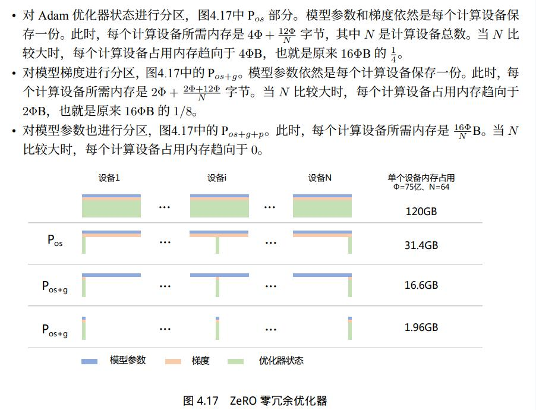
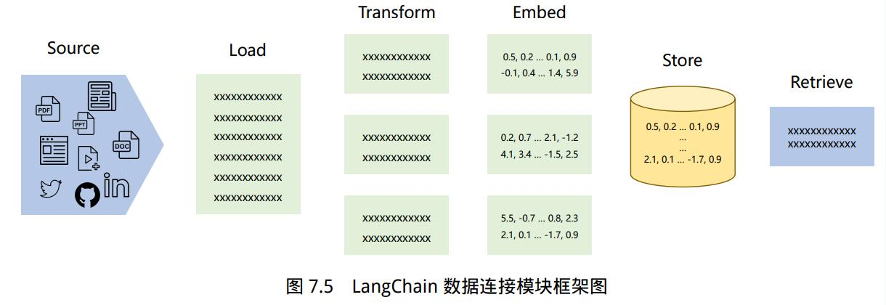

### 目录
- [目录](#目录)
- [2 大模型基础](#2-大模型基础)
  - [2.1 构建框架](#21-构建框架)
  - [2.2 预训练模型](#22-预训练模型)
    - [2.2.1 数据](#221-数据)
    - [2.2.2 文本分词](#222-文本分词)
    - [2.2.3 Bert](#223-bert)
    - [2.2.4 GPT](#224-gpt)
    - [2.2.5 BART](#225-bart)
    - [2.2.6 T5](#226-t5)
    - [2.2.7 Unilm](#227-unilm)
    - [2.2.8 GLM](#228-glm)
    - [2.2.9 LLaMA](#229-llama)
  - [2.3 有监督微调](#23-有监督微调)
    - [2.3.1 BitFit](#231-bitfit)
    - [2.3.2 Prefix-Tuning](#232-prefix-tuning)
    - [2.3.3 Prompt-Tuning](#233-prompt-tuning)
    - [2.3.4 P-Tuning](#234-p-tuning)
    - [2.3.5 LoRA](#235-lora)
    - [2.3.6 IA3](#236-ia3)
    - [2.3.7 Adapter](#237-adapter)
  - [2.4 强化学习](#24-强化学习)
    - [2.4.1 奖励模型](#241-奖励模型)
    - [2.4.2 RLHF](#242-rlhf)
- [3 多模态](#3-多模态)
  - [3.1 数据](#31-数据)
  - [3.2 视觉模型](#32-视觉模型)
    - [3.2.1 ViT](#321-vit)
    - [3.2.2 CLIP](#322-clip)
    - [3.2.3 Diffusion Probabilistic Model](#323-diffusion-probabilistic-model)
    - [3.2.4 Denoising Diffusion Probabilistic Model](#324-denoising-diffusion-probabilistic-model)
    - [3.2.5 Denoising Diffusion Implicit Model](#325-denoising-diffusion-implicit-model)
    - [3.2.6 Stable Diffusion](#326-stable-diffusion)
    - [3.2.3 ControlNet](#323-controlnet)
    - [3.2.4 Imagen](#324-imagen)
    - [3.2.5 Dreambooth](#325-dreambooth)
  - [3.3 多模态模型](#33-多模态模型)
    - [3.3.1 Blip](#331-blip)
    - [3.3.2 Blip-2](#332-blip-2)
    - [3.3.3 Mini-GPT4](#333-mini-gpt4)
- [4 分布式训练](#4-分布式训练)
  - [4.1 概述](#41-概述)
  - [4.2 并行策略](#42-并行策略)
    - [4.2.1 数据并行](#421-数据并行)
    - [4.2.2 模型并行](#422-模型并行)
  - [4.3 混合精度训练](#43-混合精度训练)
  - [4.4 Flash Attention](#44-flash-attention)
  - [4.5 DeepSpeed](#45-deepspeed)
    - [4.5.1 简介](#451-简介)
    - [4.5.1 ZeRO](#451-zero)
    - [4.5.2 DeepSpeed-Chat](#452-deepspeed-chat)
    - [4.5.3 DeepSpeed-VisualChat](#453-deepspeed-visualchat)
  - [4.6 Megatron-DeepSpeed](#46-megatron-deepspeed)
  - [4.6 模型推理](#46-模型推理)
    - [4.6.1 vLLM](#461-vllm)
- [5 大模型应用框架](#5-大模型应用框架)
  - [5.1 LangChain](#51-langchain)
    - [5.1.1 LangChain 介绍](#511-langchain-介绍)
    - [5.1.2 Model I/O](#512-model-io)
    - [5.1.3 Data connection](#513-data-connection)
    - [5.1.4 Chain](#514-chain)
    - [5.1.4 Memory](#514-memory)
    - [5.1.5 Agents](#515-agents)
    - [5.1.6 Callbacks](#516-callbacks)
    - [5.1.7 知识库问答系统](#517-知识库问答系统)
  - [5.2 LangChain-ChatGLM](#52-langchain-chatglm)
- [6 NLP 任务](#6-nlp-任务)
  - [6.1 意图识别](#61-意图识别)
  - [6.2 文本匹配](#62-文本匹配)
  - [6.3 对话管理](#63-对话管理)

### 2 大模型基础

#### 2.1 构建框架


#### 2.2 预训练模型

##### 2.2.1 数据
- Colossal Clean Crawled Corpus(C4)
- English CommonCrawl
- Github
- Wikipedia
- Gutenberg and Books3
- ArXiv
- Stack Exchange
  
  


##### 2.2.2 文本分词
- **分词类性**：
  - word 分词， OOV问题
  - character分词，过长，失去了单词的联系
  - Subword：
    "unfortunately" = "un" + "for" + "tun" + "ate" + "ly"
    常用算法：BPE，SentencePiece，WordPiece等
- **BPE**：
  Byte-Pair Encoding。先拆分为character, 然后统计token pair频率，合并， GPT
- **WordPiece**：
  与BPE 很相近，过程类似，但是会考虑单个token的频率，如果单个token的频率很高，也不会合并。如un-able， un 和 able 概率都很高，即使un-able pair很高，也不会合并
- **Unigram**：
  从一个巨大的词汇表出发，再逐渐删除trimdown其中的词汇，直到size满足预定义。初始的词汇表可以采用所有预分词器分出来的词，再加上所有高频的子串。每次从词汇表中删除词汇的原则是使预定义的损失最小。
  训练文档所有词为$x_1, x_2, ..., X_n$, 每个词token的方法是一个集合$S(x_i)$, 当一个词汇表确定时，每个词tokenize的方法集合$S(x_i)$ 就是确定的，每种方法对应一个概率$P(x)$, 依据损失进行删除。
- **SentencePiece**：
  把一个句子看作一个整体，再拆成片段，而没有保留天然的词语的概念。一般地，它把空格space也当作一种特殊字符来处理，再用BPE或者Unigram算法来构造词汇表。与Unigram算法联合使用
  
##### 2.2.3 Bert

    BERT: Pre-training of Deep Bidirectional Transformers for Language Understanding
    https://arxiv.org/pdf/1810.04805.pdf
- pretrain:
  - Masked LM
  - Next Sentence Prediction
    


##### 2.2.4 GPT
    GPT1：Improving Language Understanding by Generative Pre-Training
    https://www.cs.ubc.ca/~amuham01/LING530/papers/radford2018improving.pdf
    GPT2：Language Models are Unsupervised Multitask Learners
    https://d4mucfpksywv.cloudfront.net/better-language-models/language-models.pdf
    GPT3：Language Models are Few-Shot Learners
    https://arxiv.org/pdf/2005.14165.pdf
    InstructGPT：Training language models to follow instructions with human feedback
    https://arxiv.org/pdf/2203.02155.pdf
- GPT1:

自回归方式训练，预训练阶段窗口设置，需要主要的是fune-tuning时，损失函数包含预训练损失

- GPT2：
	堆数据，堆网络参数，网络norm层有变化

- GPT3：
	
	模型使用spare attention, 175B参数

- InstructGPT
	
  - Supervised fine-tuning (SFT)
  - Reward modeling (RM)： 使用6B 模型替代175B模型(175B模型不稳定)，损失函数如下：k in [4, 9]
  
  - Reinforcement learning (RL)
  	

##### 2.2.5 BART
```
  BART: Denoising Sequence-to-Sequence Pre-training for Natural Language Generation, Translation, and Comprehension
  https://arxiv.org/pdf/1910.13461.pdf
```
   

- Pre-training:
  - Token Masking
  - Token Deletion
  - Text Infilling
  - Sentence Permutation
  - Document Rotation


- Fine-Tuning：
	在做machine translation时，先预训练参数，只更新initialized encoder参数，后完全更新参数。

 

 ```
#  model defination
https://github.com/facebookresearch/fairseq/blob/main/fairseq/models/bart/model.py

 # transformers
 # https://huggingface.co/docs/transformers/model_doc/bart

 from transformers import BartForConditionalGeneration, BartTokenizer

model = BartForConditionalGeneration.from_pretrained("facebook/bart-large", forced_bos_token_id=0)
tok = BartTokenizer.from_pretrained("facebook/bart-large")
example_english_phrase = "UN Chief Says There Is No <mask> in Syria"
batch = tok(example_english_phrase, return_tensors="pt")
generated_ids = model.generate(batch["input_ids"])
assert tok.batch_decode(generated_ids, skip_special_tokens=True) == [
    "UN Chief Says There Is No Plan to Stop Chemical Weapons in Syria"
]

# torch
# https://github.com/facebookresearch/fairseq/tree/main/examples/bart
import torch
bart = torch.hub.load('pytorch/fairseq', 'bart.large')
bart.eval()  # disable dropout (or leave in train mode to finetune)
tokens = bart.encode('Hello world!')
assert tokens.tolist() == [0, 31414, 232, 328, 2]
bart.decode(tokens)  # 'Hello world!'
# Extract the last layer's features
last_layer_features = bart.extract_features(tokens)
assert last_layer_features.size() == torch.Size([1, 5, 1024])

# Extract all layer's features from decoder (layer 0 is the embedding layer)
all_layers = bart.extract_features(tokens, return_all_hiddens=True)
assert len(all_layers) == 13
assert torch.all(all_layers[-1] == last_layer_features)

# Download BART already finetuned for MNLI
bart = torch.hub.load('pytorch/fairseq', 'bart.large.mnli')
bart.eval()  # disable dropout for evaluation

# Encode a pair of sentences and make a prediction
tokens = bart.encode('BART is a seq2seq model.', 'BART is not sequence to sequence.')
bart.predict('mnli', tokens).argmax()  # 0: contradiction

# Encode another pair of sentences
tokens = bart.encode('BART is denoising autoencoder.', 'BART is version of autoencoder.')
bart.predict('mnli', tokens).argmax()  # 2: entailment

 ```

##### 2.2.6 T5

    Exploring the Limits of Transfer Learning with a Unified Text-to-Text Transformer
    https://arxiv.org/pdf/1910.10683.pdf

   
添加前缀

```
# TF
https://github.com/google-research/text-to-text-transfer-transformer

# transformers
# pre-training
from transformers import T5Tokenizer, T5ForConditionalGeneration

tokenizer = T5Tokenizer.from_pretrained("t5-small")
model = T5ForConditionalGeneration.from_pretrained("t5-small")

input_ids = tokenizer("The <extra_id_0> walks in <extra_id_1> park", return_tensors="pt").input_ids
labels = tokenizer("<extra_id_0> cute dog <extra_id_1> the <extra_id_2>", return_tensors="pt").input_ids

# the forward function automatically creates the correct decoder_input_ids
loss = model(input_ids=input_ids, labels=labels).loss
loss.item()

# Supervised training 
from transformers import T5Tokenizer, T5ForConditionalGeneration

tokenizer = T5Tokenizer.from_pretrained("t5-small")
model = T5ForConditionalGeneration.from_pretrained("t5-small")

input_ids = tokenizer("translate English to German: The house is wonderful.", return_tensors="pt").input_ids
labels = tokenizer("Das Haus ist wunderbar.", return_tensors="pt").input_ids

# the forward function automatically creates the correct decoder_input_ids
loss = model(input_ids=input_ids, labels=labels).loss
loss.item()


# inferences encoder-decoder
from transformers import T5Tokenizer, T5ForConditionalGeneration

tokenizer = T5Tokenizer.from_pretrained("t5-small")
model = T5ForConditionalGeneration.from_pretrained("t5-small")

input_ids = tokenizer("translate English to German: The house is wonderful.", return_tensors="pt").input_ids
outputs = model.generate(input_ids)
print(tokenizer.decode(outputs[0], skip_special_tokens=True))


# task 2: span-mask denoising objective
from transformers import T5Tokenizer, T5ForConditionalGeneration

tokenizer = T5Tokenizer.from_pretrained("t5-small")
model = T5ForConditionalGeneration.from_pretrained("t5-small")

input_ids = tokenizer("The <extra_id_0> walks in <extra_id_1> park", return_tensors="pt").input_ids

sequence_ids = model.generate(input_ids)
sequences = tokenizer.batch_decode(sequence_ids)
sequences
['<pad><extra_id_0> park offers<extra_id_1> the<extra_id_2> park.</s>']

```

##### 2.2.7 Unilm

    Unified Language Model Pre-training for Natural Language Understanding and Generation
    https://arxiv.org/pdf/1905.03197.pdf

##### 2.2.8 GLM

##### 2.2.9 LLaMA

    LLaMA: Open and Efficient Foundation Language Models
    https://arxiv.org/pdf/2302.13971.pdf
	Llama 2: Open Foundation and Fine-Tuned Chat Models
    https://arxiv.org/pdf/2307.09288.pdf
  

- **LLaMA-1**：
  - decoder only  
  - Pre-normalization
  - SwiGLU activation function
  - Rotary Embeddings

```
# defination
https://github.com/facebookresearch/llama/blob/llama_v1/llama/model.py
```

- **LLaMA-2**：

```
Llama 2: Open Foundation and Fine-Tuned Chat Models
https://scontent-sin6-2.xx.fbcdn.net/v/t39.2365-6/10000000_662098952474184_2584067087619170692_n.pdf?_nc_cat=105&ccb=1-7&_nc_sid=3c67a6&_nc_ohc=ai5Sz-xGRjkAX_I4yLO&_nc_ht=scontent-sin6-2.xx&oh=00_AfD0jghQmKakw5E2DP_nFdxK5HaI9BmXlIrZFa_ZTyrgRg&oe=656A72BF
https://github.com/facebookresearch/llama-recipes/
```
- data:
  - 混合公开数据集，无meta数据，去除隐私数据
  - 2 trillion tokens
  - vocabulary size is 32k tokens
- model：
  - Llama2： 7B, 13B, 70B
  - Llama2-Chat: 7B, 13B, 70B, dialogue use cases
- model structure:
  - pre-normalization using RMSNorm
  - SwiGLU activation function
  - rotary positional embeddings(RoPE)
- Supervised Fine-Tuning (SFT)：
  - Quality Is All You Need
- Reinforcement Learning with Human Feedback (RLHF)

#### 2.3 有监督微调
有监督微调（Supervised Finetuning, SFT）又称指令微调（Instruction Tuning），是指在已经训练好的语言模型的基础上，通过使用有标注的特定任务数据进行进一步的微调，从而使得模型具备遵循指令的能力。经过海量数据预训练后的语言模型虽然具备了大量的“知识”，但是由于其训练时的目标仅是进行下一个词的预测，此时的模型还不能够理解并遵循人类自然语言形式的指令。


微调技术综述：

	Scaling Down to Scale Up: A Guide to Parameter-Efficient Fine-Tuning
	https://arxiv.org/pdf/2303.15647.pdf

##### 2.3.1 BitFit
  ```
  BitFit: Simple Parameter-efficient Fine-tuning for Transformer-based Masked Language-models
  https://arxiv.org/pdf/2106.10199v2.pdf
  ```

  只调节神经网络的bias参数
  ```
  num_param = 0
  for name, param in model.named_parameters():
      if "bias" not in name:
          param.requires_grad = False
      else:
          num_param += param.numel()
  num_param
  ```

##### 2.3.2 Prefix-Tuning
论文：

	Prefix-Tuning: Optimizing Continuous Prompts for Generation
	https://arxiv.org/pdf/2101.00190.pdf


keeps language model parameters frozen, but optimizes a small continuous task-specific vector (called the prefix).

- autoregressive LM: $[Prefix; x]$
- encode-decode: $[Prefix; x; {Prefix}^,; y]$

  ```
  from peft import PrefixTuningConfig, get_peft_model, TaskType
  config = PrefixTuningConfig(task_type=TaskType.CAUSAL_LM, num_virtual_tokens=10, prefix_projection=True)
  model = get_peft_model(model, config)
  ```

##### 2.3.3 Prompt-Tuning
```
The Power of Scale for Parameter-Efficient Prompt Tuning
https://arxiv.org/pdf/2104.08691.pdf
```


$$ \hat{Y}=argmax_YPr_{\theta, {\theta}_p}(Y|[P;X]) $$
- ${\theta}$  model parameters, ${\theta_p}$ prompt 参数
- $Y$ output, a sequence of tokens
- $X$ input, a sequence of tokens
- $P$ prompt, a series of tokens prepended to the input 


当输入是$n$ 个tokens, 表示为${x_1, x_2,...,x_n}$, 模型会将这些input通过embedding层转换为一个矩阵$X_e \in R^{n \times e}$, 这里的$e$ 是embedding space 维度。同时, $P_e \in R^{p \times e}$, 这里的$p$ 是prompt的长度。将两者拼接起来，得到$[P_e;X_e] \in R^{(p+n)\times e}$。训练时，只更新$\theta_p$. Prefix Tuning的简化版本

Design Decision:
- random
- embedding from model's vocabulary
- embeddings that enumerate the output classes

  ```
  peft_config = PromptTuningConfig(
      task_type=TaskType.CAUSAL_LM,
      prompt_tuning_init=PromptTuningInit.TEXT,
      num_virtual_tokens=8,
      prompt_tuning_init_text="Classify if the tweet is a complaint or not:",
      tokenizer_name_or_path=model_name_or_path,
  )
  ```

##### 2.3.4 P-Tuning
```
GPT Understands, Too
https://arxiv.org/pdf/2103.10385.pdf
P-Tuning v2: Prompt Tuning Can Be Comparable to Fine-tuning Universally Across Scales and Tasks
https://arxiv.org/pdf/2110.07602.pdf
```
**P-Tuning v1**


Prompt Encoder：
  - LSTM + MLP: mapping function f to map trainable embeddings to model inputs

```
from peft import PromptEncoderConfig, TaskType, get_peft_model, PromptEncoderReparameterizationType

config = PromptEncoderConfig(task_type=TaskType.CAUSAL_LM, num_virtual_tokens=10,
                             encoder_reparameterization_type=PromptEncoderReparameterizationType.MLP,
                             encoder_dropout=0.1, encoder_num_layers=5, encoder_hidden_size=1024)
```
**P-Tuning v2**

```
peft_config = PrefixTuningConfig(task_type=TaskType.CAUSAL_LM, num_virtual_tokens=30)
# creating model
model = AutoModelForCausalLM.from_pretrained(model_name_or_path)
model = get_peft_model(model, peft_config)
```

##### 2.3.5 LoRA
```
LORA: LOW-RANK ADAPTATION OF LARGE LANGUAGE MODELS
https://arxiv.org/pdf/2106.09685.pdf
  AdaLoRA: ADAPTIVE BUDGET ALLOCATION FOR PARAMETEREFFICIENT FINE-TUNING
  https://arxiv.org/pdf/2303.10512.pdf
  https://github.com/QingruZhang/AdaLoRA
  QLORA: Efficient Finetuning of Quantized LLMs
  https://arxiv.org/pdf/2305.14314.pdf
```

原理：
- **lora**：
  
   $h=W_0 x + \Delta W * x  = W_0 x + BAx = (W_o + BA) x$， 其中 $W_0 \in R^{d \times k}$, $B \in R^{d \times r}$, $A \in R^{r \times k}$, $ r << min(d, k)$。

   初始时, $A$: random Gaussion initialization, $B$: zero， 同时为 $\Delta W $ 添加缩放系数 $ \frac{\alpha} {r}$。
   


  ```
  from transformers import (AutoConfig, AutoModelForCausalLM, AutoTokenizer, HfArgumentParser, set_seed)
  from peft import (TaskType, PeftModel, LoraConfig, get_peft_model)

  config = AutoConfig.from_pretrained(
        model_name_or_path,
        cache_dir=cache_dir,
        trust_remote_code=True
    )
  model = AutoModelForCausalLM.from_pretrained(
        model_name_or_path,
        config=config,
        cache_dir=cache_dir,
        load_in_8bit=training_args.bits == 8,
        load_in_4bit=training_args.bits == 4,
        device_map=device_map,
        torch_dtype=torch_dtype,
        trust_remote_code=True
    )
  lora_config = LoraConfig(
      r=lora_r,
      lora_alpha=lora_alpha,
      target_modules=target_modules.split(','),
      lora_dropout=lora_dropout,
      bias="none",
      inference_mode=False,
      task_type=TaskType.CAUSAL_LM
  )
  model = get_peft_model(model, lora_config)

  ```

- **adalora**：

   - $h=W_0 x + \Delta W * x  = W_0 x + P\Lambda Q x$

   - 训练过程：
  


   - 损失函数及参数更新：
  


   - 三元组参数重要重要性计算：
  
   

- **qlora**：
  ```
  QLORA: Efficient Finetuning of Quantized LLMs
  https://arxiv.org/pdf/2305.14314.pdf
  ```

  - 4-bit NormalFloat
  - Double Quantization
  - Paged Optimizers

  ```
  # https://huggingface.co/blog/4bit-transformers-bitsandbytes
  from transformers import BitsAndBytesConfig
  nf4_config = BitsAndBytesConfig(
    load_in_4bit=True,
    bnb_4bit_quant_type="nf4",
    bnb_4bit_use_double_quant=True,
    bnb_4bit_compute_dtype=torch.bfloat16
  )
  model_nf4 = AutoModelForCausalLM.from_pretrained(model_id, quantization_config=nf4_config)
  modules = find_all_linear_names(model, training_args.bits)
  lora_config = LoraConfig(
      r=training_args.lora_r,
      lora_alpha=training_args.lora_alpha,
      target_modules=modules,
      lora_dropout=training_args.lora_dropout,
      bias="none",
      inference_mode=False,
      task_type=TaskType.CAUSAL_LM
  )
  model = get_peft_model(model_nf4, lora_config)
  ```

##### 2.3.6 IA3
	Few-Shot Parameter-Efficient Fine-Tuning is Better and Cheaper than In-Context Learning
	https://arxiv.org/pdf/2205.05638.pdf

  - 对别LoRA更少的参数
  - 不增加推理耗时
  $$
  softmax(\frac{Q(l_k \odot K^T)}{\sqrt{d}})(l_v \odot V)
  $$

  $$
  (l_{ff} \odot \gamma (W_1r))W_2
  $$

  ```
  from peft import IA3Config, TaskType, get_peft_model
  config = IA3Config(task_type=TaskType.CAUSAL_LM)
  model = get_peft_model(model, config)
  ```

##### 2.3.7 Adapter

论文:

	Parameter-Efficient Transfer Learning for NLP
	https://arxiv.org/pdf/1902.00751.pdf
    AdapterFusion:Non-Destructive Task Composition for Transfer Learning
    https://arxiv.org/pdf/2005.00247.pdf
    MAD-X: An Adapter-Based Framework for Multi-Task Cross-Lingual Transfer

原理：
- **adapter**：


- **adapterFusion**
	- knowledge extraction stage
	- knowledge composition step


  
  
  
  


#### 2.4 强化学习
```
https://huggingface.co/docs/trl/example_overview
https://huggingface.co/blog/rlhf
```


##### 2.4.1 奖励模型

```
https://github.com/huggingface/trl/blob/main/examples/scripts/reward_modeling.py
```


##### 2.4.2 RLHF
```
ppo:
https://github.com/huggingface/trl/blob/main/examples/scripts/ppo.py
```


### 3 多模态
#### 3.1 数据

#### 3.2 视觉模型

##### 3.2.1 ViT
```
  An image is worth 16x16 words: Transformers for image recognition at scale
  https://arxiv.org/pdf/2010.11929.pdf
```


  ```
  # https://huggingface.co/docs/transformers/model_doc/vit
  from transformers import ViTConfig, ViTModel, ViTFeatureExtractor
  configuration = ViTConfig()
  model = ViTModel(configuration)

  model_ckpt = 'google/vit-base-patch16-224-in21k'
  device = torch.device('cuda' if torch.cuda.is_available() else 'cpu')
  extractor = ViTFeatureExtractor.from_pretrained(model_ckpt)
  extractor(samples[0]['image'], return_tensors='pt')
  ```

##### 3.2.2 CLIP
```
Learning Transferable Visual Models From Natural Language Supervision
https://arxiv.org/pdf/2103.00020.pdf
```


  ```
  # https://huggingface.co/docs/transformers/model_doc/clip
  from PIL import Image
  from transformers import CLIPProcessor, CLIPModel
  model = CLIPModel.from_pretrained("openai/clip-vit-base-patch32")
  processor = CLIPProcessor.from_pretrained("openai/clip-vit-base-patch32")
  url = "http://images.cocodataset.org/val2017/000000039769.jpg"
  image = Image.open(requests.get(url, stream=True).raw)
  inputs = processor(text=["a photo of a cat", "a photo of a dog"], images=image, return_tensors="pt", padding=True)
  outputs = model(**inputs)
  logits_per_image = outputs.logits_per_image
  probs = logits_per_image.softmax(dim=1)

  # Chinese CLIP
  # https://arxiv.org/pdf/2211.01335.pdf
  # https://huggingface.co/docs/transformers/model_doc/chinese_clip
  from transformers import ChineseCLIPProcessor, ChineseCLIPModel
  model = ChineseCLIPModel.from_pretrained("OFA-Sys/chinese-clip-vit-base-patch16")
  processor = ChineseCLIPProcessor.from_pretrained("OFA-Sys/chinese-clip-vit-base-patch16")
  url = "https://clip-cn-beijing.oss-cn-beijing.aliyuncs.com/pokemon.jpeg"
  image = Image.open(requests.get(url, stream=True).raw)
  # Squirtle, Bulbasaur, Charmander, Pikachu in English
  texts = ["杰尼龟", "妙蛙种子", "小火龙", "皮卡丘"]
  # compute image feature
  inputs = processor(images=image, return_tensors="pt")
  image_features = model.get_image_features(**inputs)
  image_features = image_features / image_features.norm(p=2, dim=-1, keepdim=True)  # normalize
  # compute text features
  inputs = processor(text=texts, padding=True, return_tensors="pt")
  text_features = model.get_text_features(**inputs)
  text_features = text_features / text_features.norm(p=2, dim=-1, keepdim=True)  # normalize
  # compute image-text similarity scores
  inputs = processor(text=texts, images=image, return_tensors="pt", padding=True)
  outputs = model(**inputs)
  logits_per_image = outputs.logits_per_image  # this is the image-text similarity score
  probs = logits_per_image.softmax(dim=1)  # 
  ```
##### 3.2.3 Diffusion Probabilistic Model
```
Understanding Diffusion Models: A Unified Perspective
https://arxiv.org/pdf/2208.11970.pdf
```
**VAE**
- **简介**：
  
  
  从$X->Z$ 对应条件概率 $P(Z|X)$， 对应编码过程
  从$Z->X$ 对应条件概率 $P(X|Z)$， 对应解码过程
  其联合概率分布为：
  $$
  P(X,Z) = P(X)P(Z|X) = P(Z)P(X|Z)
  $$
  $$
  P(Z|X) = \frac{P(Z)P(X|Z)}{P(X)}
  $$

  假定存在观察样本$\mathcal{D}=\{(z^{(1)},x^{(1)}),\cdots,(z^{(N)},x^{(N)})\}$
  $$
  \ell(\theta;\mathcal{D}) = \sum_{i=1}^{N} \ln p_{\theta}(z^{(i)},x^{(i)})
  $$
  但$z$为隐变量，当观测样本$\mathcal{D}=\{x^{(1)},\cdots,x^{(N)}\}$, 极大化下目标函数：
  $$
  \ell(\theta;\mathcal{D}) = \sum_{i=1}^{N} \ln p_{\theta}(x^{(i)})
  = \sum_{i=1}^{N} \ln  \int_z p_{\theta}(x^{(i)},z) dz
  $$
- **ELBO(Evidence Lower Bound)**：
  $$
  \begin{aligned}\ell(\theta;x) &=  \ln  p_{\theta}(x)\\ &=  \ln \int_{z} p_{\theta}(x,z)\\&=  \ln \int_{z} q_{\phi}(z) \frac{p_{\theta}(x,z)}{q_{\phi}(z)}  \ \ \ \text{同时乘除} q_{\phi}(z) \text{，等于没变化}\\&=  \ln\mathbb{E}_{q_{\phi}(z) } \left [ \frac{p_{\theta}(x,z)}{q_{\phi}(z)} \right ]\\& \ge  \mathbb{E}_{q_{\phi}(z) } \ln\left [ \frac{p_{\theta}(x,z)}{q_{\phi}(z)} \right ]
  \ \ \ \text{根据Jensen不等式}\\
  &=  \int_{z} q_{\phi}(z) \ln \left [ \frac{p_{\theta}(x,z)}{q_{\phi}(z)} \right ]\\&=  \left [  \int_{z} q_{\phi}(z) \ln  p_{\theta}(x,z)
    \int_{z} q_{\phi}(z) \ln q_{\phi}(z) \right ]\\&\triangleq \mathcal{L}(q,\theta)\end{aligned}
  $$

  下界函数：
  $$
  \begin{aligned}
  \mathcal{L}(q,\theta) &= \int_{z} q_{\phi}(z)  \ln  p_{\theta}(x,z) -
  \int_{z} q_{\phi}(z) \ln q_{\phi}(z) \\
  &=   \mathbb{E}_{z \sim q_{\phi}} [ \ln  p_{\theta}(x,z) ] - \mathbb{E}_{z \sim q_{\phi}}[ \ln q_{\phi}(z) ]
  \end{aligned}
  $$
  
  
  


**马尔科夫分层自编码器（MHVAE）**

编码过程：
$$
q_{\phi}(z_{1:T}|x) = q_{\phi}(z_{1}|x) \prod_{t=2}^T q_{\phi}(z_{t}|z_{t-1})
$$
解码过程
$$
p(x,z_{1:T}) = p(z_T) p_{\theta}(x|z_1) \prod_{t=2}^T p_{\theta}(z_{t-1}|z_t)
$$
**扩散模型**


前向过程：
$$
q(x_{1:T}|x_0) = q(x_1|x_0) \prod_{t=2}^T q(x_t|x_{t-1}) =  \prod_{t=1}^T q(x_t|x_{t-1})
$$
每一个$x_t$都是一个高斯变量，前向过程每一个步骤的编码器$q(x_t|x_{t-1})$固定为一个线性高斯变换， 所谓线性高斯变换是指$x_t$的均值和$x_{t-1}$的值是线性关系。 定义$q(x_t|x_{t-1})$的方差与$x_{t-1}$独立, 为$\beta_tI$(超参), 并且
$$0 \lt \beta_1 \lt \beta_2 \lt \dots \beta_T \lt 1$$
前期方差较小，添加的噪声少，扩散速度慢；随着方差逐步加大，添加的噪声越来越多，扩散的速度加快。
定义$q(x_t|x_{t-1})$的均值$\mu_{x_t}$和$x_{t-1}$是线性关系, 设定另外一个参数$\alpha_t = 1 - \beta_t $:
$$
\mu_{x_t} =  \sqrt{\alpha_t} \ x_{t-1}
$$

$$
\Sigma_{x_t} = \beta_t \textit{I} =  (1- \alpha_t ) \textit{I}
$$
$q(x_t|x_{t-1})$就是一个以$\sqrt{\alpha_t} \ x_{t-1}$为均值， 以$(1- \alpha_t ) \textit{I}$ 为方差的高斯分布。 按照线性高斯的特征，它可以看做是$\sqrt{\alpha_t} \ x_{t-1}$在基础上加上一个$\mathcal{N} (0, (1- \alpha_t ) \textit{I} )$的随机高斯噪声。 这就相当于每一个步骤都在前一个步骤的基础上加上一个随机高斯噪声数据，随着的增加，逐步变成一个高斯噪声数据。
$$
q(x_t|x_{t-1}) = \mathcal{N} (\sqrt{\alpha_t} \ x_{t-1}, (1- \alpha_t ) \textit{I} )
$$
$$
\begin{aligned}
x_{t} &=\sqrt{\alpha_t} \ x_{t-1} + \mathcal{N} (0, (1- \alpha_t ) \textit{I} )\\&=\sqrt{\alpha_t} \ x_{t-1} +  \sqrt{1- \alpha_t } \ \epsilon \ \ \ ,\epsilon \sim \mathcal{N} (0, \textit{I} )
\end{aligned}
$$

后向过程：
$$
p(x_{0:T}) = p(x_T) \prod_{t={T-1}}^0 p(x_{t}|x_{t+1})
$$

其中$ p(x_T) $ 是标准正态分布，即$ p(x_T) \sim \mathcal{N} (0, \textit{I} )$。使用神经网络进行学习。

目标函数：


- reconstruction term
  $$
  \begin{aligned}\ln p(x_0|x_1) &=\ln \frac{1}{(2\pi)^{n/2} |\Sigma |^{1/2}}exp\{-\frac{1}{2}(x_0 - \mu_{\theta}(x_1,t=1))^{T}\Sigma^{-1}(x - \mu_{\theta}(x_1,t=1))\}\\& \propto -\frac{1}{2}(x_0 - \mu_{\theta}(x_1,t=1))^{T}(x_0 - \mu_{\theta}(x_1,t=1))\}\\& = -\frac{1}{2} \left\lVert x_0 - \mu_{\theta}(x_1,t=1) \right\rVert_2^2\end{aligned}
  $$

  $$
  \begin{aligned}& {\operatorname{\arg\max}}_{\theta}
  \mathbb{E}_{q(x_{1}|x_0)}\left[\ln p_{{\theta}}(x_0|x_1)\right]\\&\Leftrightarrow  {\operatorname{\arg\max}}_{\theta} \  \mathbb{E}_{q(x_{1}|x_0)}
  \left [ -\frac{1}{2} \left\lVert x_0 - \hat x_{0}(x_1,t=1) \right\rVert_2^2 \right ]\\&\Leftrightarrow   {\operatorname{\arg\min}}_{\theta} \  \mathbb{E}_{q(x_{1}|x_0)}
  \left [ \left\lVert x_0 - \hat x_{0}(x_1,t=1) \right\rVert_2^2 \right ]\end{aligned}
  $$

- prior matching term
  
  KL 散度, $P(x_0|x_T)$ 是前向扩散阶段的后验概率分布。 $P(x_T)$是逆向生成过程中的先验分布。其约束是让两者尽可能的接近，起正则作用。其都没有包含未知参数，可以忽略。

- denoising matching term
  $$
  \begin{split}\begin{align}
  {q(x_{t-1}|x_t, x_0)}
  &= {\frac{q(x_t | x_{t-1}, x_0)q(x_{t-1}|x_0)}{q(x_{t}|x_0)}}\\
  &= {\frac{\mathcal{N}(x_{t} ; \sqrt{\alpha_t} x_{t-1}, (1 - \alpha_t)\textit{I})\mathcal{N}(x_{t-1} ; \sqrt{\bar\alpha_{t-1}}x_0, (1 - \bar\alpha_{t-1}) \textit{I})}{\mathcal{N}(x_{t} ; \sqrt{\bar\alpha_{t}}x_0, (1 - \bar\alpha_{t})\textit{I})}}\\
  &\propto {\text{exp}\left\{-\left[\frac{(x_{t} - \sqrt{\alpha_t} x_{t-1})^2}{2(1 - \alpha_t)} + \frac{(x_{t-1} - \sqrt{\bar\alpha_{t-1}} x_0)^2}{2(1 - \bar\alpha_{t-1})} - \frac{(x_{t} - \sqrt{\bar\alpha_t} x_{0})^2}{2(1 - \bar\alpha_t)} \right]\right\}}\\
  &= {\text{exp}\left\{-\frac{1}{2}\left[\frac{(x_{t} - \sqrt{\alpha_t} x_{t-1})^2}{1 - \alpha_t} + \frac{(x_{t-1} - \sqrt{\bar\alpha_{t-1}} x_0)^2}{1 - \bar\alpha_{t-1}} - \frac{(x_{t} - \sqrt{\bar\alpha_t} x_{0})^2}{1 - \bar\alpha_t} \right]\right\}}\\
  &= {\text{exp}\left\{-\frac{1}{2}\left[\frac{(-2\sqrt{\alpha_t} x_{t}x_{t-1} + \alpha_t x_{t-1}^2)}{1 - \alpha_t} + \frac{(x_{t-1}^2 - 2\sqrt{\bar\alpha_{t-1}}x_{t-1} x_0)}{1 - \bar\alpha_{t-1}} + C(x_t, x_0)\right]\right\}} \\
  &\propto {\text{exp}\left\{-\frac{1}{2}\left[- \frac{2\sqrt{\alpha_t} x_{t}x_{t-1}}{1 - \alpha_t} + \frac{\alpha_t x_{t-1}^2}{1 - \alpha_t} + \frac{x_{t-1}^2}{1 - \bar\alpha_{t-1}} - \frac{2\sqrt{\bar\alpha_{t-1}}x_{t-1} x_0}{1 - \bar\alpha_{t-1}}\right]\right\}}\\
  &= {\text{exp}\left\{-\frac{1}{2}\left[(\frac{\alpha_t}{1 - \alpha_t} + \frac{1}{1 - \bar\alpha_{t-1}})x_{t-1}^2 - 2\left(\frac{\sqrt{\alpha_t}x_{t}}{1 - \alpha_t} + \frac{\sqrt{\bar\alpha_{t-1}}x_0}{1 - \bar\alpha_{t-1}}\right)x_{t-1}\right]\right\}}\\
  &= {\text{exp}\left\{-\frac{1}{2}\left[\frac{\alpha_t(1-\bar\alpha_{t-1}) + 1 - \alpha_t}{(1 - \alpha_t)(1 - \bar\alpha_{t-1})}x_{t-1}^2 - 2\left(\frac{\sqrt{\alpha_t}x_{t}}{1 - \alpha_t} + \frac{\sqrt{\bar\alpha_{t-1}}x_0}{1 - \bar\alpha_{t-1}}\right)x_{t-1}\right]\right\}}\\
  &= {\text{exp}\left\{-\frac{1}{2}\left[\frac{\alpha_t-\bar\alpha_{t} + 1 - \alpha_t}{(1 - \alpha_t)(1 - \bar\alpha_{t-1})}x_{t-1}^2 - 2\left(\frac{\sqrt{\alpha_t}x_{t}}{1 - \alpha_t} + \frac{\sqrt{\bar\alpha_{t-1}}x_0}{1 - \bar\alpha_{t-1}}\right)x_{t-1}\right]\right\}}\\
  &= {\text{exp}\left\{-\frac{1}{2}\left[\frac{1 -\bar\alpha_{t}}{(1 - \alpha_t)(1 - \bar\alpha_{t-1})}x_{t-1}^2 - 2\left(\frac{\sqrt{\alpha_t}x_{t}}{1 - \alpha_t} + \frac{\sqrt{\bar\alpha_{t-1}}x_0}{1 - \bar\alpha_{t-1}}\right)x_{t-1}\right]\right\}}\\
  &= {\text{exp}\left\{-\frac{1}{2}\left(\frac{1 -\bar\alpha_{t}}{(1 - \alpha_t)(1 - \bar\alpha_{t-1})}\right)\left[x_{t-1}^2 - 2\frac{\left(\frac{\sqrt{\alpha_t}x_{t}}{1 - \alpha_t} + \frac{\sqrt{\bar\alpha_{t-1}}x_0}{1 - \bar\alpha_{t-1}}\right)}{\frac{1 -\bar\alpha_{t}}{(1 - \alpha_t)(1 - \bar\alpha_{t-1})}}x_{t-1}\right]\right\}}\\
  &= {\text{exp}\left\{-\frac{1}{2}\left(\frac{1 -\bar\alpha_{t}}{(1 - \alpha_t)(1 - \bar\alpha_{t-1})}\right)\left[x_{t-1}^2 - 2\frac{\left(\frac{\sqrt{\alpha_t}x_{t}}{1 - \alpha_t} + \frac{\sqrt{\bar\alpha_{t-1}}x_0}{1 - \bar\alpha_{t-1}}\right)(1 - \alpha_t)(1 - \bar\alpha_{t-1})}{1 -\bar\alpha_{t}}x_{t-1}\right]\right\}}\\
  &= {\text{exp}\left\{-\frac{1}{2}\left(\frac{1}{\frac{(1 - \alpha_t)(1 - \bar\alpha_{t-1})}{1 -\bar\alpha_{t}}}\right)\left[x_{t-1}^2 - 2\frac{\sqrt{\alpha_t}(1-\bar\alpha_{t-1})x_{t} + \sqrt{\bar\alpha_{t-1}}(1-\alpha_t)x_0}{1 -\bar\alpha_{t}}x_{t-1}\right]\right\}}\\
  &\propto {\mathcal{N}(x_{t-1} ;} \underbrace{{\frac{\sqrt{\alpha_t}(1-\bar\alpha_{t-1})x_{t} + \sqrt{\bar\alpha_{t-1}}(1-\alpha_t)x_0}{1 -\bar\alpha_{t}}}}_{\mu_q(x_t, x_0)}, \underbrace{{\frac{(1 - \alpha_t)(1 - \bar\alpha_{t-1})}{1 -\bar\alpha_{t}}\textit{I}}}_{{\Sigma}_q(t)})
  \end{align}\end{split}
  $$
  其跟$x_{t-1}$无关，只跟$x_t, \alpha, x_0$有关。同样也是一个高斯分布，均值可以记为$\mu_q(x_t, x_0)$ 是一个有关$x_0, x_t$的函数。方差记作$\Sigma_q(t)$.
  $$
  \begin{aligned}\mu_q(x_t, x_0) &= { \frac{\sqrt{\alpha_t}(1-\bar\alpha_{t-1})x_{t} + \sqrt{\bar\alpha_{t-1}}(1-\alpha_t)x_0}{1 -\bar\alpha_{t}}}\\\Sigma_q(t) &= \frac{(1 - \alpha_t)(1 - \bar\alpha_{t-1})}{ 1 -\bar\alpha_{t}}  \textit{I} = \sigma_q^2(t)   \textit{I}\end{aligned}
  $$

  参数化模型分布$p_\theta(x_{t-1}|x_t)$, 尽可能的接近高斯分布$q(x_{t-1}|x_t, x_0)$. 假定其为高斯分布，其均值记为$\mu_{\theta}$, $\Sigma_\theta$为其方差，其不用学习，令其$\Sigma_\theta=\Sigma_q(t)$。
  $$
  p_{\theta} (x_{t-1}|x_t) \sim \mathcal{N}(x_{t-1} ;\mu_{\theta},\Sigma_q(t))
  $$

  
  极大化 ELBO 函数，等同于极小化$D_{KL}({q(x_{t-1}|x_t, x_0)}||{p_{{\theta}}(x_{t-1}|x_t)})$, 等同于极小化$\left[\left\lVert{\mu}_{{\theta}}-{\mu}_q\right\rVert_2^2\right]$.
  其中：
  $$
  \mu_q(x_t, x_0) = { \frac{\sqrt{\alpha_t}(1-\bar\alpha_{t-1})x_{t} + \sqrt{\bar\alpha_{t-1}}(1-\alpha_t)x_0}{1 -\bar\alpha_{t}}}
  $$

  $$
  \mu_{\theta}={\mu}_{{\theta}}(x_t, t) = \frac{\sqrt{\alpha_t}(1-\bar\alpha_{t-1})x_{t} + \sqrt{\bar\alpha_{t-1}}(1-\alpha_t)\hat x_{{\theta}}(x_t, t)}{1 -\bar\alpha_{t}}
  $$

  $$
  \begin{aligned}& \quad \left\lVert{\mu}_{{\theta}}-{\mu}_q \right\rVert_2^2\\&= \left\lVert  \frac{\sqrt{\alpha_t}(1-\bar\alpha_{t-1})x_{t} + \sqrt{\bar\alpha_{t-1}}(1-\alpha_t)\hat x_{{\theta}}(x_t, t)}{1 -\bar\alpha_{t}}
  -{ \frac{\sqrt{\alpha_t}(1-\bar\alpha_{t-1})x_{t} + \sqrt{\bar\alpha_{t-1}}(1-\alpha_t)x_0}{1 -\bar\alpha_{t}}}
  \right\rVert_2^2\\&= \left\lVert  \frac{ \sqrt{\bar\alpha_{t-1}}(1-\alpha_t)\hat x_{{\theta}}(x_t, t)}{1 -\bar\alpha_{t}}
  -{ \frac{\sqrt{\bar\alpha_{t-1}}(1-\alpha_t)x_0}{1 -\bar\alpha_{t}}}
  \right\rVert_2^2\\&= \left\lVert  \frac{ \sqrt{\bar\alpha_{t-1}}(1-\alpha_t) }  {1 -\bar\alpha_{t}}
  ( \hat x_{{\theta}}(x_t, t)   -    x_0 )
  \right\rVert_2^2\\&=  \frac{ \sqrt{\bar\alpha_{t-1}}(1-\alpha_t) }  {1 -\bar\alpha_{t}}
  \left\lVert  ( \hat x_{{\theta}}(x_t, t) -  x_0 ) \right\rVert_2^2\end{aligned}
  $$
  

最终目标函数：

采样过程：


##### 3.2.4 Denoising Diffusion Probabilistic Model
```
Denoising Diffusion Probabilistic Models
https://arxiv.org/pdf/2006.11239.pdf
```
  $$
  q(x_t|x_0) \sim \mathcal{N}(x_t; \sqrt{\bar{\alpha}_t } \ x_0,  (1- \bar{ \alpha}_t)    \textit{I})
  $$

  $$
  x_t = \sqrt{\bar{\alpha}_t } \ x_0 + \sqrt{1- \bar{ \alpha}_t }  \ \epsilon_t  \ \ \ ,
  \bar{\alpha}_t = \prod_{i=1}^t \alpha_i ,\ \ \epsilon_t \sim \mathcal{N}(0,\textit{I})
  $$
  反过来， 用$x_t$表示$x_0$
  $$
  x_0 =  \frac{x_t -\sqrt{1- \bar{ \alpha}_t }  \ \epsilon_t }{ \sqrt{\bar{\alpha}_t }  }
  ,\ \ \epsilon_t \sim \mathcal{N}(0,\textit{I})
  $$

  $$
  \begin{split}\begin{align}
  {\mu}_q &= {\mu}_q(x_t, x_0) = \frac{\sqrt{\alpha_t}(1-\bar\alpha_{t-1})x_{t} + \sqrt{\bar\alpha_{t-1}}(1-\alpha_t)x_0}{1 -\bar\alpha_{t}}\\
  &= \frac{\sqrt{\alpha_t}(1-\bar\alpha_{t-1})x_{t} + \sqrt{\bar\alpha_{t-1}}(1-\alpha_t)\frac{x_t - \sqrt{1 - \bar\alpha_t}\epsilon }{\sqrt{\bar\alpha_t}}}{1 -\bar\alpha_{t}}\\
  &= \frac{\sqrt{\alpha_t}(1-\bar\alpha_{t-1})x_{t} + (1-\alpha_t)\frac{x_t - \sqrt{1 - \bar\alpha_t}\epsilon }{\sqrt{\alpha_t}}}{1 -\bar\alpha_{t}}\\
  &= \frac{\sqrt{\alpha_t}(1-\bar\alpha_{t-1})x_{t}}{1 - \bar\alpha_t} + \frac{(1-\alpha_t)x_t}{(1-\bar\alpha_t)\sqrt{\alpha_t}} - \frac{(1 - \alpha_t)\sqrt{1 - \bar\alpha_t}\epsilon }{(1-\bar\alpha_t)\sqrt{\alpha_t}}\\
  &= \left(\frac{\sqrt{\alpha_t}(1-\bar\alpha_{t-1})}{1 - \bar\alpha_t} + \frac{1-\alpha_t}{(1-\bar\alpha_t)\sqrt{\alpha_t}}\right)x_t - \frac{(1 - \alpha_t)\sqrt{1 - \bar\alpha_t}}{(1-\bar\alpha_t)\sqrt{\alpha_t}}\epsilon \\
  &= \left(\frac{\alpha_t(1-\bar\alpha_{t-1})}{(1 - \bar\alpha_t)\sqrt{\alpha_t}} + \frac{1-\alpha_t}{(1-\bar\alpha_t)\sqrt{\alpha_t}}\right)x_t - \frac{1 - \alpha_t}{\sqrt{1 - \bar\alpha_t}\sqrt{\alpha_t}}\epsilon \\
  &= \frac{\alpha_t-\bar\alpha_{t} + 1-\alpha_t}{(1 - \bar\alpha_t)\sqrt{\alpha_t}}x_t - \frac{1 - \alpha_t}{\sqrt{1 - \bar\alpha_t}\sqrt{\alpha_t}}\epsilon \\
  &= \frac{1-\bar\alpha_t}{(1 - \bar\alpha_t)\sqrt{\alpha_t}}x_t - \frac{1 - \alpha_t}{\sqrt{1 - \bar\alpha_t}\sqrt{\alpha_t}}\epsilon \\
  &= \frac{1}{\sqrt{\alpha_t}}x_t - \frac{1 - \alpha_t}{\sqrt{1 - \bar\alpha_t}\sqrt{\alpha_t}}\epsilon
  \end{align}\end{split}
  $$
  $$
  \mu_{\theta}={\mu}_{{\theta}}(x_t, t) = \frac{1}{\sqrt{\alpha_t}}x_t - \frac{1 - \alpha_t}{\sqrt{1 - \bar\alpha_t}\sqrt{\alpha_t}} {\hat\epsilon}_{ {\theta}}(x_t, t)
  $$
  $$
  \begin{split}\begin{align}
  &  D_{KL}({q(x_{t-1}|x_t, x_0)}||{p_{{\theta}}(x_{t-1}|x_t)}) \\
  &=\frac{1}{2\sigma_q^2(t)}\left[\left\lVert{\mu}_{{\theta}}-{\mu}_q\right\rVert_2^2\right]\\
  &= \frac{1}{2\sigma_q^2(t)}\left[\left\lVert\frac{1}{\sqrt{\alpha_t}}x_t - \frac{1 - \alpha_t}{\sqrt{1 - \bar\alpha_t}\sqrt{\alpha_t}}{\hat\epsilon}_{{\theta}}(x_t, t) -
  \frac{1}{\sqrt{\alpha_t}}x_t + \frac{1 - \alpha_t}{\sqrt{1 - \bar\alpha_t}\sqrt{\alpha_t}}\epsilon \right\rVert_2^2\right]\\
  &= \frac{1}{2\sigma_q^2(t)}\left[\left\lVert \frac{1 - \alpha_t}{\sqrt{1 - \bar\alpha_t}\sqrt{\alpha_t}}\epsilon  - \frac{1 - \alpha_t}{\sqrt{1 - \bar\alpha_t}\sqrt{\alpha_t}}{\hat\epsilon}_{{\theta}}(x_t, t)\right\rVert_2^2\right]\\
  &= \frac{1}{2\sigma_q^2(t)}\left[\left\lVert \frac{1 - \alpha_t}{\sqrt{1 - \bar\alpha_t}\sqrt{\alpha_t}}(\epsilon  - {\hat\epsilon}_{{\theta}}(x_t, t))\right\rVert_2^2\right]\\
  &= \frac{1}{2\sigma_q^2(t)}\frac{(1 - \alpha_t)^2}{(1 - \bar\alpha_t)\alpha_t}\left[\left\lVert\epsilon  - {\hat\epsilon}_{{\theta}}(x_t, t)\right\rVert_2^2\right]
  \end{align}\end{split}
  $$


##### 3.2.5 Denoising Diffusion Implicit Model
```
DENOISING DIFFUSION IMPLICIT MODELS
https://arxiv.org/pdf/2010.02502.pdf
```
##### 3.2.6 Stable Diffusion
```
High-Resolution Image Synthesis with Latent Diffusion Models
https://arxiv.org/pdf/2112.10752.pdf
# https://github.com/AUTOMATIC1111/stable-diffusion-webui
# https://github.com/CompVis/stable-diffusion
# https://github.com/Stability-AI/stablediffusion
```


```
from diffusers import StableDiffusionPipeline
import torch
model_id = "runwayml/stable-diffusion-v1-5"
pipe = StableDiffusionPipeline.from_pretrained(model_id, torch_dtype=torch.float16)
pipe = pipe.to("cuda")
prompt = "a photo of an astronaut riding a horse on mars"
image = pipe(prompt).images[0]  
image.save("astronaut_rides_horse.png")
```

##### 3.2.3 ControlNet
```
Adding Conditional Control to Text-to-Image Diffusion Models
https://arxiv.org/pdf/2302.05543.pdf
```


 

##### 3.2.4 Imagen
    Photorealistic Text-to-Image Diffusion Models with Deep Language Understanding
    https://arxiv.org/pdf/2205.11487.pdf
 

##### 3.2.5 Dreambooth
    DreamBooth: Fine Tuning Text-to-Image Diffusion Models for Subject-Driven Generation
    https://arxiv.org/pdf/2208.12242.pdf


#### 3.3 多模态模型
##### 3.3.1 Blip
```
BLIP: Bootstrapping Language-Image Pre-training for Unified Vision-Language Understanding and Generation
https://arxiv.org/pdf/2201.12086.pdf
```
 
- ITC: Image-Text Contrastive Loss, align the feature space of the visual transformer and the text transformer by encouraging positive image-text pairs to have similar representations in contrast to the negative pairs
- ITM: learn image-text multimodal representation that captures the fine-grained alignment between vision and language. a binary classification task.
- LM: aims to generate textual descriptions given an image
- CapFilt: a captioner to generate captions given web images, and a filter to remove noisy image-text pairs. the captioner is an image-grounded text decoder. The filter is an image-grounded text encoder.

 
##### 3.3.2 Blip-2
```
BLIP-2: Bootstrapping Language-Image Pre-training with Frozen Image Encoders and Large Language Models
https://arxiv.org/pdf/2301.12597.pdf
```


- representation learning stage：connect Q-Former to a frozen image encoder and perform pre-training using image-text pairs. ITC， ITM，LM.
- generative pre-training stage: connect QFormer (with the frozen image encoder attached) to a frozen LLM to harvest the LLM’s generative language capability


##### 3.3.3 Mini-GPT4
```
MINIGPT-4: ENHANCING VISION-LANGUAGE UNDERSTANDING WITH ADVANCED LARGE LANGUAGE MODELS
https://arxiv.org/pdf/2304.10592.pdf
```

- pretraining:
  500w image-text paris
  
- sccond-funetuning:
  Initial aligned image-text generation:
  ```
  ###Human: <ImageFeature></Img>Describe this image in detail. Give as many details as possible. Say everything you see. ###Assistant:
  ```
  Data post-processing: ChatGPT4
  SECOND-STAGE FINETUNING:
  ```
  ###Human: <ImageFeature></Img><Instruction>###Assistant:
  ```

### 4 分布式训练
#### 4.1 概述

  - 通讯
    - 点对点通信
    - 集体通信
      - Scatter
      - Gather
      - Reduce
      - All-Reduce
      - Broadcast
      - All-Gather
    - backend
      - nccl
      - mpi
      - gloo
  ```
  https://pytorch.org/tutorials/intermediate/dist_tuto.html
  https://docs.nvidia.com/deeplearning/nccl/user-guide/docs/usage/collectives.html#
  ``` 
  
    

#### 4.2 并行策略

##### 4.2.1 数据并行
  ```
  https://pytorch.org/docs/stable/notes/ddp.html
  ```
  

##### 4.2.2 模型并行
- 流水线并行


- 张量并行
```
Megatron-LM: Training Multi-Billion Parameter Language Models Using Model Parallelism
https://arxiv.org/pdf/1909.08053.pdf 
```


#### 4.3 混合精度训练
- torch.float32
- torch.float16
- torch.bfloat16


  ```
  https://pytorch.org/docs/stable/amp.html
  # Creates model and optimizer in default precision
  from torch.cuda.amp import autocast as autocast
  from torch.cuda.amp import GradScaler

  model = Net().cuda()
  optimizer = optim.SGD(model.parameters(), ...)

  # Creates a GradScaler once at the beginning of training.
  scaler = GradScaler()

  for epoch in epochs:
      for input, target in data:
          optimizer.zero_grad()

          # Runs the forward pass with autocasting.
          with autocast(device_type='cuda', dtype=torch.float16):
              output = model(input)
              loss = loss_fn(output, target)

          # Scales loss.  Calls backward() on scaled loss to create scaled gradients.
          # Backward passes under autocast are not recommended.
          # Backward ops run in the same dtype autocast chose for corresponding forward ops.
          scaler.scale(loss).backward()

          # scaler.step() first unscales the gradients of the optimizer's assigned params.
          # If these gradients do not contain infs or NaNs, optimizer.step() is then called,
          # otherwise, optimizer.step() is skipped.
          scaler.step(optimizer)

          # Updates the scale for next iteration.
          scaler.update()
  ```
#### 4.4 Flash Attention

```
FlashAttention: Fast and Memory-Efficient Exact Attention with IO-Awareness
https://arxiv.org/pdf/2205.14135.pdf
```

不节约FLOPs，优化GPU中减少对HBM的访问
还有Flash Attention V2, V3, V4 版本(need update)

```
from xformers import ops as xops
query_states = query_states.transpose(1, 2)
key_states = key_states.transpose(1, 2)
value_states = value_states.transpose(1, 2)
attn_output = xops.memory_efficient_attention(
    query_states, key_states, value_states, attn_bias=xops.LowerTriangularMask(), p=self.dropout_prob
)
```

#### 4.5 DeepSpeed
##### 4.5.1 简介


  - APIs：DeepSpeed 提供了易于使用的 API 接口，简化了训练模型和推断的过程。用户只需通过调用几个 API 接口即可完成任务。通过“initialize”接口可以初始化引擎，并在参数中配置训练参数和优化技术等。这些配置参数通常保存在名为“ds_config.json”的文件中。。
  - RunTime：DeepSpeed 的核心运行时组件，使用 Python 语言实现，负责管理、执行和优化性能。它承担了将训练任务部署到分布式设备的功能，包括数据分区、模型分区、系统优化、微调、故障检测以及检查点的保存和加载等任务。
  - Ops：DeepSpeed 的底层内核组件，使用 C++ 和 CUDA 实现。它优化计算和通信过程，提供了一系列底层操作，包括 Ultrafast Transformer Kernels、fuse LAN kernels、Customary Deals等。Ops 的目标是通过高效的计算和通信加速深度学习训练过程。
##### 4.5.1 ZeRO
零冗余优化器（Zero Redundancy Optimizer，缩写为Zero）是一种用于大规模分布式深度学习的新型内存优化技术。ZeRO可以在当前一代GPU集群上以当前最佳系统吞吐量的三到五倍的速度训练具有1000亿个参数的深度学习模型。它还为训练具有数万亿参数的模型提供了一条清晰的道路，展示了深度学习系统技术的前所未有的飞跃。ZeRO作为DeepSpeed的一部分，用于提高显存效率和计算效率。

假定模型参数为$\Theta$, 模型参数和梯度分别为$2 \Theta$(fp16), adam 优化器 copy参数、梯度、动量分别为$4\Theta$。(了解阶段)
- ZeRO-0： 数据并行
- ZeRO-1： 对Adam 优化器状态进行分区
- ZeRO-2： 对模型梯度进行分区
- ZeRO-3： 对模型参数也进行分区


- ZeRO-Offload：利用 CPU 内存减少 GPU 内存的压力，集成到了ZeRO-2中
- ZeRO-Infinity：在 ZeRO-Offload 的基础上进一步优化，从ZeRO-2 延伸到了 ZeRO-3
- ZeRO++:  优化通信时的压力
  ```
  https://github.com/microsoft/DeepSpeed/tree/master/blogs/zeropp/chinese
  ```

##### 4.5.2 DeepSpeed-Chat
project/deepspeed/DeepSpeed-Chat
##### 4.5.3 DeepSpeed-VisualChat
project/deepspeed/DeepSpeed-VisualChat

#### 4.6 Megatron-DeepSpeed
```
https://github.com/microsoft/Megatron-DeepSpeed/tree/main
```

#### 4.6 模型推理
##### 4.6.1 vLLM
- PageAttention

### 5 大模型应用框架
#### 5.1 LangChain
##### 5.1.1 LangChain 介绍
```
https://www.langchain.asia/
```


LangChain 的提供了以下 6 种标准化、可扩展的接口并且可以外部集成的核心模块：
  - 模型输入/输出（Model I/O）与语言模型交互的接口；
  - 数据连接（Data connection）与特定应用程序的数据进行交互的接口；
  - 链（Chains）用于复杂的应用的调用序列；
  - 智能体（Agents）语言模型作为推理器决定要执行的动作序列；
  - 记忆（Memory）用于链的多次运行之间持久化应用程序状态；
  - 回调（Callbacks）记录和流式传输任何链式组装的中间步骤。

##### 5.1.2 Model I/O
LangChain 中模型输入/输出模块是与各种大语言模型进行交互的基本组件，是大语言模型应用的核心元素。
主要包含以下部分：Prompts、Language Models 以
及 Output Parsers。用户原始输入与模型和示例进行组合，然后输入给大语言模型，再根据大语言模型的返回结果进行输出或者结构化处理。
- Prompts：
  提示词模板、提示词动态选择和输入管理
  ```
  from langchain import PromptTemplate
  template = """\
  You are a naming consultant for new companies.
  What is a good name for a company that makes {product}?
  """
  prompt = PromptTemplate.from_template(template)
  prompt.format(product="colorful socks")
  ```
  如果有多个提示词，需要选择合适的提示词模板。LangChain 中提供了 Example Selector 提供各种类型的选择，包括LengthBasedExampleSelector、MaxMarginalRelevanceExampleSelector、SemanticSimilarityExampleSelector、NGramOverlapExampleSelector 等，可以提供按照句子长度、最大边际相关性、语义相似度、n-gram 覆盖率等多种选择方式
- Language Models
  LangChain 提供了两种类型模型的接口和集成：LLMs，接受文本字符串作为输入并返回文本字符串；Chat Model，由大语言模型支持，但接受 Chat Messages 列表作为输入并返回 Chat Message。在 LangChain 中，LLMs 指纯文本完成模型。接受字符串提示词作为输入，并输出字符串完成。
  ```
  from langchain.llms import OpenAI
  llm = OpenAI()
  llm.predict("say hi!") # '\n\nHi there!'

  from langchain.chat_models import ChatOpenAI
  from langchain.schema import (AIMessage, HumanMessage, SystemMessage)
  chat = ChatOpenAI(openai_api_key="...", temperature=0, model='gpt-3.5-turbo')
  messages = [
  SystemMessage(content="You are a helpful assistant."),
  HumanMessage(content="Hi AI, how are you today?"),
  AIMessage(content="I'm great thank you. How can I help you?"),
  HumanMessage(content="I'd like to understand string theory.")
  ]
  # HumanMessage 表示用户输入的消息，AIMessage 表示系统回复用户的消息，SystemMessage 表示设置的 AI 应该遵循的目标，ChatMessage 表示任务角色的消息
  res = chat(messages)
  print(res.content)
  ```
- Output Parsers
  部分的目标是辅助开发者从大语言模型输出中获取比仅文本更结构化的信息。
  ```
  from langchain.prompts import PromptTemplate, ChatPromptTemplate, HumanMessagePromptTemplate
  from langchain.llms import OpenAI
  from langchain.chat_models import ChatOpenAI
  from langchain.output_parsers import PydanticOutputParser
  from pydantic import BaseModel, Field, validator
  from typing import List
  model_name = 'text-davinci-003'
  temperature = 0.0
  model = OpenAI(model_name=model_name, temperature=temperature)
  # Define your desired data structure.
  class Joke(BaseModel):
  setup: str = Field(description="question to set up a joke")
  punchline: str = Field(description="answer to resolve the joke")
  # You can add custom validation logic easily with Pydantic.
  @validator('setup')
  def question_ends_with_question_mark(cls, field):
  if field[-1] != '?':
  raise ValueError("Badly formed question!")
  return field
  # Set up a parser + inject instructions into the prompt template.
  parser = PydanticOutputParser(pydantic_object=Joke)
  prompt = PromptTemplate(
  template="Answer the user query.\n{format_instructions}\n{query}\n",
  input_variables=["query"],
  partial_variables={"format_instructions": parser.get_format_instructions()}
  )
  # And a query intended to prompt a language model to populate the data structure.
  joke_query = "Tell me a joke."
  _input = prompt.format_prompt(query=joke_query)
  output = model(_input.to_string())
  parser.parse(output)
  # Joke(setup='Why did the chicken cross the road?', punchline='To get to the other side!')
  ```

##### 5.1.3 Data connection

Data connection模块提供组件来加载、转换、存储和查询数据, 主要包括：Document loaders、Document transformers、Text embedding models、Vector stores 以及 Retrievers。
- Document loaders：
  ```
  from langchain.document_loaders import TextLoader
  loader = TextLoader("./index.md")
  loader.load()

  # PDF
  from langchain.document_loaders import PyPDFLoader 
  loader = PyPDFLoader("example_data/layout-parser-paper.pdf")
  pages = loader.load_and_split()
  ```
- Document transformers:
  处理文档, 以完成各种转换任务, 拆分、合并等
  ```
  from langchain.text_splitter import CharacterTextSplitter
  text_splitter = CharacterTextSplitter.from_huggingface_tokenizer(tokenizer, chunk_size=100, chunk_overlap=0)
  texts = text_splitter.split_text(state_of_the_union)
  ```

- Text embedding models: 将非结构化文本转换为嵌入表示。提供两个方法，一个用于文档嵌入表示，另一个用于查询嵌入表示。
  ```
  from langchain.embeddings import OpenAIEmbeddings
  embeddings_model = OpenAIEmbeddings(openai_api_key="...")
  embeddings = embeddings_model.embed_documents([
  "Hi there!",
  "Oh, hello!",
  "What's your name?",
  "My friends call me World",
  "Hello World!"
  ])
  # len(embeddings), len(embeddings[0])
  embedded_query = embeddings_model.embed_query("What was the name mentioned in this session?")
  # embedded_query[:5]
  ```
- Vector stores：是存储和检索非结构化数据的主要方式之一。它首先将数据转化为嵌入表示，然后存储这些生成的嵌入向量
  ```
  # exampe1:
  from langchain.embeddings import HuggingFaceEmbeddings
  from langchain.vectorstores import Annoy
  embeddings_func = HuggingFaceEmbeddings()
  texts = ["pizza is great", "I love salad", "my car", "a dog"]
  # default metric is angular
  vector_store = Annoy.from_texts(texts, embeddings_func)
  vector_store_v2 = Annoy.from_texts(
    texts, embeddings_func, metric="dot", n_trees=100, n_jobs=1
  )
  vector_store.similarity_search("food", k=3)
  # output
  [(Document(page_content='pizza is great', metadata={}), 1.0944390296936035),
  (Document(page_content='I love salad', metadata={}), 1.1273186206817627),
  (Document(page_content='my car', metadata={}), 1.1580758094787598)]

  # example2:
  from langchain.document_loaders import TextLoader
  from langchain.embeddings.openai import OpenAIEmbeddings
  from langchain.text_splitter import CharacterTextSplitter
  from langchain.vectorstores import FAISS
  # Load the document, split it into chunks, embed each chunk and load it into the vector store.
  raw_documents = TextLoader('../../../state_of_the_union.txt').load()
  text_splitter = CharacterTextSplitter(chunk_size=1000, chunk_overlap=0)
  documents = text_splitter.split_documents(raw_documents)
  db = FAISS.from_documents(documents, OpenAIEmbeddings())
  # Do Simiarity Search
  query = "What did the president say about Ketanji Brown Jackson"
  docs = db.similarity_search(query)
  print(docs[0].page_content)
  ```
- Retrievers: 其功能是基于非结构化查询返回相应的文档。检索器不需要存储文档，只需要能根据查询返回结果即可。
  ```
  from abc import ABC, abstractmethod
  from typing import Any, List
  from langchain.schema import Document
  from langchain.callbacks.manager import Callbacks
  class BaseRetriever(ABC):
    def get_relevant_documents(self, query: str, *, callbacks: Callbacks = None, **kwargs: Any
    ) -> List[Document]:
      """Retrieve documents relevant to a query.
      Args:
      query: string to find relevant documents for
      callbacks: Callback manager or list of callbacks
      Returns:
      List of relevant documents
      """
    async def aget_relevant_documents(self, query: str, *, callbacks: Callbacks = None, **kwargs: Any
    ) -> List[Document]:
      """Asynchronously get documents relevant to a query.
      Args:
      query: string to find relevant documents for
      callbacks: Callback manager or list of callbacks
      Returns:
      List of relevant documents
      """
  from langchain.document_loaders import TextLoader
  loader = TextLoader('../../../state_of_the_union.txt')
  from langchain.text_splitter import CharacterTextSplitter
  from langchain.vectorstores import FAISS
  from langchain.embeddings import OpenAIEmbeddings
  documents = loader.load()
  text_splitter = CharacterTextSplitter(chunk_size=1000, chunk_overlap=0)
  texts = text_splitter.split_documents(documents)
  embeddings = OpenAIEmbeddings()
  db = FAISS.from_documents(texts, embeddings)
  retriever = db.as_retriever()
  docs = retriever.get_relevant_documents("what did he say about ketanji brown jackson")
  ```

##### 5.1.4 Chain
应对大语言模型进行链式组合，或与其他组件进行链式调用，LangChain提供了Chain 接口。 LangChain 中链 LLMChain, RouterChain、SimpleSequentialChain、 SequentialChain、TransformChain等
  ```
  # example 1　LLM Chain
  from langchain.chat_models import ChatOpenAI
  from langchain.prompts.chat import ChatPromptTemplate, HumanMessagePromptTemplate
  human_message_prompt = HumanMessagePromptTemplate(
  prompt=PromptTemplate(
    template="What is a good name for a company that makes {product}?",
    input_variables=["product"],)
  )
  chat_prompt_template = ChatPromptTemplate.from_messages([human_message_prompt])
  chat = ChatOpenAI(temperature=0.9)
  chain = LLMChain(llm=chat, prompt=chat_prompt_template)
  print(chain.run("colorful socks"))

  # example 2 SimpleSequentialChain　
  from langchain.llms import OpenAI
  from langchain.chains import LLMChain
  from langchain.prompts import PromptTemplate
  # This is an LLMChain to write a synopsis given a title of a play.
  llm = OpenAI(temperature=.7)
  template = """You are a playwright. Given the title of play, it is your
  job to write a synopsis for that title.
  Title: {title}
  Playwright: This is a synopsis for the above play:"""
  prompt_template = PromptTemplate(input_variables=["title"], template=template)
  synopsis_chain = LLMChain(llm=llm, prompt=prompt_template)
  # This is an LLMChain to write a review of a play given a synopsis.
  llm = OpenAI(temperature=.7)
  template = """You are a play critic from the New York Times. Given the synopsis of play,
  it is your job to write a review for that play.
  Play Synopsis:
  {synopsis}
  Review from a New York Times play critic of the above play:"""
  prompt_template = PromptTemplate(input_variables=["synopsis"], template=template)
  review_chain = LLMChain(llm=llm, prompt=prompt_template)
  # This is the overall chain where we run these two chains in sequence.
  from langchain.chains import SimpleSequentialChain
  overall_chain = SimpleSequentialChain(chains=[synopsis_chain, review_chain], verbose=True)
  ```

##### 5.1.4 Memory
LangChain提供了管理和操作以前的聊天消息的辅助工具。大多数大语言模型应用都使用对话方式与用户交互。对话中的一个关键环节是能够引用和参考之前在对话中的信息。对于对话系统来说，最基础的要求是能够直接访问一些过去的消息。

  ```
  # example 1
  from langchain.memory import ConversationBufferMemory
  from langchain.schema import messages_from_dict, messages_to_dict
  history = ChatMessageHistory()
  history.add_user_message("hi!")
  history.add_ai_message("whats up?")
  dicts = messages_to_dict(history.messages)

  # example 2
  from langchain.chat_models import ChatOpenAI
  from langchain.schema import SystemMessage
  from langchain.prompts import ChatPromptTemplate, HumanMessagePromptTemplate, MessagesPlaceholder
  prompt = ChatPromptTemplate.from_messages([
  SystemMessage(content="You are a chatbot having a conversation with a human."),
  MessagesPlaceholder(variable_name="chat_history"), # Where the memory will be stored.
  HumanMessagePromptTemplate.from_template("{human_input}"), # Where the human input will injectd
  ])
  memory = ConversationBufferMemory(memory_key="chat_history", return_messages=True)
  llm = ChatOpenAI()
  chat_llm_chain = LLMChain(llm=llm, prompt=prompt, verbose=True, memory=memory,)
  chat_llm_chain.predict(human_input="Hi there my friend")

  # result1:
  """
  Entering new LLMChain chain...
  Prompt after formatting:
  System: You are a chatbot having a conversation with a human.
  Human: Hi there my friend
  > Finished chain.
  'Hello! How can I assist you today, my friend?'
  """
  # result 2, 对话的历史记录都通过记忆传递给了 ChatModel
  chat_llm_chain.predict(human_input="Not too bad - how are you?")
  """
  Entering new LLMChain chain...
  Prompt after formatting:
  System: You are a chatbot having a conversation with a human.
  Human: Hi there my friend
  AI: Hello! How can I assist you today, my friend?
  Human: Not too bad - how are you?
  > Finished chain.
  "I'm an AI chatbot, so I don't have feelings, but I'm here to help and chat with you! Is there
  something specific you would like to talk about or any questions I can assist you with?"
  """
  ```

##### 5.1.5 Agents
  核心思想是使用大语言模型来选择要执行的一系列动作。智能体通过将大语言模型与动作列表结合，自动地选择最佳的动作序列，从而实现自动化决策和行动。
- Agent：是负责决定下一步该采取什么步骤的类。由大语言模型和提示驱动
- Tools：是智能体调用的函数。这里有两个重要的考虑因素：1）为智能体提供正确的工具访问权限；2）用对智能体最有帮助的方式描述工具。
- Toolkits：是一组旨在一起使用以完成特定任务的工具集合，并具有方便的加载方法。通常一个工具集中有 3-5 个工具。
- AgentExecutor：是智能体的运行空间，这是实际调用智能体并执行其选择的操作的部分。除了 AgentExecutor 类外，LangChain 还支持其他智能体运行空间，包括 Plan-and-execute Agent、Baby AGI、Auto GPT 等。

```
from langchain.agents import Tool
from langchain.agents import AgentType
from langchain.memory import ConversationBufferMemory
from langchain.chat_models import ChatOpenAI
from langchain.utilities import SerpAPIWrapper
from langchain.agents import initialize_agent
search = SerpAPIWrapper()
tools = [
    Tool(name = "Current Search", func=search.run, description="useful for when you need to answer questions about current events or the current state of the world"),
  ]
memory = ConversationBufferMemory(memory_key="chat_history", return_messages=True)
llm = ChatOpenAI(openai_api_key=OPENAI_API_KEY, temperature=0)
agent_chain = initialize_agent(tools, llm, agent=AgentType.CHAT_CONVERSATIONAL_REACT_DESCRIPTION, verbose=True, memory=memory)
agent_chain.run(input="what's my name?")
agent_chain.run(input="whats the weather like in pomfret?")
```

##### 5.1.6 Callbacks

##### 5.1.7 知识库问答系统
  - 收集领域知识数据构造知识库，这些数据应当能够尽可能的全面覆盖问答需求
  - 将知识库中的对非结构数据进行文本提取和文本拆分，得到文本块
  - 利用嵌入向量表示模型给出文本块嵌入表示，并利用向量数据库进行保存
  - 根据用户输入信息的嵌入表示，通过向量数据库检索得到最相关文本片段，利用提示词模板与用户输入以及历史消息合并输入大语言模型
  - 将大语言模型结果返回用户
  ```
  from langchain.document_loaders import DirectoryLoader
  from langchain.embeddings.openai import OpenAIEmbeddings
  from langchain.text_splitter import CharacterTextSplitter
  from langchain.vectorstores import Chroma
  from langchain.chains import ChatVectorDBChain, ConversationalRetrievalChain
  from langchain.chat_models import ChatOpenAI
  from langchain.chains import RetrievalQA
  # 从本地读取相关数据
  loader = DirectoryLoader('./Langchain/KnowledgeBase/', glob='**/*.pdf', show_progress=True)
  docs = loader.load()
  # 将文件进行切分
  text_splitter = CharacterTextSplitter(chunk_size=1000, chunk_overlap=0)
  docs_split = text_splitter.split_documents(docs)
  # 初始化 OpenAI Embeddings
  embeddings = OpenAIEmbeddings()
  # 将数据存入 Chroma 向量存储
  vector_store = Chroma.from_documents(docs, embeddings)
  # 初始化检索器，使用向量存储
  retriever = vector_store.as_retriever()
  system_template = """
  Use the following pieces of context to answer the users question.
  If you don't know the answer, just say that you don't know, don't try to make up an answer.
  Answering these questions in Chinese.
  -----------
  {question}
  -----------
  {chat_history}
  """
  # 构建初始 Messages 列表
  messages = [
  SystemMessagePromptTemplate.from_template(system_template),
  HumanMessagePromptTemplate.from_template('{question}')
  ]
  # 初始化 Prompt 对象
  prompt = ChatPromptTemplate.from_messages(messages)
  # 初始化大语言模型，使用 OpenAI API
  llm=ChatOpenAI(temperature=0.1, max_tokens=2048)
  # 初始化问答链
  qa = ConversationalRetrievalChain.from_llm(llm,retriever,condense_question_prompt=prompt)
  chat_history = []
  while True:
    question = input('问题：')
    # 开始发送问题 chat_history 为必须参数, 用于存储对话历史
    result = qa({'question': question, 'chat_history': chat_history})
    chat_history.append((question, result['answer']))
    print(result['answer'])
  ```

### 6 NLP 任务
#### 6.1 意图识别
#### 6.2 文本匹配
#### 6.3 对话管理

    A Survey on Dialog Management: Recent Advances and Challenges
    https://arxiv.org/pdf/2005.02233.pdf


