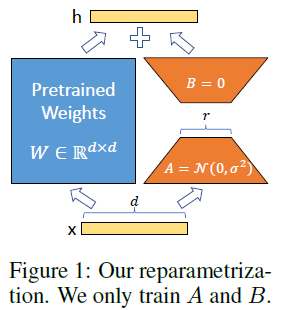
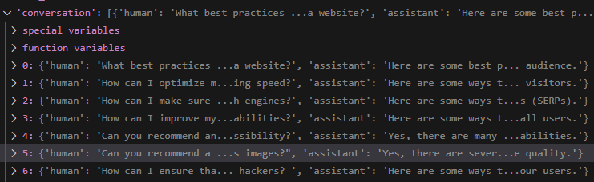
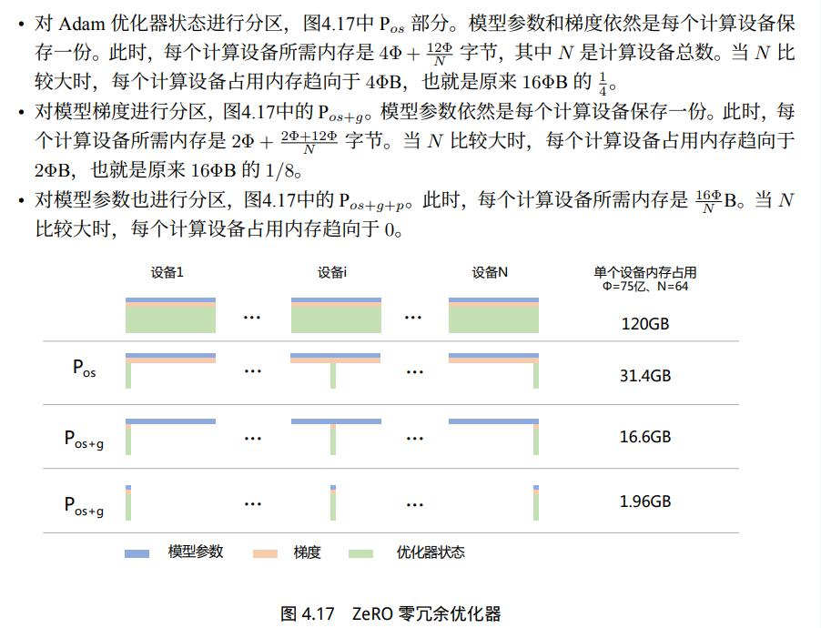

### 1.SFT
#### 1.1 prompt-tuning
    ```
    AIGC.md: 2.3.3 Prompt-Tuning
    ```
#### 1.2 p-tuning
    ```
    AIGC.md: 2.3.4 P-Tuning
    ```
#### 1.3 LoRA
- model structure

    

- model code
    ```
    from transformers import AutoConfig, AutoModelForCausalLM, AutoTokenizer,
    from peft import TaskType, PeftModel, LoraConfig, get_peft_model
    config = AutoConfig.from_pretrained(
        model_args.model_name_or_path,
        cache_dir=training_args.cache_dir,
        trust_remote_code=True
    )
    lora_config = LoraConfig(
        r=training_args.lora_r,
        lora_alpha=training_args.lora_alpha,
        target_modules=model_args.target_modules.split(','),
        lora_dropout=training_args.lora_dropout,
        bias="none",
        inference_mode=False,
        task_type=TaskType.CAUSAL_LM
    )
    model = get_peft_model(model, lora_config)
    tokenizer = AutoTokenizer.from_pretrained(
        model_args.model_name_or_path,
        cache_dir=training_args.cache_dir,
        padding_side="right",
        trust_remote_code=True
    )
    ```
    ```
    trainable params: 18,022,400 || all params: 1,118,070,784 || trainable%: 1.6119194113563386
    PeftModelForCausalLM(
    (base_model): LoraModel(
        (model): LlamaForCausalLM(
        (model): LlamaModel(
            (embed_tokens): Embedding(32000, 2048)
            (layers): ModuleList(
            (0-21): 22 x LlamaDecoderLayer(
                (self_attn): LlamaAttention(
                (q_proj): Linear(
                    in_features=2048, out_features=2048, bias=False
                    (lora_dropout): ModuleDict(
                    (default): Dropout(p=0.05, inplace=False)
                    )
                    (lora_A): ModuleDict(
                    (default): Linear(in_features=2048, out_features=64, bias=False)
                    )
                    (lora_B): ModuleDict(
                    (default): Linear(in_features=64, out_features=2048, bias=False)
                    )
                    (lora_embedding_A): ParameterDict()
                    (lora_embedding_B): ParameterDict()
                )
                (k_proj): Linear(
                    in_features=2048, out_features=256, bias=False
                    (lora_dropout): ModuleDict(
                    (default): Dropout(p=0.05, inplace=False)
                    )
                    (lora_A): ModuleDict(
                    (default): Linear(in_features=2048, out_features=64, bias=False)
                    )
                    (lora_B): ModuleDict(
                    (default): Linear(in_features=64, out_features=256, bias=False)
                    )
                    (lora_embedding_A): ParameterDict()
                    (lora_embedding_B): ParameterDict()
                )
                (v_proj): Linear(
                    in_features=2048, out_features=256, bias=False
                    (lora_dropout): ModuleDict(
                    (default): Dropout(p=0.05, inplace=False)
                    )
                    (lora_A): ModuleDict(
                    (default): Linear(in_features=2048, out_features=64, bias=False)
                    )
                    (lora_B): ModuleDict(
                    (default): Linear(in_features=64, out_features=256, bias=False)
                    )
                    (lora_embedding_A): ParameterDict()
                    (lora_embedding_B): ParameterDict()
                )
                (o_proj): Linear(
                    in_features=2048, out_features=2048, bias=False
                    (lora_dropout): ModuleDict(
                    (default): Dropout(p=0.05, inplace=False)
                    )
                    (lora_A): ModuleDict(
                    (default): Linear(in_features=2048, out_features=64, bias=False)
                    )
                    (lora_B): ModuleDict(
                    (default): Linear(in_features=64, out_features=2048, bias=False)
                    )
                    (lora_embedding_A): ParameterDict()
                    (lora_embedding_B): ParameterDict()
                )
                (rotary_emb): LlamaRotaryEmbedding()
                )
                (mlp): LlamaMLP(
                (gate_proj): Linear(in_features=2048, out_features=5632, bias=False)
                (up_proj): Linear(in_features=2048, out_features=5632, bias=False)
                (down_proj): Linear(in_features=5632, out_features=2048, bias=False)
                (act_fn): SiLUActivation()
                )
                (input_layernorm): LlamaRMSNorm()
                (post_attention_layernorm): LlamaRMSNorm()
            )
            )
            (norm): LlamaRMSNorm()
        )
        (lm_head): Linear(in_features=2048, out_features=32000, bias=False)
        )
    )
    )
    ```
- dataset

    
    ```
    # f"<s>{human}</s><s>{assistant}</s><s>{human}</s><s>{assistant}</s>"
    for chat in conversation:
        q_ids = tokenizer.encode(chat["human"])
        a_ids = tokenizer.encode(chat["assistant"])
        chat_ids = [tokenizer.bos_token_id] + q_ids + [tokenizer.eos_token_id] + \
                    [tokenizer.bos_token_id] + a_ids + [tokenizer.eos_token_id]
        ignore_len = len(q_ids) + 3
        chat_labels = [IGNORE_INDEX] * ignore_len + a_ids + [tokenizer.eos_token_id]
        input_ids += chat_ids
        labels += chat_labels
    ```
- training:
    ```
    trainer = LoraTrainer(model=model, tokenizer=tokenizer, args=training_args, **data_module)
    trainer.train()
    trainer.save_state()
    trainer.save_model(output_dir=training_args.output_dir)
    ```
    ```
    processing: 500it [10:59,  1.32s/it]
    {'loss': 1.0684, 'learning_rate': 9.938441702975689e-05, 'epoch': 008}                                                                                                                                                                                               
    {'loss': 1.0881, 'learning_rate': 9.567727288213005e-05, 'epoch': 0.16}                                                                                                                                                                                               
    16%|████████████████████████████████████▎                                                                                                                                                                                            | 10/62 [02:12<11:27, 13.21s/it]Saving model checkpoint to dummy_output/checkpoint-10
    {'loss': 1.0462, 'learning_rate': 8.885729807284856e-05, 'epoch': 0.24}                                                                                                                                                                                               
    {'loss': 1.0175, 'learning_rate': 7.938926261462366e-05, 'epoch': 0.32}                                                                                                                                                                                               
    32%|████████████████████████████████████████████████████████████████████████▌                                                                                                                                                        | 20/62 [04:27<09:22, 13.39s/it]Saving model checkpoint to dummy_output/checkpoint-20
    ```
- inference:
    ```
    # merge lora to base model
    def merge_and_save(args):
        device_map = {"": 0} if args.device == "cuda" else {"": "cpu"}
        # load base model and tokenizer
        torch_dtype = torch.bfloat16 if torch.cuda.is_bf16_supported() else torch.float16
        model = transformers.AutoModelForCausalLM.from_pretrained(
            args.base_model,
            cache_dir=args.cache_dir,
            torch_dtype=torch_dtype,
            device_map=device_map,
            trust_remote_code=True
        )
        tokenizer = transformers.AutoTokenizer.from_pretrained(
            args.base_model,
            cache_dir=args.cache_dir,
            trust_remote_code=True
        )
        if tokenizer.__class__.__name__ == 'QWenTokenizer':
            tokenizer.bos_token = '<|im_start|>'
            tokenizer.eos_token = '<|endoftext|>'
            tokenizer.pad_token = '<|im_end|>'
        else:
            assert tokenizer.bos_token_id is not None
            assert tokenizer.eos_token_id is not None
            if tokenizer.pad_token_id is None:
                assert tokenizer.unk_token_id is not None
                tokenizer.pad_token_id = tokenizer.unk_token_id

        # merge lora weights and save hf model    
        model = PeftModel.from_pretrained(model, args.peft_model, device_map=device_map)
        model = model.merge_and_unload() ---> important
        model.save_pretrained(args.save_dir)
        tokenizer.save_pretrained(args.save_dir)
    ```
    ```
    tokenizer = transformers.AutoTokenizer.from_pretrained(
        args.model_name_or_path, 
        cache_dir=args.cache_dir,
        trust_remote_code=True
    )
    device_map = {"": 0} if torch.cuda.is_available() else {"": "cpu"}
    torch_dtype = torch.bfloat16 if torch.cuda.is_bf16_supported() else torch.float16
    model = transformers.AutoModelForCausalLM.from_pretrained(
        args.model_name_or_path,
        cache_dir=args.cache_dir,
        torch_dtype=torch_dtype,
        device_map=device_map,
        trust_remote_code=True
    )
    
    print("clear清空历史对话, quit/stop退出")
    prompt = args.task_prompt + "{}" if args.task_prompt is not None else None
    history = []
    if args.multi_round:
        while True:
            text = input("User: ")
            if text == "stop" or text == "quit":
                break
            if text == "clear":
                history = []
                continue
            input_ids = [tokenizer.bos_token_id]
            input_ids.extend(tokenizer.encode(text))
            input_ids.append(tokenizer.eos_token_id)
            input_ids.append(tokenizer.bos_token_id)
            input_ids = torch.tensor([input_ids], device=model.device)
            # multi_round
            history = input_ids if len(history) == 0 else torch.concat((history, input_ids), dim=-1)
            # truncate left
            history = history[:, -args.max_input_tokens: ]

            outputs = model.generate(
                history,
                do_sample=True,
                top_p=args.top_p,
                top_k=args.top_k,
                temperature=args.temperature,
                max_new_tokens=args.max_new_tokens,
                eos_token_id=tokenizer.eos_token_id,
                repetition_penalty=args.repetition_penalty
            )
            
            response_ids = outputs[0][len(history[0]): ]
            response = tokenizer.decode(response_ids, skip_special_tokens=True)
            print("Assistant: {}\n".format(response))
            
            history = torch.concat((history, outputs[:, len(history[0]): ]), dim=-1)
    else:
        while True:
            text = input("User: ")
            if text == "stop" or text == "quit":
                break
            input_ids = [tokenizer.bos_token_id]
            input_ids.extend(tokenizer.encode(prompt.format(text) if prompt is not None else text))
            input_ids.append(tokenizer.eos_token_id)
            input_ids.append(tokenizer.bos_token_id)
            input_ids = torch.tensor([input_ids], device=model.device)
            
            if args.task_inference:
                outputs = model.generate(
                    input_ids,
                    do_sample=False,
                    max_new_tokens=args.max_new_tokens,
                    eos_token_id=tokenizer.eos_token_id
                )
            else:
                outputs = model.generate(
                    input_ids,
                    do_sample=True,
                    top_p=args.top_p,
                    top_k=args.top_k,
                    temperature=args.temperature,
                    max_new_tokens=args.max_new_tokens,
                    eos_token_id=tokenizer.eos_token_id,
                    repetition_penalty=args.repetition_penalty
                )
            
            response_ids = outputs[0][len(input_ids[0]): ]
            response = tokenizer.decode(response_ids, skip_special_tokens=True)
            print("Assistant: {}\n".format(response))
    ```

- trick:
    - flash attention
    - gradient_checkpointing

#### 1.4 QLoRA
- model core
    - 4-bit NormalFloat Quantization
    - Double Quantization
    - Paged Optimizers
- model code
    ```
    from transformers import AutoConfig, AutoModelForCausalLM, AutoTokenizer, BitsAndBytesConfig, HfArgumentParser,
    from peft import TaskType, PeftModel, LoraConfig, get_peft_model
    config = AutoConfig.from_pretrained(
        model_args.model_name_or_path,
        cache_dir=training_args.cache_dir,
        trust_remote_code=True
    )
    # qlora core
    # load_in_4bit 4bit load model
    # bnb_4bit_use_double_quant 双重优化
    # bnb_4bit_quant_type 量化类型
    # bnb_4bit_compute_dtype 4int 存储，反量化计算时数据类型
    quantization_config = BitsAndBytesConfig(
        load_in_4bit=training_args.bits == 4,
        load_in_8bit=training_args.bits == 8,
        llm_int8_threshold=6.0,
        llm_int8_has_fp16_weight=False,
        bnb_4bit_use_double_quant=training_args.double_quant,
        bnb_4bit_quant_type=training_args.quant_type,
        bnb_4bit_compute_dtype=compute_dtype
    )
    setattr(config, "torch_dtype", compute_dtype)
    model = AutoModelForCausalLM.from_pretrained(
        model_args.model_name_or_path,
        config=config,
        cache_dir=training_args.cache_dir,
        load_in_4bit=training_args.bits == 4,
        load_in_8bit=training_args.bits == 8,
        device_map=device_map,
        torch_dtype=compute_dtype,
        quantization_config=quantization_config,
        trust_remote_code=True
    )
    def find_all_linear_names(model, bits):
        cls = bnb.nn.Linear4bit if bits == 4 else \
            (bnb.nn.Linear8bitLt if bits == 8 else torch.nn.Linear)
        lora_module_names = set()
        for name, module in model.named_modules():
            if isinstance(module, cls):
                names = name.split('.')
                lora_module_names.add(names[0] if len(names) == 1 else names[-1])

        if 'lm_head' in lora_module_names: # needed for 16-bit
            lora_module_names.remove('lm_head')
        return list(lora_module_names)
    modules = find_all_linear_names(model, training_args.bits)
    lora_config = LoraConfig(
        r=training_args.lora_r,
        lora_alpha=training_args.lora_alpha,
        target_modules=modules,
        lora_dropout=training_args.lora_dropout,
        bias="none",
        inference_mode=False,
        task_type=TaskType.CAUSAL_LM
    )
    model = get_peft_model(model, lora_config)
    ```
- train
    ```
    # trainable params: 50,462,720 || all params: 1,150,511,104 || trainable%: 4.386113252149889
    # Linear4bit
    PeftModelForCausalLM(
    (base_model): LoraModel(
        (model): LlamaForCausalLM(
        (model): LlamaModel(
            (embed_tokens): Embedding(32000, 2048, padding_idx=0)
            (layers): ModuleList(
            (0-21): 22 x LlamaDecoderLayer(
                (self_attn): LlamaAttention(
                (q_proj): Linear4bit(
                    in_features=2048, out_features=2048, bias=False
                    (lora_dropout): ModuleDict(
                    (default): Dropout(p=0.05, inplace=False)
                    )
                    (lora_A): ModuleDict(
                    (default): Linear(in_features=2048, out_features=64, bias=False)
                    )
                    (lora_B): ModuleDict(
                    (default): Linear(in_features=64, out_features=2048, bias=False)
                    )
                    (lora_embedding_A): ParameterDict()
                    (lora_embedding_B): ParameterDict()
                )
                (k_proj): Linear4bit(
                    in_features=2048, out_features=256, bias=False
                    (lora_dropout): ModuleDict(
                    (default): Dropout(p=0.05, inplace=False)
                    )
                    (lora_A): ModuleDict(
                    (default): Linear(in_features=2048, out_features=64, bias=False)
                    )
                    (lora_B): ModuleDict(
                    (default): Linear(in_features=64, out_features=256, bias=False)
                    )
                    (lora_embedding_A): ParameterDict()
                    (lora_embedding_B): ParameterDict()
                )
                (v_proj): Linear4bit(
                    in_features=2048, out_features=256, bias=False
                    (lora_dropout): ModuleDict(
                    (default): Dropout(p=0.05, inplace=False)
                    )
                    (lora_A): ModuleDict(
                    (default): Linear(in_features=2048, out_features=64, bias=False)
                    )
                    (lora_B): ModuleDict(
                    (default): Linear(in_features=64, out_features=256, bias=False)
                    )
                    (lora_embedding_A): ParameterDict()
                    (lora_embedding_B): ParameterDict()
                )
                (o_proj): Linear4bit(
                    in_features=2048, out_features=2048, bias=False
                    (lora_dropout): ModuleDict(
                    (default): Dropout(p=0.05, inplace=False)
                    )
                    (lora_A): ModuleDict(
                    (default): Linear(in_features=2048, out_features=64, bias=False)
                    )
                    (lora_B): ModuleDict(
                    (default): Linear(in_features=64, out_features=2048, bias=False)
                    )
                    (lora_embedding_A): ParameterDict()
                    (lora_embedding_B): ParameterDict()
                )
                (rotary_emb): LlamaRotaryEmbedding()
                )
                (mlp): LlamaMLP(
                (gate_proj): Linear4bit(
                    in_features=2048, out_features=5632, bias=False
                    (lora_dropout): ModuleDict(
                    (default): Dropout(p=0.05, inplace=False)
                    )
                    (lora_A): ModuleDict(
                    (default): Linear(in_features=2048, out_features=64, bias=False)
                    )
                    (lora_B): ModuleDict(
                    (default): Linear(in_features=64, out_features=5632, bias=False)
                    )
                    (lora_embedding_A): ParameterDict()
                    (lora_embedding_B): ParameterDict()
                )
                (up_proj): Linear4bit(
                    in_features=2048, out_features=5632, bias=False
                    (lora_dropout): ModuleDict(
                    (default): Dropout(p=0.05, inplace=False)
                    )
                    (lora_A): ModuleDict(
                    (default): Linear(in_features=2048, out_features=64, bias=False)
                    )
                    (lora_B): ModuleDict(
                    (default): Linear(in_features=64, out_features=5632, bias=False)
                    )
                    (lora_embedding_A): ParameterDict()
                    (lora_embedding_B): ParameterDict()
                )
                (down_proj): Linear4bit(
                    in_features=5632, out_features=2048, bias=False
                    (lora_dropout): ModuleDict(
                    (default): Dropout(p=0.05, inplace=False)
                    )
                    (lora_A): ModuleDict(
                    (default): Linear(in_features=5632, out_features=64, bias=False)
                    )
                    (lora_B): ModuleDict(
                    (default): Linear(in_features=64, out_features=2048, bias=False)
                    )
                    (lora_embedding_A): ParameterDict()
                    (lora_embedding_B): ParameterDict()
                )
                (act_fn): SiLUActivation()
                )
                (input_layernorm): LlamaRMSNorm()
                (post_attention_layernorm): LlamaRMSNorm()
            )
            )
            (norm): LlamaRMSNorm()
        )
        (lm_head): Linear(in_features=2048, out_features=32000, bias=False)
        )
    )
    )
    ```

### 2. DeepSpeed-Chat
#### 2.1 DeepSpeed 介绍
- APIs：
    DeepSpeed 提供了易于使用的 API 接口，简化了训练模型和推断的过程。用户只需通过调用几个 API 接口即可完成任务。通过“initialize”接口可以初始化引擎，并在参数中配置训练参数和优化技术等。这些配置参数通常保存在名为“ds_config.json”的文件中。。
- RunTime：
    DeepSpeed 的核心运行时组件，使用 Python 语言实现，负责管理、执行和优化性能。它承担了将训练任务部署到分布式设备的功能，包括数据分区、模型分区、系统优化、微调、故障检测以及检查点的保存和加载等任务。
- Ops：
    DeepSpeed 的底层内核组件，使用 C++ 和 CUDA 实现。它优化计算和通信过程，提供了一系列底层操作，包括 Ultrafast Transformer Kernels、fuse LAN kernels、Customary Deals等。Ops 的目标是通过高效的计算和通信加速深度学习训练过程。
- ZeRO
    零冗余优化器（Zero Redundancy Optimizer，缩写为Zero）是一种用于大规模分布式深度学习的新型内存优化技术。ZeRO可以在当前一代GPU集群上以当前最佳系统吞吐量的三到五倍的速度训练具有1000亿个参数的深度学习模型。它还为训练具有数万亿参数的模型提供了一条清晰的道路，展示了深度学习系统技术的前所未有的飞跃。ZeRO作为DeepSpeed的一部分，用于提高显存效率和计算效率。

    假定模型参数为$\Theta$, 模型参数和梯度分别为$2 \Theta$(fp16), adam 优化器 copy参数、梯度、动量分别为$4\Theta$。
    - ZeRO-0： 数据并行
    - ZeRO-1： 对Adam 优化器状态进行分区
    - ZeRO-2： 对模型梯度进行分区
    - ZeRO-3： 对模型参数也进行分区
    

    - ZeRO-Offload：利用 CPU 内存减少 GPU 内存的压力，集成到了ZeRO-2中
    - ZeRO-Infinity：在 ZeRO-Offload 的基础上进一步优化，从ZeRO-2 延伸到了 ZeRO-3
    - ZeRO++:  优化通信时的压力
    ```
    https://github.com/microsoft/DeepSpeed/tree/master/blogs/zeropp/chinese
    ```
#### 2.2 sft
- lora code
    ```
    class LinearLayer_LoRA(nn.Module):
        # an simple implementation of LoRA
        # for now only support Linear Layer
        def __init__(self,
                    weight,
                    lora_dim=0,
                    lora_scaling=1,
                    lora_droppout=0,
                    bias=None):
            super(LinearLayer_LoRA, self).__init__()
            self.weight = weight
            self.bias = bias

            if lora_dim <= 0:
                raise ValueError(
                    "You are training to use LoRA, whose reduced dim should be larger than 1"
                )

            try:
                # for zero stage 3
                rows, columns = weight.ds_shape
            except:
                rows, columns = weight.shape
            self.lora_right_weight = nn.Parameter(torch.zeros(
                columns,
                lora_dim))  # apply transpose so in forward we do not need to
            self.lora_left_weight = nn.Parameter(torch.zeros(lora_dim, rows))
            self.lora_scaling = lora_scaling / lora_dim

            if lora_droppout > 0:
                self.lora_dropout = nn.Dropout(lora_droppout)
            else:
                self.lora_dropout = nn.Identity()

            self.reset_parameters()
            # disable the original weight gradient
            self.weight.requires_grad = False
            # fuse LoRA to the original weight
            self.fuse_lora = False

        def eval(self):
            self.lora_dropout.eval()

        #   self.fuse_lora_weight()

        def train(self, mode=True):
            self.lora_dropout.train(mode)
            # self.unfuse_lora_weight()

        def reset_parameters(self):
            nn.init.kaiming_uniform_(self.lora_right_weight, a=math.sqrt(5))
            nn.init.zeros_(self.lora_left_weight)

        def fuse_lora_weight(self):
            if not self.fuse_lora:
                self.weight.data += self.lora_scaling * torch.matmul(
                    self.lora_left_weight.t(), self.lora_right_weight.t())
            self.fuse_lora = True

        def unfuse_lora_weight(self):
            if self.fuse_lora:
                self.weight.data -= self.lora_scaling * torch.matmul(
                    self.lora_left_weight.t(), self.lora_right_weight.t())
            self.fuse_lora = False

        def forward(self, input):
            if self.fuse_lora:
                return F.linear(input, self.weight, self.bias)
            else:
                return F.linear(
                    input, self.weight,
                    self.bias) + (self.lora_dropout(input) @ self.lora_right_weight
                                @ self.lora_left_weight) * self.lora_scaling


    # convert the linear layer to LoRA
    def convert_linear_layer_to_lora(model,
                                    part_module_name,
                                    lora_dim=0,
                                    lora_scaling=1,
                                    lora_droppout=0):
        replace_name = []
        for name, module in model.named_modules():
            if isinstance(module, nn.Linear) and part_module_name in name:
                replace_name.append(name)
        for name in replace_name:
            module = recursive_getattr(model, name)
            tmp = LinearLayer_LoRA(
                module.weight, lora_dim, lora_scaling, lora_droppout,
                module.bias).to(module.weight.device).to(module.weight.dtype)
            recursive_setattr(model, name, tmp)
        return model
    if args.lora_dim > 0:
        model = convert_linear_layer_to_lora(model, args.lora_module_name,
                                             args.lora_dim)
        if args.only_optimize_lora:
            model = only_optimize_lora_parameters(model)
            model = make_model_gradient_checkpointing_compatible(model)
    ```
- deepspeed init:
    ```
    # config
    {'train_batch_size': 128, 'train_micro_batch_size_per_gpu': 16, 'steps_per_print': 10, 'zero_optimization': {'stage': 0, 'offload_param': {'device': 'none'}, 'offload_optimizer': {'device': 'none'}, 'stage3_param_persistence_threshold': 10000.0, 'stage3_max_live_parameters': 30000000.0, 'stage3_prefetch_bucket_size': 30000000.0, 'memory_efficient_linear': False}, 'fp16': {'enabled': True, 'loss_scale_window': 100}, 'gradient_clipping': 1.0, 'prescale_gradients': False, 'wall_clock_breakdown': False, 'hybrid_engine': {'enabled': False, 'max_out_tokens': 512, 'inference_tp_size': 1, 'release_inference_cache': False, 'pin_parameters': True, 'tp_gather_partition_size': 8}, 'tensorboard': {'enabled': True, 'output_path': './output/ds_tensorboard_logs/', 'job_name': 'step1_model_tensorboard'}}
    # optimizer 设置
    # Split weights in two groups, one with weight decay and the other not.
    optimizer_grouped_parameters = get_optimizer_grouped_parameters(
        model, args.weight_decay, args.lora_learning_rate)

    AdamOptimizer = DeepSpeedCPUAdam if args.offload else FusedAdam
    optimizer = AdamOptimizer(optimizer_grouped_parameters,
                              lr=args.learning_rate,
                              betas=(0.9, 0.95))
    # init
    deepspeed.init_distributed()
    model, optimizer, _, lr_scheduler = deepspeed.initialize(
        model=model,
        optimizer=optimizer,
        args=args,
        config=ds_config,
        lr_scheduler=lr_scheduler,
        dist_init_required=True)
    ```
- dataset
    ```
    rm-static
    if self.train_phase == 1:
        return {
            "input_ids": self.chosen_dataset[idx]["input_ids"],
            "attention_mask": self.chosen_dataset[idx]["attention_mask"],
            "labels": self.chosen_dataset[idx]["input_ids"]
        }
    ```
- loss
    ```
    shift_logits = lm_logits[..., :-1, :].float().contiguous()
    shift_labels = labels[..., 1:].contiguous()
    batch_size, seq_length, vocab_size = shift_logits.shape
    # Flatten the tokens
    loss_fct = torch.nn.CrossEntropyLoss()
    loss = loss_fct(
        shift_logits.view(batch_size * seq_length, vocab_size),
        shift_labels.view(batch_size * seq_length))
    ```
- train
    ```
    Beginning of Epoch 1/1, Total Micro Batches 1907
    Time: 2023-12-11 16:39:18, Epoch: 0, Step: 0, Rank: 0, loss = 6.8125
    Model Parameters: 0.388 B, Latency: 2.08s, TFLOPs: 9.34, Samples/sec: 7.68, Time/seq 0.13s, Batch Size: 16, Sequence Length: 512
    Time: 2023-12-11 16:39:28, Epoch: 0, Step: 5, Rank: 0, loss = 7.7890625
    [2023-12-11 16:39:34,450] [INFO] [fused_optimizer.py:344:_update_scale] 
    Grad overflow on iteration 0
    [2023-12-11 16:39:34,450] [INFO] [fused_optimizer.py:345:_update_scale] Reducing dynamic loss scale from 65536 to 32768.0
    [2023-12-11 16:39:34,450] [INFO] [logging.py:96:log_dist] [Rank 0] Overflow detected. Skipping step. Attempted loss scale: 65536, reducing to 32768.0
    Time: 2023-12-11 16:39:38, Epoch: 0, Step: 10, Rank: 0, loss = 8.59375
    Time: 2023-12-11 16:39:49, Epoch: 0, Step: 15, Rank: 0, loss = 7.203125
    [2023-12-11 16:39:50,691] [INFO] [fused_optimizer.py:344:_update_scale] 
    Grad overflow on iteration 1
    [2023-12-11 16:39:50,691] [INFO] [fused_optimizer.py:345:_update_scale] Reducing dynamic loss scale from 32768.0 to 16384.0
    [2023-12-11 16:39:50,691] [INFO] [logging.py:96:log_dist] [Rank 0] Overflow detected. Skipping step. Attempted loss scale: 32768.0, reducing to 16384.0
    Time: 2023-12-11 16:39:59, Epoch: 0, Step: 20, Rank: 0, loss = 7.3984375
    [2023-12-11 16:40:07,275] [INFO] [fused_optimizer.py:344:_update_scale] 
    Grad overflow on iteration 2
    [2023-12-11 16:40:07,275] [INFO] [fused_optimizer.py:345:_update_scale] Reducing dynamic loss scale from 16384.0 to 8192.0
    [2023-12-11 16:40:07,275] [INFO] [logging.py:96:log_dist] [Rank 0] Overflow detected. Skipping step. Attempted loss scale: 16384.0, reducing to 8192.0
    Time: 2023-12-11 16:40:09, Epoch: 0, Step: 25, Rank: 0, loss = 8.3671875
    Time: 2023-12-11 16:40:19, Epoch: 0, Step: 30, Rank: 0, loss = 7.31640625
    [2023-12-11 16:40:23,437] [INFO] [fused_optimizer.py:344:_update_scale] 
    Grad overflow on iteration 3
    ```
#### 2.3 Reward model
- core code
    ```
    class RewardModel(nn.Module):

    def __init__(self,
                 base_model,
                 tokenizer,
                 num_padding_at_beginning=0,
                 compute_fp32_loss=False):
        super().__init__()
        self.config = base_model.config
        self.num_padding_at_beginning = num_padding_at_beginning
        if hasattr(self.config, "word_embed_proj_dim"):
            # `OPT` models use word_embed_proj_dim as final output
            # https://github.com/huggingface/transformers/blob/main/src/transformers/models/opt/modeling_opt.py#L497
            self.v_head = nn.Linear(self.config.word_embed_proj_dim,
                                    1,
                                    bias=False)
        else:
            # `gpt-neo(x)` models use `hidden_size` attribute names instead of `n_embd``
            self.config.n_embd = self.config.hidden_size if hasattr(
                self.config, "hidden_size") else self.config.n_embd
            self.v_head = nn.Linear(self.config.n_embd, 1, bias=False)
        self.rwtransformer = base_model
        self.PAD_ID = tokenizer.pad_token_id
        self.compute_fp32_loss = compute_fp32_loss

    def gradient_checkpointing_enable(self):
        self.rwtransformer.gradient_checkpointing_enable()

    def gradient_checkpointing_disable(self):
        self.rwtransformer.gradient_checkpointing_disable()

    def forward(self,
                input_ids=None,
                past_key_values=None,
                attention_mask=None,
                position_ids=None,
                head_mask=None,
                inputs_embeds=None,
                use_cache=False):
        loss = None

        if self.config.model_type == "llama":
            kwargs = dict()
        else:
            kwargs = dict(head_mask=head_mask)

        transformer_outputs = self.rwtransformer(
            input_ids,
            past_key_values=past_key_values,
            attention_mask=attention_mask,
            inputs_embeds=inputs_embeds,
            use_cache=use_cache,
            **kwargs)

        hidden_states = transformer_outputs[0]
        rewards = self.v_head(hidden_states).squeeze(-1)
        chosen_mean_scores = []
        rejected_mean_scores = []

        # Split the inputs and rewards into two parts, chosen and rejected
        assert len(input_ids.shape) == 2
        bs = input_ids.shape[0] // 2
        seq_len = input_ids.shape[1]

        chosen_ids = input_ids[:bs]  # bs x seq x 1
        rejected_ids = input_ids[bs:]
        chosen_rewards = rewards[:bs]
        rejected_rewards = rewards[bs:]

        # Compute pairwise loss. Only backprop on the different tokens before padding
        loss = 0.
        for i in range(bs):
            chosen_id = chosen_ids[i]
            rejected_id = rejected_ids[i]
            chosen_reward = chosen_rewards[i]
            rejected_reward = rejected_rewards[i]

            c_inds = (chosen_id == self.PAD_ID).nonzero()
            c_ind = c_inds[self.num_padding_at_beginning].item() if len(
                c_inds
            ) > self.num_padding_at_beginning else seq_len  # OPT model pads the first token, so we need to use the second padding token as the end of the sequence
            check_divergence = (chosen_id != rejected_id).nonzero()

            if len(check_divergence) == 0:
                end_ind = rejected_reward.size(-1)
                divergence_ind = end_ind - 1
                r_ind = c_ind
            else:
                # Check if there is any padding otherwise take length of sequence
                r_inds = (rejected_id == self.PAD_ID).nonzero()
                r_ind = r_inds[self.num_padding_at_beginning].item(
                ) if len(r_inds) > self.num_padding_at_beginning else seq_len
                end_ind = max(c_ind, r_ind)
                divergence_ind = check_divergence[0]
            assert divergence_ind > 0
            c_truncated_reward = chosen_reward[divergence_ind:end_ind]
            r_truncated_reward = rejected_reward[divergence_ind:end_ind]
            chosen_mean_scores.append(
                chosen_reward[c_ind - 1])  #use the end score for reference
            rejected_mean_scores.append(rejected_reward[r_ind - 1])

            if self.compute_fp32_loss:
                c_truncated_reward = c_truncated_reward.float()
                r_truncated_reward = r_truncated_reward.float()
            loss += -torch.nn.functional.logsigmoid(c_truncated_reward -
                                                    r_truncated_reward).mean()

        loss = loss / bs
        chosen_mean_scores = torch.stack(chosen_mean_scores)
        rejected_mean_scores = torch.stack(rejected_mean_scores)
        return {
            "loss": loss,
            "chosen_mean_scores": chosen_mean_scores,
            "rejected_mean_scores": rejected_mean_scores,
        }

    def forward_value(self,
                      input_ids=None,
                      attention_mask=None,
                      past_key_values=None,
                      position_ids=None,
                      head_mask=None,
                      inputs_embeds=None,
                      return_value_only=False,
                      prompt_length=0,
                      use_cache=False):

        if self.config.model_type == "llama":
            kwargs = dict()
        else:
            kwargs = dict(head_mask=head_mask)

        transformer_outputs = self.rwtransformer(
            input_ids,
            past_key_values=past_key_values,
            attention_mask=attention_mask,
            inputs_embeds=inputs_embeds,
            use_cache=use_cache,
            **kwargs)
        hidden_states = transformer_outputs[0]
        values = self.v_head(hidden_states).squeeze(-1)
        if return_value_only:
            return values
        else:
            # [0 0 0 0 prompt, answer, 0 0 0 0 ] for step 3, we have padding at the beginning
            # [prompt, answer, 0, 0, 0, 0] this is normal
            assert prompt_length > 1, "prompt_length must be greater than 1 to help select the end score"
            bs = values.size(0)
            seq_len = input_ids.shape[1]
            chosen_end_scores = [
            ]  # we use this name for consistency with the original forward function
            for i in range(bs):
                input_id = input_ids[i]
                value = values[i]

                c_inds = (input_id[prompt_length:] == self.PAD_ID).nonzero()
                # here we only use the answer part of the sequence so we do not need to care about the padding at the beginning
                c_ind = c_inds[0].item() + prompt_length if len(
                    c_inds) > 0 else seq_len
                chosen_end_scores.append(value[c_ind - 1])
            return {
                "values": values,
                "chosen_end_scores": torch.stack(chosen_end_scores),
            }

    ```
- dataset
    ```
    class DataCollatorReward:
        def __call__(self, data):
            batch = {}
            batch["input_ids"] = torch.cat([f[0]
                                            for f in data] + [f[2] for f in data],
                                        dim=0)
            batch["attention_mask"] = torch.cat([f[1] for f in data] +
                                                [f[3] for f in data],
                                                dim=0)
            return batch
    ```
- loss
    ```
    chosen_ids = input_ids[:bs]  # bs x seq x 1
    rejected_ids = input_ids[bs:]
    chosen_rewards = rewards[:bs]
    rejected_rewards = rewards[bs:]
    loss = 0.
    for i in range(bs):
        chosen_id = chosen_ids[i]
        rejected_id = rejected_ids[i]
        chosen_reward = chosen_rewards[i]
        rejected_reward = rejected_rewards[i]

        c_inds = (chosen_id == self.PAD_ID).nonzero()
        c_ind = c_inds[self.num_padding_at_beginning].item() if len(
            c_inds
        ) > self.num_padding_at_beginning else seq_len  # OPT model pads the first token, so we need to use the second padding token as the end of the sequence
        check_divergence = (chosen_id != rejected_id).nonzero()

        if len(check_divergence) == 0:
            end_ind = rejected_reward.size(-1)
            divergence_ind = end_ind - 1
            r_ind = c_ind
        else:
            # Check if there is any padding otherwise take length of sequence
            r_inds = (rejected_id == self.PAD_ID).nonzero()
            r_ind = r_inds[self.num_padding_at_beginning].item(
            ) if len(r_inds) > self.num_padding_at_beginning else seq_len
            end_ind = max(c_ind, r_ind)
            divergence_ind = check_divergence[0]
        assert divergence_ind > 0
        c_truncated_reward = chosen_reward[divergence_ind:end_ind]
        r_truncated_reward = rejected_reward[divergence_ind:end_ind]
        chosen_mean_scores.append(
            chosen_reward[c_ind - 1])  #use the end score for reference
        rejected_mean_scores.append(rejected_reward[r_ind - 1])

        if self.compute_fp32_loss:
            c_truncated_reward = c_truncated_reward.float()
            r_truncated_reward = r_truncated_reward.float()
        loss += -torch.nn.functional.logsigmoid(c_truncated_reward -
                                                r_truncated_reward).mean()
    ```
- train
    ```
    Epoch 1/1 with loss 0.6502279072578002
    ***** Evaluating reward, Epoch 1/1 *****
    chosen_last_scores (higher is better) : -0.4669615924358368, rejected_last_scores (lower is better) : -0.7795459032058716, acc (higher is better) : 0.6387499570846558
    saving model ...
    [launch.py:347:main] Process 25609 exits successfully.
    ```
#### 2.4 RLHF
- model structure
    
- model
    ```
    class DeepSpeedRLHFEngine():
        def __init__(self, actor_model_name_or_path, critic_model_name_or_path,
                    tokenizer, args, num_total_iters):
            self.args = args
            self.num_total_iters = num_total_iters
            self.tokenizer = tokenizer

            self.actor = self._init_actor(
                actor_model_name_or_path=actor_model_name_or_path)
            self.ref = self._init_ref(
                actor_model_name_or_path=actor_model_name_or_path)
            self.actor_ema = None
            if self.args.enable_ema:
                self.actor_ema = self._init_ema(
                    actor_model_name_or_path=actor_model_name_or_path)
            self.critic = self._init_critic(
                critic_model_name_or_path=critic_model_name_or_path)
            self.reward = self._init_reward(
                critic_model_name_or_path=critic_model_name_or_path)
            if self.args.critic_gradient_checkpointing:
                self.critic.gradient_checkpointing_enable()
    ```
- loss
    ```
    ```
- train
    ```
    |E2E latency=4.78s |Gather latency=0.00s (0.00%) |Generate time=1.74s (36.47%) |Training time=2.82s (59.05%) |Others=0.21 (4.48%)|CurSamplesPerSec=0.84 |AvgSamplesPerSec=1.03
    Epoch: 0 | Step: 8 | PPO Epoch: 1 | Actor Loss: 0.010894775390625 | Critic Loss: 0.0201416015625 | Unsupervised Loss: 0.0
    End-to-End => Latency: 2.55s, TFLOPs: 3.29, Samples/sec: 1.57, Time/seq 0.64s, Batch Size: 4, Total Seq. Length: 512
    Generation => Latency: 1.77s, Per-token Latency 6.92 ms, TFLOPs: 0.85, BW: 112.09 GB/sec, Answer Seq. Length: 256
    Training   => Latency: 0.78s, TFLOPs: 8.85
    Actor Model Parameters => 0.388 B, Critic Model Parameters => 0.125 B
    Average reward score: 0.0121307373046875 | EMA reward score: -0.11880723571777341
    -------------------------------------------------------------------------------------
    |E2E latency=2.87s |Gather latency=0.00s (0.00%) |Generate time=1.76s (61.42%) |Training time=0.95s (32.99%) |Others=0.16 (5.59%)|CurSamplesPerSec=1.39 |AvgSamplesPerSec=1.06
    Epoch: 0 | Step: 9 | PPO Epoch: 1 | Actor Loss: 0.029266357421875 | Critic Loss: 0.00753021240234375 | Unsupervised Loss: 0.0
    End-to-End => Latency: 2.76s, TFLOPs: 3.04, Samples/sec: 1.45, Time/seq 0.69s, Batch Size: 4, Total Seq. Length: 512
    Generation => Latency: 1.74s, Per-token Latency 6.80 ms, TFLOPs: 0.86, BW: 114.07 GB/sec, Answer Seq. Length: 256
    Training   => Latency: 1.02s, TFLOPs: 6.77
    Actor Model Parameters => 0.388 B, Critic Model Parameters => 0.125 B
    Average reward score: -0.7724609375 | EMA reward score: -0.14494302215576169
    -------------------------------------------------------------------------------------
    |E2E latency=4.72s |Gather latency=0.00s (0.00%) |Generate time=1.73s (36.74%) |Training time=2.77s (58.73%) |Others=0.21 (4.54%)|CurSamplesPerSec=0.85 |AvgSamplesPerSec=1.03
    Epoch: 0 | Step: 10 | PPO Epoch: 1 | Actor Loss: 0.008270263671875 | Critic Loss: 0.0162200927734375 | Unsupervised Loss: 0.0
    End-to-End => Latency: 2.53s, TFLOPs: 3.31, Samples/sec: 1.58, Time/seq 0.63s, Batch Size: 4, Total Seq. Length: 512
    Generation => Latency: 1.75s, Per-token Latency 6.85 ms, TFLOPs: 0.85, BW: 113.18 GB/sec, Answer Seq. Length: 256
    Training   => Latency: 0.78s, TFLOPs: 8.84
    Actor Model Parameters => 0.388 B, Critic Model Parameters => 0.125 B
    Average reward score: -0.66259765625 | EMA reward score: -0.14494302215576169
    |E2E latency=3.24s |Gather latency=0.00s (0.00%) |Generate time=1.75s (53.81%) |Training time=1.28s (39.58%) |Others=0.21 (6.60%)|CurSamplesPerSec=1.23 |AvgSamplesPerSec=1.33
    Epoch: 0 | Step: 3812 | PPO Epoch: 1 | Actor Loss: -0.0008296966552734375 | Critic Loss: 0.0009889602661132812 | Unsupervised Loss: 0.0
    End-to-End => Latency: 2.37s, TFLOPs: 3.54, Samples/sec: 1.69, Time/seq 0.59s, Batch Size: 4, Total Seq. Length: 512
    Generation => Latency: 1.69s, Per-token Latency 6.60 ms, TFLOPs: 0.89, BW: 117.45 GB/sec, Answer Seq. Length: 256
    Training   => Latency: 0.68s, TFLOPs: 10.16
    Actor Model Parameters => 0.388 B, Critic Model Parameters => 0.125 B
    Average reward score: 0.0033359527587890625 | EMA reward score: 0.052159083454192734
    -------------------------------------------------------------------------------------
    saving model ...
    [2023-12-12 12:06:23,098] [INFO] [launch.py:347:main] Process 762 exits successfully.
    ```

### 3. LangChain
    ```
    AIGC.md 5 大模型应用框架
    ```
