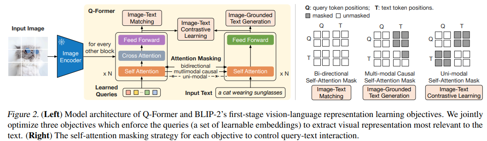
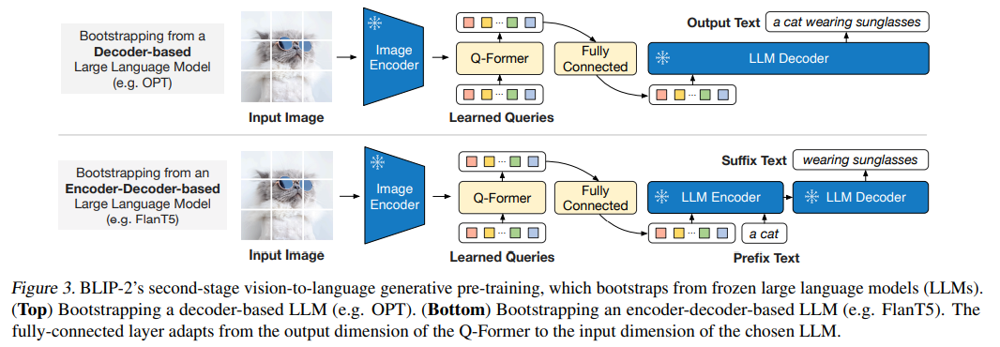
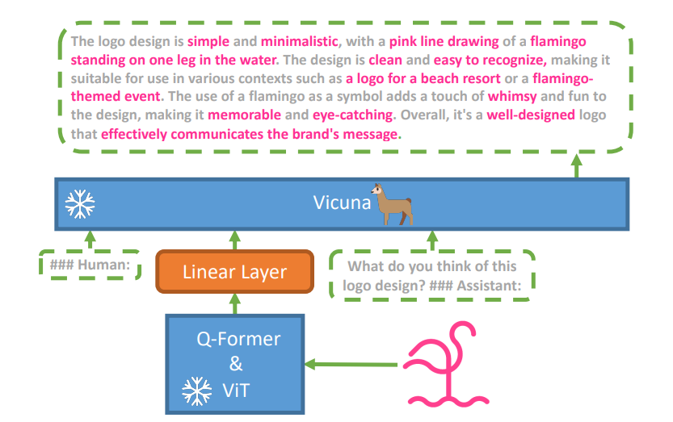
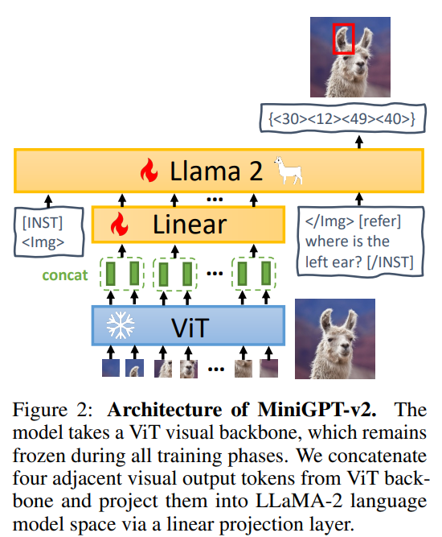
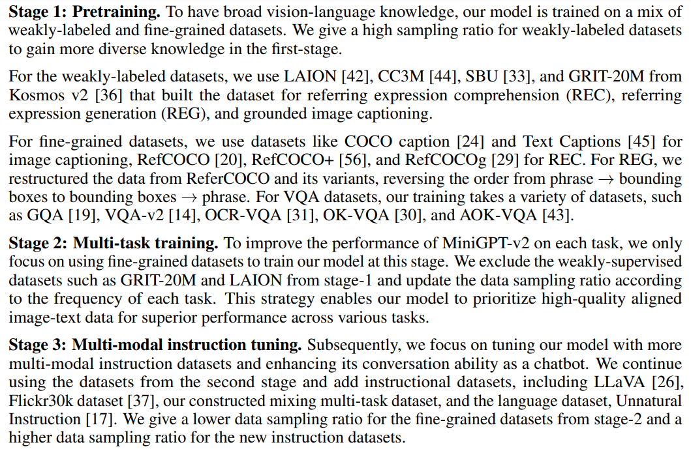
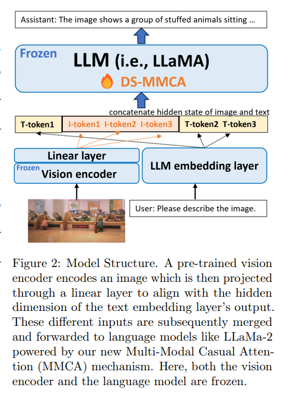

- [1.Blip-2](#1blip-2)
  - [1.1 stage1](#11-stage1)
  - [1.2 stage2](#12-stage2)
  - [1.3 Caption:](#13-caption)
  - [1.4 retrieval:](#14-retrieval)
  - [1.4 vqa:](#14-vqa)
  - [1.5 result:](#15-result)
- [2.MiniGPT-4](#2minigpt-4)
  - [2.1 model](#21-model)
  - [2.2 model code:](#22-model-code)
- [3.DeepSpeed-VisualChat:](#3deepspeed-visualchat)
  - [3.1 model:](#31-model)
  - [3.2 code:](#32-code)


### 1.Blip-2
#### 1.1 stage1
- model structure

- model core code
    ```
    self.tokenizer = self.init_tokenizer()

    self.visual_encoder, self.ln_vision = self.init_vision_encoder(
        vit_model, img_size, drop_path_rate, use_grad_checkpoint, vit_precision
    )
    if freeze_vit:
        for name, param in self.visual_encoder.named_parameters():
            param.requires_grad = False
        self.visual_encoder = self.visual_encoder.eval()
        self.visual_encoder.train = disabled_train
        logging.info("freeze vision encoder")
    self.Qformer, self.query_tokens = self.init_Qformer(
        num_query_token, self.visual_encoder.num_features, cross_attention_freq
    )
    self.Qformer.resize_token_embeddings(len(self.tokenizer))
    state_dict = self.Qformer.state_dict()
    for name, param in self.Qformer.named_parameters():
        if "_query" in name:
            key_orig = name.replace("_query", "")
            param.data.copy_(state_dict[key_orig])

    self.vision_proj = nn.Linear(self.Qformer.config.hidden_size, embed_dim)
    self.text_proj = nn.Linear(self.Qformer.config.hidden_size, embed_dim)

    self.itm_head = nn.Linear(self.Qformer.config.hidden_size, 2)

    self.temp = nn.Parameter(0.07 * torch.ones([]))
    self.max_txt_len = max_txt_len
    ```
    ```
    # init_Qformer
    @classmethod
    def init_Qformer(cls, num_query_token, vision_width, cross_attention_freq=2):
        encoder_config = BertConfig.from_pretrained("/mnt/f/aigc_data/model/bert-base-uncased/")
        encoder_config.encoder_width = vision_width
        # insert cross-attention layer every other block
        encoder_config.add_cross_attention = True
        encoder_config.cross_attention_freq = cross_attention_freq
        encoder_config.query_length = num_query_token
        Qformer = BertLMHeadModel.from_pretrained(
            "/mnt/f/aigc_data/model/bert-base-uncased/", config=encoder_config, ignore_mismatched_sizes=True
        )
        query_tokens = nn.Parameter(
            torch.zeros(1, num_query_token, encoder_config.hidden_size)
        )
        query_tokens.data.normal_(mean=0.0, std=encoder_config.initializer_range)
        return Qformer, query_tokens
    ```
- dataset
    ```
    129M images in total, including COCO (Linet al., 2014), Visual Genome (Krishna et al., 2017), CC3M (Sharma et al., 2018), CC12M (Changpinyo et al.,2021), SBU (Ordonez et al., 2011), and 115M images from the LAION400M dataset (Schuhmann et al., 2021)
    #my test：coco
    ```
- loss
    - Image-Text Contrastive Learning(ITC)
        ```
        # align image representation and text representation such that their mutual information is maximized. It achieves so by contrasting the image-text similarity of a positive pair against those of negative pairs
        # Image-text Contrastive
        # image-text similarity: aggregate across all query tokens
        sim_q2t = torch.matmul(
            image_feats.unsqueeze(1), text_feat_all.unsqueeze(-1)
        ).squeeze()
        # [batch_size, batch_size*num_gpu, num_query_tokens]
        # image-text similarity: aggregate across all query tokens
        sim_i2t, _ = sim_q2t.max(-1)
        sim_i2t = sim_i2t / self.temp
        # text-query similarity: [batch_size, batch_size*num_gpu, num_query_tokens]
        sim_t2q = torch.matmul(
            text_feat.unsqueeze(1).unsqueeze(1), image_feats_all.permute(0, 2, 1)
        ).squeeze()
        # text-image similarity: aggregate across all query tokens
        sim_t2i, _ = sim_t2q.max(-1)
        sim_t2i = sim_t2i / self.temp  # [batch_size, batch_size*num_gpu]

        # dist.init_process_group("nccl", init_method='env://')
        rank = dist.get_rank()
        bs = image.size(0)
        targets = torch.linspace(rank * bs, rank * bs + bs - 1, bs, dtype=int).to(
            image.device
        )
        loss_itc = (
            F.cross_entropy(sim_i2t, targets, label_smoothing=0.1)
            + F.cross_entropy(sim_t2i, targets, label_smoothing=0.1)
        ) / 2
        ```
    - Image-Text Matching (ITM)
        ```
        # learn fine-grained alignment between image and text representation. It is a binary classification task where the model is asked to predict whether an image-text pair is positive (matched) or negative (unmatched). 
        text_input_ids_world = concat_all_gather(text_tokens.input_ids)
        text_attention_mask_world = concat_all_gather(text_tokens.attention_mask)
        image_embeds_world = all_gather_with_grad(image_embeds)
        with torch.no_grad():
            if "image_id" in samples.keys():
                mask = torch.eq(image_ids, image_ids_all.t())
                sim_t2i.masked_fill_(mask, -10000)
                sim_i2t.masked_fill_(mask, -10000)
            else:    
                sim_t2i[:, rank * bs : rank * bs + bs].fill_diagonal_(-10000)
                sim_i2t[:, rank * bs : rank * bs + bs].fill_diagonal_(-10000)            
                
            weights_t2i = F.softmax(sim_t2i, dim=1)
            weights_i2t = F.softmax(sim_i2t, dim=1)

        # select a negative image for each text
        image_embeds_neg = []
        for b in range(bs):
            neg_idx = torch.multinomial(weights_t2i[b], 1).item()
            image_embeds_neg.append(image_embeds_world[neg_idx])
        image_embeds_neg = torch.stack(image_embeds_neg, dim=0)

        # select a negative text for each image
        text_ids_neg = []
        text_atts_neg = []
        for b in range(bs):
            neg_idx = torch.multinomial(weights_i2t[b], 1).item()
            text_ids_neg.append(text_input_ids_world[neg_idx])
            text_atts_neg.append(text_attention_mask_world[neg_idx])

        text_ids_neg = torch.stack(text_ids_neg, dim=0)
        text_atts_neg = torch.stack(text_atts_neg, dim=0)

        text_ids_all = torch.cat(
            [text_tokens.input_ids, text_tokens.input_ids, text_ids_neg], dim=0
        )  # pos, pos, neg
        text_atts_all = torch.cat(
            [text_tokens.attention_mask, text_tokens.attention_mask, text_atts_neg],
            dim=0,
        )

        query_tokens_itm = self.query_tokens.expand(text_ids_all.shape[0], -1, -1)
        query_atts_itm = torch.ones(query_tokens_itm.size()[:-1], dtype=torch.long).to(
            image.device
        )
        attention_mask_all = torch.cat([query_atts_itm, text_atts_all], dim=1)

        image_embeds_all = torch.cat(
            [image_embeds, image_embeds_neg, image_embeds], dim=0
        )  # pos, neg, pos
        image_atts_all = torch.ones(image_embeds_all.size()[:-1], dtype=torch.long).to(
            image.device
        )

        output_itm = self.Qformer.bert(
            text_ids_all,
            query_embeds=query_tokens_itm,
            attention_mask=attention_mask_all,
            encoder_hidden_states=image_embeds_all,
            encoder_attention_mask=image_atts_all,
            return_dict=True,
        )

        vl_embeddings = output_itm.last_hidden_state[:, : query_tokens_itm.size(1), :]
        vl_output = self.itm_head(vl_embeddings)
        logits = vl_output.mean(dim=1)

        itm_labels = torch.cat(
            [torch.ones(bs, dtype=torch.long), torch.zeros(2 * bs, dtype=torch.long)],
            dim=0,
        ).to(image.device)
        loss_itm = F.cross_entropy(logits, itm_labels)
        self.itm_head = nn.Linear(self.Qformer.config.hidden_size, 2)
        vl_embeddings = output_itm.last_hidden_state[:, : query_tokens_itm.size(1), :]
        vl_output = self.itm_head(vl_embeddings)
        loss_itm = F.cross_entropy(logits, itm_labels)
        ```
    - Image-grounded Text Generation(IM)
        ```
        # trains the Q-Former to generate texts, given input images as the condition.
        query_output = self.Qformer.bert(
            query_embeds=query_tokens,
            encoder_hidden_states=image_embeds,
            encoder_attention_mask=image_atts,
            use_cache=True,
            return_dict=True,
        )
        lm_output = self.Qformer(
            decoder_input_ids,
            attention_mask=attention_mask,
            past_key_values=query_output.past_key_values,
            return_dict=True,
            labels=labels,
        )
        ```

- train
    ```
    [INFO] {
        "arch": "blip2",
        "drop_path_rate": 0,
        "finetuned": "",
        "freeze_vit": true,
        "image_size": 224,
        "load_finetuned": false,
        "load_pretrained": false,
        "model_type": "pretrain",
        "num_query_token": 32,
        "pretrained": "https://storage.googleapis.com/sfr-vision-language-research/LAVIS/models/BLIP2/blip2_pretrained.pth",
        "use_grad_checkpoint": true,
        "vit_precision": "fp16"
    }
    Train: data epoch: [0]  [     0/141686]  eta: 25 days, 6:33:10  lr: 0.000001  loss: 12.6299  loss_itc: 1.3381 (1.3381)  loss_itm: 0.6693 (0.6693)  loss_lm: 10.6225 (10.6225)  time: 15.4115  data: 0.0000  max mem: 4790
    Train: data epoch: [0]  [    50/141686]  eta: 3 days, 22:03:01  lr: 0.000002  loss: 11.9090  loss_itc: 1.4567 (1.4305)  loss_itm: 0.6391 (0.6522)  loss_lm: 10.0633 (10.3399)  time: 2.1639  data: 0.0000  max mem: 6246
    Train: data epoch: [0]  [   100/141686]  eta: 3 days, 14:37:00  lr: 0.000003  loss: 10.7109  loss_itc: 1.4236 (1.4291)  loss_itm: 0.6235 (0.6447)  loss_lm: 8.6893 (9.7355)  time: 2.0241  data: 0.0000  max mem: 6246
    ```
 
#### 1.2 stage2

- train
    ```
    [INFO] {
        "arch": "blip2_opt",
        "drop_path_rate": 0,
        "finetuned": "",
        "freeze_vit": true,
        "image_size": 224,
        "load_finetuned": false,
        "load_pretrained": true,
        "model_type": "pretrain_opt2.7b",
        "num_query_token": 32,
        "opt_model": "facebook/opt-2.7b",
        "pretrained": "/mnt/f/aigc_data/model/vit/blip2_pretrained.pth",
        "prompt": "",
        "use_grad_checkpoint": false,
        "vit_precision": "fp16"
    }
    ```
- all:
    ```
    class Blip2OPT(Blip2Base):
        """
        BLIP2 OPT model.
        Supported model types:
            - pretrained_opt2.7b: pretrained model with OPT2.7b
            - pretrained_opt6.7b: pretrained model with OPT6.7b
            - caption_coco_opt2.7b: fintuned image captioning model with OPT2.7b
            - caption_coco_opt6.7b: fintuned image captioning model with OPT6.7b
        Usage:
            >>> from lavis.models import load_model
            >>> model = load_model("blip2_opt", "caption_coco_opt2.7b")
        """
        PRETRAINED_MODEL_CONFIG_DICT = {
            "pretrain_opt2.7b": "configs/models/blip2/blip2_pretrain_opt2.7b.yaml",
            "pretrain_opt6.7b": "configs/models/blip2/blip2_pretrain_opt6.7b.yaml",
            "caption_coco_opt2.7b": "configs/models/blip2/blip2_caption_opt2.7b.yaml",
            "caption_coco_opt6.7b": "configs/models/blip2/blip2_caption_opt6.7b.yaml",
        }

        def __init__(
            self,
            vit_model="eva_clip_g",
            img_size=224,
            drop_path_rate=0,
            use_grad_checkpoint=False,
            vit_precision="fp16",
            freeze_vit=True,
            num_query_token=32,
            opt_model="/mnt/f/aigc_data/model/facebook/opt-2.7b",
            prompt="",
            max_txt_len=32,
            apply_lemmatizer=False,
        ):
            """
            apply_lemmatizer: when set to True, postprocess predict_answers() result with lemmas.
            """
            super().__init__()
            transformers_version = version.parse(transformers.__version__)
            assert transformers_version >= version.parse("4.27"), "BLIP-2 OPT requires transformers>=4.27"

            opt_model="/mnt/f/aigc_data/model/facebook/opt-2.7b"
            self.opt_tokenizer = AutoTokenizer.from_pretrained(opt_model, use_fast=False)
            self.opt_model = OPTForCausalLM.from_pretrained(
                opt_model, torch_dtype=torch.float16
            )
            
            self.tokenizer = self.init_tokenizer()

            self.visual_encoder, self.ln_vision = self.init_vision_encoder(
                vit_model, img_size, drop_path_rate, use_grad_checkpoint, vit_precision
            )
            if freeze_vit:
                for name, param in self.visual_encoder.named_parameters():
                    param.requires_grad = False
                self.visual_encoder = self.visual_encoder.eval()
                self.visual_encoder.train = disabled_train
                logging.info("freeze vision encoder")

            self.Qformer, self.query_tokens = self.init_Qformer(
                num_query_token, self.visual_encoder.num_features
            )
            self.Qformer.cls = None
            self.Qformer.bert.embeddings.word_embeddings = None
            self.Qformer.bert.embeddings.position_embeddings = None
            for layer in self.Qformer.bert.encoder.layer:
                layer.output = None
                layer.intermediate = None

            for name, param in self.opt_model.named_parameters():
                param.requires_grad = False
            self.eos_token_id = self.opt_tokenizer(
                "\n", add_special_tokens=False
            ).input_ids[0]

            # 更新此参数
            self.opt_proj = nn.Linear(
                self.Qformer.config.hidden_size, self.opt_model.config.hidden_size
            )

            self.max_txt_len = max_txt_len
            self.prompt = prompt
            prompt_tokens = self.opt_tokenizer(self.prompt, return_tensors="pt")
            self.prompt_length = prompt_tokens.attention_mask.sum(1)
            
            self._apply_lemmatizer = apply_lemmatizer
            self._lemmatizer = None       

        def forward(self, samples):
            image = samples["image"]
            with self.maybe_autocast():
                image_embeds = self.ln_vision(self.visual_encoder(image))
            image_atts = torch.ones(image_embeds.size()[:-1], dtype=torch.long).to(
                image.device
            )

            query_tokens = self.query_tokens.expand(image_embeds.shape[0], -1, -1)
            query_output = self.Qformer.bert(
                query_embeds=query_tokens,
                encoder_hidden_states=image_embeds,
                encoder_attention_mask=image_atts,
                return_dict=True,
            )

            inputs_opt = self.opt_proj(query_output.last_hidden_state)
            atts_opt = torch.ones(inputs_opt.size()[:-1], dtype=torch.long).to(image.device) # 关键

            self.opt_tokenizer.padding_side = "right"

            text = [t + "\n" for t in samples["text_input"]]

            opt_tokens = self.opt_tokenizer(
                text,
                return_tensors="pt",
                padding="longest",
                truncation=True,
                max_length=self.max_txt_len,
            ).to(image.device)

            targets = opt_tokens.input_ids.masked_fill(
                opt_tokens.input_ids == self.opt_tokenizer.pad_token_id, -100
            )
            if self.prompt:
                targets[:, : self.prompt_length] = -100  # do not apply loss to the prompt

            empty_targets = (
                torch.ones(atts_opt.size(), dtype=torch.long).to(image.device).fill_(-100)
            )
            targets = torch.cat([empty_targets, targets], dim=1)

            inputs_embeds = self.opt_model.model.decoder.embed_tokens(opt_tokens.input_ids)
            inputs_embeds = torch.cat([inputs_opt, inputs_embeds], dim=1)
            attention_mask = torch.cat([atts_opt, opt_tokens.attention_mask], dim=1)

            with self.maybe_autocast():
                outputs = self.opt_model(
                    inputs_embeds=inputs_embeds,
                    attention_mask=attention_mask,
                    return_dict=True,
                    labels=targets,
                )
            loss = outputs.loss

            return {"loss": loss}
    ```

#### 1.3 Caption:
    ```
    "prompt": "a photo of",
    ```

#### 1.4 retrieval:
    ```
    # loss
    image_ids = samples["image_id"].view(-1,1)
    image_ids_all = concat_all_gather(image_ids)
    pos_idx = torch.eq(image_ids, image_ids_all.t()).float()       
    sim_targets = pos_idx / pos_idx.sum(1,keepdim=True)   
    sim_targets = 0.9 * sim_targets + 0.1 * torch.ones_like(sim_targets) / sim_targets.size(1)

    loss_t2i = -torch.sum(F.log_softmax(sim_t2i, dim=1)*sim_targets,dim=1).mean()
    loss_i2t = -torch.sum(F.log_softmax(sim_i2t, dim=1)*sim_targets,dim=1).mean()     
    loss_itc = (loss_t2i+loss_i2t)/2 
    ```

#### 1.4 vqa:
    ```
    # default
    ```
#### 1.5 result:
    ```
    
    ```

### 2.MiniGPT-4
#### 2.1 model
MiniGPT-4:

MiniGPT-V2:



#### 2.2 model code:
- forward:
    ```
    def forward(self, samples, reduction='mean'):
        # prepare the embedding to condition and the embedding to regress
        cond_embeds, cond_atts, regress_embeds, regress_atts, part_targets = \
            self.preparing_embedding(samples)

        # concat the embedding to condition and the embedding to regress
        inputs_embeds, attention_mask, input_lens = \
            self.concat_emb_input_output(cond_embeds, cond_atts, regress_embeds, regress_atts)

        # get bos token embedding
        bos = torch.ones_like(part_targets[:, :1]) * self.llama_tokenizer.bos_token_id
        bos_embeds = self.embed_tokens(bos)
        bos_atts = cond_atts[:, :1]

        # add bos token at the begining
        inputs_embeds = torch.cat([bos_embeds, inputs_embeds], dim=1)
        attention_mask = torch.cat([bos_atts, attention_mask], dim=1)

        # ensemble the final targets
        targets = torch.ones([inputs_embeds.shape[0], inputs_embeds.shape[1]],
                             dtype=torch.long).to(self.device).fill_(-100)

        for i, target in enumerate(part_targets):
            targets[i, input_lens[i]+1:input_lens[i]+len(target)+1] = target  # plus 1 for bos

        with self.maybe_autocast():
            outputs = self.llama_model(
                inputs_embeds=inputs_embeds,
                attention_mask=attention_mask,
                return_dict=True,
                labels=targets,
                reduction=reduction
            )
        loss = outputs.loss

        return {"loss": loss}
    ```

### 3.DeepSpeed-VisualChat:
#### 3.1 model:

#### 3.2 code:
    ```
    class DeepSpeedViLModel(nn.Module):
        def __init__(self, vis_encoder,
                        lang_decoder,
                        tokenizer,
                        vis_config=None, 
                        decoder_name='gpt2',
                        lang_config=None,
                        max_seq_length=512,
                        args=None):
            super().__init__()
            self.vis_encoder = vis_encoder
            
            self.lang_decoder = lang_decoder 
            self.tokenizer = tokenizer 
            self.args = args
            self._enable_special_token()

            self.lang_config = lang_config
            self._get_model_stat(decoder_name)
            lang_embed, pos_embedding = self._languag_embedding()
            self.pos_embedding = pos_embedding
            self.max_seq_length = max_seq_length
            if lang_embed is None:
                print ('randomly initialized a language embedding')
                self.lang_embed = nn.Embedding(self.lang_config.vocab_size,\
                                                self.hidden_size,\
                                                self.pad_token_id) # randomly initialized language embedder
            else:
                self.lang_embed = lang_embed

            self.pos_embedding = pos_embedding
            self.projection = self.build_projection(vis_config, self.lang_config.hidden_size)   
            self._init_weight()
            

            # get padding token embedding
            self.padding_embedding = None 
            self.vis_encoder_update = None

        def _enable_special_token(self):
            self.DEFAULT_IMAGE_TOKEN_ID = self.tokenizer.convert_tokens_to_ids(DST.DEFAULT_IMAGE_TOKEN)
            self.DEFAULT_IMAGE_PATCH_TOKEN_ID = self.tokenizer.convert_tokens_to_ids(DST.DEFAULT_IMAGE_PATCH_TOKEN)
            self.DEFAULT_IM_START_TOKEN_ID = self.tokenizer.convert_tokens_to_ids(DST.DEFAULT_IM_START_TOKEN)
            self.DEFAULT_IM_END_TOKEN_ID = self.tokenizer.convert_tokens_to_ids(DST.DEFAULT_IM_END_TOKEN)

            
        def _get_model_stat(self, model_name):   
            config_dic = {
                'llama-2': ['max_position_embeddings','num_hidden_layers'],
                'llama': ['max_position_embeddings','num_hidden_layers'],
                'gpt2': ['n_positions','n_layer'],
                'opt': ['max_position_embeddings','num_hidden_layers']
            }
            pos_name, layer_name = config_dic[model_name][0], config_dic[model_name][1]
            self.n_positions = getattr(self.lang_config, pos_name)
            self.num_layer = getattr(self.lang_config, layer_name)
            self.hidden_size  = getattr(self.lang_config, 'hidden_size')
            self.vocab_size = getattr(self.lang_config, 'vocab_size')
            
        def _languag_embedding(self):
            pos_embedding = None
            token_embedding = None
            for name, module in self.lang_decoder.named_modules():
                if isinstance(module, nn.Embedding):
                    try:
                        # z3 shape
                        rows = module.weight.ds_shape[0]
                    except:
                        rows = module.weight.size()[0]
                        
                    if rows == self.vocab_size:
                        token_embedding = copy.deepcopy(module)
                    if rows == self.n_positions:
                        pos_embedding = copy.deepcopy(module)
            return token_embedding, pos_embedding
        
            
        def _init_weight(self):
            self.vis_encoder.requires_grad_(False)  
            self.lang_decoder.requires_grad_(False)  
            self.lang_embed.requires_grad_(True)   
            self.projection.requires_grad_(True) 
            if  self.pos_embedding  is not None:     
                self.pos_embedding.requires_grad_(True) 
            

        def build_projection(self, vis_config, lang_dim):
            if self.args.vis_proj == 'vit':
                output =  VisProjection_vit(vis_config, lang_dim=lang_dim)
                return output 
            elif self.args.vis_proj == 'baseline':
                return nn.Sequential( 
                                nn.Linear(vis_config.hidden_size, lang_dim), # an example implementation
                                nn.LayerNorm(lang_dim, eps=1e-12))
            elif self.args.vis_proj == 'perceiver':
                return VisProjection_perceiver(vis_config, lang_dim=lang_dim)

        def concat(self, img_proj, lang, attention_mask, input_labels, image_num, do_generation=False):
            output_lang = []
            output_attention_mask = []
            output_input_labels = []

            def split_tensor_by_a_list(tensor, split_list):
                output = []
                initial_pos = 0
                accumulated_sum = [sum(split_list[:i]) for i in range(1, len(split_list)+1)]
                for pos in accumulated_sum:
                    output.append(tensor[initial_pos:pos])
                    initial_pos = pos
                del tensor
                return output
            
            img_proj = split_tensor_by_a_list(img_proj, image_num)
            
            for index in range(len(img_proj)): # each seq has multi iamges, so we need to use it as index
                initial_pos = 0
                cur_img = img_proj[index]
                cur_lang = lang[index]
                cur_attention_mask = attention_mask[index]
                cur_input_labels = input_labels[index]
                img_pos_list = cur_lang.eq(self.DEFAULT_IMAGE_TOKEN_ID).nonzero(as_tuple=True)[0]
                assert len(img_pos_list) == image_num[index], "the number of images in the lang and image_num does not match"
                if len(img_pos_list) == 0:
                    continue # there is no image probably it is a pure text insturctio
                
                cur_lang = self.lang_embed(cur_lang) # get the real embedding
                for img_i, img_pos in zip(cur_img, torch.flip(img_pos_list, dims=(0,))): # do it reversely so that we can easily insert the image
                    lang_pre_img_embed = cur_lang[initial_pos:img_pos]
                    attention_mask_pre_img = cur_attention_mask[initial_pos:img_pos]
                    input_labels_pre_img = cur_input_labels[initial_pos:img_pos]

                    lang_post_img_embed = cur_lang[img_pos+1:]
                    attention_mask_post_img = cur_attention_mask[img_pos+1:]
                    input_labels_post_img = cur_input_labels[img_pos+1:]
                    # now we need to concat the image embedding
                    lang_full = torch.cat((lang_pre_img_embed, img_i, lang_post_img_embed), dim=0)
                    # label the position of all images as 2 instead of 1
        
                    attention_mask_full = torch.cat( (attention_mask_pre_img, 2 * torch.ones_like(img_i[:, 0]), attention_mask_post_img), dim=0)

                    input_labels_full = torch.cat((input_labels_pre_img.long(), DST.DEFAULT_LABEL_PADDING_NUM * torch.ones_like(img_i[:, 0], dtype=torch.long), input_labels_post_img),   dim=0)

                    cur_lang = lang_full
                    cur_attention_mask = attention_mask_full
                    cur_input_labels = input_labels_full
                # append to the output 
                output_lang.append(lang_full.unsqueeze(0))
                output_attention_mask.append(attention_mask_full.unsqueeze(0))
                output_input_labels.append(input_labels_full.unsqueeze(0))

            if self.padding_embedding is None:
                with torch.no_grad():
                    self.padding_embedding = self.lang_embed(torch.tensor(self.tokenizer.pad_token_id).to(lang.device).unsqueeze(0)).unsqueeze(0).detach()

            def pad_tensor_list(tensor_list, pad_token_id, pad_vec=False):
                max_len = max([tensor.size(1) for tensor in tensor_list])
                if not do_generation:
                    max_len = int(np.ceil(max_len / 8) * 8) # make it divisible by 8
                padded_tensor_list = []
                for tensor in tensor_list:
                    if max_len > tensor.size(1):
                        if pad_vec: # output_lang padding
                            # pad with self.padding_embedding 
                            padded_tensor = torch.cat([tensor] + [self.padding_embedding] * (max_len - tensor.size(1)), dim=1)
                            
                        else:
                            padded_tensor = F.pad(tensor, (0, max_len - tensor.size(1)), value=pad_token_id)
                    else:
                        padded_tensor = tensor
                    padded_tensor_list.append(padded_tensor)
                return padded_tensor_list
            output_lang = pad_tensor_list(output_lang, self.tokenizer.pad_token_id, pad_vec=True)
            output_attention_mask = pad_tensor_list(output_attention_mask, 0)
            output_input_labels = pad_tensor_list(output_input_labels, DST.DEFAULT_LABEL_PADDING_NUM)

            return torch.cat(output_lang, dim=0), torch.cat(output_attention_mask, dim=0), torch.cat(output_input_labels, dim=0)

        def forward(self, img, lang, 
                attention_mask=None,
                input_labels=None,
                image_num=1,
                past_key_values=None,
                use_cache=False,
                output_attentions=False, 
                output_hidden_states=False,
                return_dict=True):
            
            assert attention_mask is not None, "attention mask is required"
            assert input_labels is not None, "input labels is required"

            if self.vis_encoder_update is None:
                self.vis_encoder_update = False # default is False
                for p in self.vis_encoder.parameters():
                    if p.requires_grad:
                        self.vis_encoder_update = True
            # this part for now does not require gradient
            if self.vis_encoder_update:
                # update vis encoder
                img_feature = self.vis_encoder(img) 
                if not isinstance(img_feature, torch.Tensor):
                    img_feature = img_feature.last_hidden_state
            else:
                # do not update vis encoder
                with torch.no_grad():
                    img_feature = self.vis_encoder(img)
                    if not isinstance(img_feature, torch.Tensor):
                        img_feature = img_feature.last_hidden_state
            img_proj = self.projection(img_feature)
        
            hidden_states, attention_mask, input_labels = self.concat(img_proj, lang, attention_mask, input_labels, image_num)
            labels = input_labels   
                
            if self.pos_embedding is not None:
                if past_key_values is None:
                    past_length = 0
                else:
                    past_length = past_key_values[0][0].size(-2)
                position_ids = torch.arange(past_length, hidden_states.size()[1] + past_length, dtype=torch.long, device=hidden_states.device)
                position_ids = position_ids.unsqueeze(0).view(-1, hidden_states.size()[1])
                position_embeds = self.pos_embedding(position_ids)
                hidden_states = hidden_states + position_embeds
                
            logits = self.lang_decoder(input_ids=None, 
                                        inputs_embeds=hidden_states,
                                        attention_mask=attention_mask,
                                        labels=None,
                                        past_key_values=past_key_values,
                                        use_cache=use_cache,
                                        output_attentions=output_attentions, 
                                        output_hidden_states=output_hidden_states,
                                        return_dict=return_dict).logits
            
            
            logits_shift = logits[..., :-1, :].contiguous().view(-1, self.vocab_size) # remove the last token
            labels_shift = labels[..., 1:].contiguous().to(logits_shift.device).view(-1) # remove the first token
            # select index that is not -100
            labels_index = labels_shift != -100
            if torch.sum(labels_index) ==0:
                logits_shift = logits_shift[-2:,:].contiguous()
                labels_shift = labels_shift[-2:].contiguous()            
            else:
                logits_shift = logits_shift[labels_index,:].contiguous()
                labels_shift = labels_shift[labels_index].contiguous()

            loss_fct = CrossEntropyLoss() 
            loss = loss_fct(logits_shift, labels_shift) 
            
            return [loss,] 
    ```

