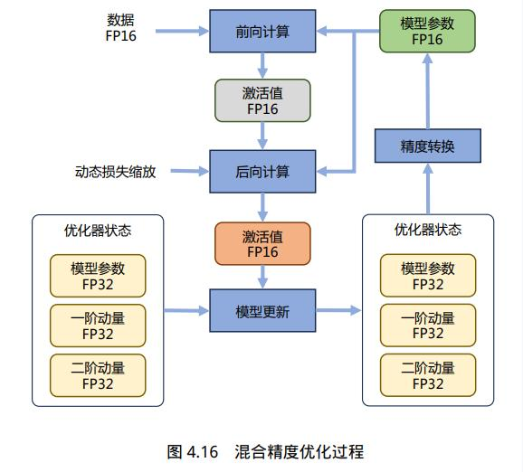

### 目录
- [目录](#目录)
- [1 DeepSpeed](#1-deepspeed)
  - [1.1 pipeline\_parallelism](#11-pipeline_parallelism)
  - [1.2 DeepSpeed-Chat](#12-deepspeed-chat)
  - [1.3 DeepSpeed-VisualChat](#13-deepspeed-visualchat)
- [2.LangChain](#2langchain)


### 1 DeepSpeed

Zero (Zero Redundancy Optimizer)目标就是针对模型状态的存储进行去除冗余的优化。ZeRO 使用分区的方法，即将模型状态量分割成多个分区，每个计算设备只保存其中的一部分。这样整个训练系统内只需要维护一份模型状态，减少了内存消耗和通信开销。具体来说: 对Adam优化器状态进行分区(Zero-1); 对模型梯度进行分区(Zero-2); 对模型参数也进行分区(Zero-3)。

    https://github.com/microsoft/DeepSpeedExamples
#### 1.1 pipeline_parallelism

```
# train sh
import deepspeed
from deepspeed.pipe import PipelineModule
from deepspeed.utils import RepeatingLoader
deepspeed train.py --deepspeed_config=ds_config.json -p 2 --steps=200
# config-> ds_config
 {
  "train_batch_size" : 256,
  "train_micro_batch_size_per_gpu" : 8,

   "optimizer": {
    "type": "Adam",
    "params": {
      "lr": 0.001,
      "betas": [
        0.9,
        0.999
      ],
      "eps": 1e-8
    }
  },
  
  "steps_per_print" : 10,
  "wall_clock_breakdown" : false
 }

# train base
engine, _, dataloader, __ = deepspeed.initialize(
    args=args,
    model=net,
    model_parameters=[p for p in net.parameters() if p.requires_grad],
    training_data=trainset)


rank = dist.get_rank()
gas = engine.gradient_accumulation_steps()

dataloader = RepeatingLoader(dataloader)
data_iter = iter(dataloader)

# training step
outputs = engine(inputs)
loss = criterion(outputs, labels)
engine.backward(loss)
engine.step()


# training pipeline
net = AlexNet(num_classes=10)
net = PipelineModule(layers=join_layers(net),
                        loss_fn=torch.nn.CrossEntropyLoss(),
                        num_stages=args.pipeline_parallel_size,
                        partition_method=part,
                        activation_checkpoint_interval=0)

trainset = cifar_trainset(args.local_rank)

engine, _, _, _ = deepspeed.initialize(
    args=args,
    model=net,
    model_parameters=[p for p in net.parameters() if p.requires_grad],
    training_data=trainset)

for step in range(args.steps):
    loss = engine.train_batch()
```

#### 1.2 DeepSpeed-Chat
```
https://github.com/microsoft/DeepSpeedExamples/tree/master/applications/DeepSpeed-Chat
```

#### 1.3 DeepSpeed-VisualChat
```
https://github.com/microsoft/DeepSpeedExamples/tree/master/applications/DeepSpeed-VisualChat
```


### 2.LangChain
```
https://github.com/chatchat-space/Langchain-Chatchat/tree/master
```