### 1. DDPM
#### 1.1 model core
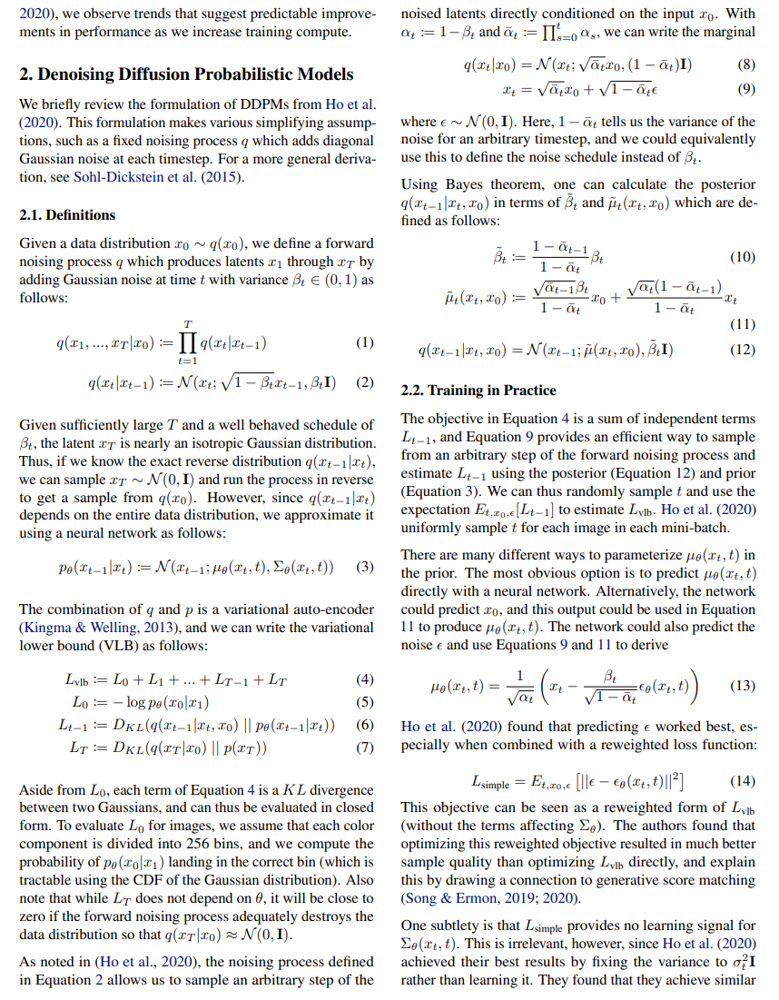

#### 1.2 code
- model:
    -  beta
        ```
        def get_named_beta_schedule(schedule_name, num_diffusion_timesteps):
            """
            Get a pre-defined beta schedule for the given name.

            The beta schedule library consists of beta schedules which remain similar
            in the limit of num_diffusion_timesteps.
            Beta schedules may be added, but should not be removed or changed once
            they are committed to maintain backwards compatibility.
            """
            if schedule_name == "linear":
                # Linear schedule from Ho et al, extended to work for any number of
                # diffusion steps.
                scale = 1000 / num_diffusion_timesteps
                beta_start = scale * 0.0001
                beta_end = scale * 0.02
                return np.linspace(
                    beta_start, beta_end, num_diffusion_timesteps, dtype=np.float64
                )
            elif schedule_name == "cosine":
                return betas_for_alpha_bar(
                    num_diffusion_timesteps,
                    lambda t: math.cos((t + 0.008) / 1.008 * math.pi / 2) ** 2,
                )
            else:
                raise NotImplementedError(f"unknown beta schedule: {schedule_name}")
        ```
    - compute ref
        ```
        def q_mean_variance(self, x_start, t):
            """
            Get the distribution q(x_t | x_0).

            :param x_start: the [N x C x ...] tensor of noiseless inputs.
            :param t: the number of diffusion steps (minus 1). Here, 0 means one step.
            :return: A tuple (mean, variance, log_variance), all of x_start's shape.
            """
            mean = (
                _extract_into_tensor(self.sqrt_alphas_cumprod, t, x_start.shape) * x_start
            )
            variance = _extract_into_tensor(1.0 - self.alphas_cumprod, t, x_start.shape)
            log_variance = _extract_into_tensor(
                self.log_one_minus_alphas_cumprod, t, x_start.shape
            )
            return mean, variance, log_variance

        def q_sample(self, x_start, t, noise=None):
            """
            Diffuse the data for a given number of diffusion steps.

            In other words, sample from q(x_t | x_0).

            :param x_start: the initial data batch.
            :param t: the number of diffusion steps (minus 1). Here, 0 means one step.
            :param noise: if specified, the split-out normal noise.
            :return: A noisy version of x_start.
            """
            if noise is None:
                noise = th.randn_like(x_start)
            assert noise.shape == x_start.shape
            return (
                _extract_into_tensor(self.sqrt_alphas_cumprod, t, x_start.shape) * x_start
                + _extract_into_tensor(self.sqrt_one_minus_alphas_cumprod, t, x_start.shape)
                * noise
            )

        def q_posterior_mean_variance(self, x_start, x_t, t):
            """
            Compute the mean and variance of the diffusion posterior:
                q(x_{t-1} | x_t, x_0)
            """
            assert x_start.shape == x_t.shape
            posterior_mean = (
                _extract_into_tensor(self.posterior_mean_coef1, t, x_t.shape) * x_start
                + _extract_into_tensor(self.posterior_mean_coef2, t, x_t.shape) * x_t
            )
            posterior_variance = _extract_into_tensor(self.posterior_variance, t, x_t.shape)
            posterior_log_variance_clipped = _extract_into_tensor(
                self.posterior_log_variance_clipped, t, x_t.shape
            )
            assert (
                posterior_mean.shape[0]
                == posterior_variance.shape[0]
                == posterior_log_variance_clipped.shape[0]
                == x_start.shape[0]
            )
            return posterior_mean, posterior_variance, posterior_log_variance_clipped
        ```
    - compute modelout
        ```
        def p_mean_variance(
            self, model, x, t, clip_denoised=True, denoised_fn=None, model_kwargs=None
        ):
            """
            Apply the model to get p(x_{t-1} | x_t), as well as a prediction of
            the initial x, x_0.

            :param model: the model, which takes a signal and a batch of timesteps
                        as input.
            :param x: the [N x C x ...] tensor at time t.
            :param t: a 1-D Tensor of timesteps.
            :param clip_denoised: if True, clip the denoised signal into [-1, 1].
            :param denoised_fn: if not None, a function which applies to the
                x_start prediction before it is used to sample. Applies before
                clip_denoised.
            :param model_kwargs: if not None, a dict of extra keyword arguments to
                pass to the model. This can be used for conditioning.
            :return: a dict with the following keys:
                    - 'mean': the model mean output.
                    - 'variance': the model variance output.
                    - 'log_variance': the log of 'variance'.
                    - 'pred_xstart': the prediction for x_0.
            """
            if model_kwargs is None:
                model_kwargs = {}

            B, C = x.shape[:2]
            assert t.shape == (B,)
            model_output = model(x, self._scale_timesteps(t), **model_kwargs)

            if self.model_var_type in [ModelVarType.LEARNED, ModelVarType.LEARNED_RANGE]:
                # 需要学习方差
                assert model_output.shape == (B, C * 2, *x.shape[2:])
                model_output, model_var_values = th.split(model_output, C, dim=1)
                if self.model_var_type == ModelVarType.LEARNED:
                    model_log_variance = model_var_values
                    model_variance = th.exp(model_log_variance)
                else:
                    # improved DDPM 创新
                    min_log = _extract_into_tensor(
                        self.posterior_log_variance_clipped, t, x.shape
                    )
                    max_log = _extract_into_tensor(np.log(self.betas), t, x.shape)
                    # The model_var_values is [-1, 1] for [min_var, max_var].
                    frac = (model_var_values + 1) / 2
                    model_log_variance = frac * max_log + (1 - frac) * min_log
                    model_variance = th.exp(model_log_variance)
            else:
                model_variance, model_log_variance = {
                    # for fixedlarge, we set the initial (log-)variance like so
                    # to get a better decoder log likelihood.
                    ModelVarType.FIXED_LARGE: (
                        np.append(self.posterior_variance[1], self.betas[1:]),
                        np.log(np.append(self.posterior_variance[1], self.betas[1:])),
                    ),
                    ModelVarType.FIXED_SMALL: (
                        self.posterior_variance,
                        self.posterior_log_variance_clipped,
                    ),
                }[self.model_var_type]
                model_variance = _extract_into_tensor(model_variance, t, x.shape)
                model_log_variance = _extract_into_tensor(model_log_variance, t, x.shape)

            def process_xstart(x):
                if denoised_fn is not None:
                    x = denoised_fn(x)
                if clip_denoised:
                    return x.clamp(-1, 1)
                return x

            if self.model_mean_type == ModelMeanType.PREVIOUS_X:
                # 计算 x_t-1
                pred_xstart = process_xstart(
                    self._predict_xstart_from_xprev(x_t=x, t=t, xprev=model_output)
                )
                model_mean = model_output
            elif self.model_mean_type in [ModelMeanType.START_X, ModelMeanType.EPSILON]:
                # 计算 x_start, 计算噪声EPSILON
                if self.model_mean_type == ModelMeanType.START_X:
                    pred_xstart = process_xstart(model_output)
                else:
                    pred_xstart = process_xstart(
                        self._predict_xstart_from_eps(x_t=x, t=t, eps=model_output)
                    )
                model_mean, _, _ = self.q_posterior_mean_variance(
                    x_start=pred_xstart, x_t=x, t=t
                )
            else:
                raise NotImplementedError(self.model_mean_type)

            assert (
                model_mean.shape == model_log_variance.shape == pred_xstart.shape == x.shape
            )
            return {
                "mean": model_mean,
                "variance": model_variance,
                "log_variance": model_log_variance,
                "pred_xstart": pred_xstart,
            }

        def _predict_xstart_from_eps(self, x_t, t, eps):
            assert x_t.shape == eps.shape
            return (
                _extract_into_tensor(self.sqrt_recip_alphas_cumprod, t, x_t.shape) * x_t
                - _extract_into_tensor(self.sqrt_recipm1_alphas_cumprod, t, x_t.shape) * eps
            )

        def _predict_xstart_from_xprev(self, x_t, t, xprev):
            assert x_t.shape == xprev.shape
            return (  # (xprev - coef2*x_t) / coef1
                _extract_into_tensor(1.0 / self.posterior_mean_coef1, t, x_t.shape) * xprev
                - _extract_into_tensor(
                    self.posterior_mean_coef2 / self.posterior_mean_coef1, t, x_t.shape
                )
                * x_t
            )

        def _predict_eps_from_xstart(self, x_t, t, pred_xstart):
            return (
                _extract_into_tensor(self.sqrt_recip_alphas_cumprod, t, x_t.shape) * x_t
                - pred_xstart
            ) / _extract_into_tensor(self.sqrt_recipm1_alphas_cumprod, t, x_t.shape)

        def _scale_timesteps(self, t):
            if self.rescale_timesteps:
                return t.float() * (1000.0 / self.num_timesteps)
            return t

        def p_sample(
            self, model, x, t, clip_denoised=True, denoised_fn=None, model_kwargs=None
        ):
            """
            Sample x_{t-1} from the model at the given timestep.

            :param model: the model to sample from.
            :param x: the current tensor at x_{t-1}.
            :param t: the value of t, starting at 0 for the first diffusion step.
            :param clip_denoised: if True, clip the x_start prediction to [-1, 1].
            :param denoised_fn: if not None, a function which applies to the
                x_start prediction before it is used to sample.
            :param model_kwargs: if not None, a dict of extra keyword arguments to
                pass to the model. This can be used for conditioning.
            :return: a dict containing the following keys:
                    - 'sample': a random sample from the model.
                    - 'pred_xstart': a prediction of x_0.
            """
            out = self.p_mean_variance(
                model,
                x,
                t,
                clip_denoised=clip_denoised,
                denoised_fn=denoised_fn,
                model_kwargs=model_kwargs,
            )
            noise = th.randn_like(x)
            nonzero_mask = (
                (t != 0).float().view(-1, *([1] * (len(x.shape) - 1)))
            )  # no noise when t == 0
            sample = out["mean"] + nonzero_mask * th.exp(0.5 * out["log_variance"]) * noise
            return {"sample": sample, "pred_xstart": out["pred_xstart"]}
        ```
- dataset:
    ```
    class ImageDataset(Dataset):
        def __init__(self, resolution, image_paths, classes=None, shard=0, num_shards=1):
            super().__init__()
            self.resolution = resolution
            self.local_images = image_paths[shard:][::num_shards]
            self.local_classes = None if classes is None else classes[shard:][::num_shards]

        def __len__(self):
            return len(self.local_images)

        def __getitem__(self, idx):
            path = self.local_images[idx]
            with bf.BlobFile(path, "rb") as f:
                pil_image = Image.open(f)
                pil_image.load()

            # We are not on a new enough PIL to support the `reducing_gap`
            # argument, which uses BOX downsampling at powers of two first.
            # Thus, we do it by hand to improve downsample quality.
            while min(*pil_image.size) >= 2 * self.resolution:
                pil_image = pil_image.resize(
                    tuple(x // 2 for x in pil_image.size), resample=Image.BOX
                )

            scale = self.resolution / min(*pil_image.size)
            pil_image = pil_image.resize(
                tuple(round(x * scale) for x in pil_image.size), resample=Image.BICUBIC
            )

            arr = np.array(pil_image.convert("RGB"))
            crop_y = (arr.shape[0] - self.resolution) // 2
            crop_x = (arr.shape[1] - self.resolution) // 2
            arr = arr[crop_y : crop_y + self.resolution, crop_x : crop_x + self.resolution]
            arr = arr.astype(np.float32) / 127.5 - 1

            out_dict = {}
            if self.local_classes is not None:
                out_dict["y"] = np.array(self.local_classes[idx], dtype=np.int64)
            return np.transpose(arr, [2, 0, 1]), out_dict
    # input
    micro = batch[i : i + self.microbatch].to(dist_util.dev())
    micro_cond = {
        k: v[i : i + self.microbatch].to(dist_util.dev())
        for k, v in cond.items()
    }
    last_batch = (i + self.microbatch) >= batch.shape[0]
    t, weights = self.schedule_sampler.sample(micro.shape[0], dist_util.dev())

    compute_losses = functools.partial(
        self.diffusion.training_losses,
        self.ddp_model,
        micro,
        t,
        model_kwargs=micro_cond,
    )
    micro = start
    if model_kwargs is None:
        model_kwargs = {}
    if noise is None:
        noise = th.randn_like(x_start)
    x_t = self.q_sample(x_start, t, noise=noise)
    ```

- loss:
    ```
    def training_losses(self, model, x_start, t, model_kwargs=None, noise=None):
        """
        Compute training losses for a single timestep.

        :param model: the model to evaluate loss on.
        :param x_start: the [N x C x ...] tensor of inputs.
        :param t: a batch of timestep indices.
        :param model_kwargs: if not None, a dict of extra keyword arguments to
            pass to the model. This can be used for conditioning.
        :param noise: if specified, the specific Gaussian noise to try to remove.
        :return: a dict with the key "loss" containing a tensor of shape [N].
                 Some mean or variance settings may also have other keys.
        """
        if model_kwargs is None:
            model_kwargs = {}
        if noise is None:
            noise = th.randn_like(x_start)
        x_t = self.q_sample(x_start, t, noise=noise)

        terms = {}

        if self.loss_type == LossType.KL or self.loss_type == LossType.RESCALED_KL:
            terms["loss"] = self._vb_terms_bpd(
                model=model,
                x_start=x_start,
                x_t=x_t,
                t=t,
                clip_denoised=False,
                model_kwargs=model_kwargs,
            )["output"]
            if self.loss_type == LossType.RESCALED_KL:
                terms["loss"] *= self.num_timesteps
        elif self.loss_type == LossType.MSE or self.loss_type == LossType.RESCALED_MSE:
            model_output = model(x_t, self._scale_timesteps(t), **model_kwargs)

            if self.model_var_type in [
                ModelVarType.LEARNED,
                ModelVarType.LEARNED_RANGE,
            ]:
                B, C = x_t.shape[:2]
                assert model_output.shape == (B, C * 2, *x_t.shape[2:])
                model_output, model_var_values = th.split(model_output, C, dim=1)
                # Learn the variance using the variational bound, but don't let
                # it affect our mean prediction.
                frozen_out = th.cat([model_output.detach(), model_var_values], dim=1)
                terms["vb"] = self._vb_terms_bpd(
                    model=lambda *args, r=frozen_out: r,
                    x_start=x_start,
                    x_t=x_t,
                    t=t,
                    clip_denoised=False,
                )["output"]
                if self.loss_type == LossType.RESCALED_MSE:
                    # Divide by 1000 for equivalence with initial implementation.
                    # Without a factor of 1/1000, the VB term hurts the MSE term.
                    terms["vb"] *= self.num_timesteps / 1000.0

            target = {
                ModelMeanType.PREVIOUS_X: self.q_posterior_mean_variance(
                    x_start=x_start, x_t=x_t, t=t
                )[0],
                ModelMeanType.START_X: x_start,
                ModelMeanType.EPSILON: noise,
            }[self.model_mean_type]
            assert model_output.shape == target.shape == x_start.shape
            terms["mse"] = mean_flat((target - model_output) ** 2)
            if "vb" in terms:
                terms["loss"] = terms["mse"] + terms["vb"]
            else:
                terms["loss"] = terms["mse"]
        else:
            raise NotImplementedError(self.loss_type)

        return terms
    ```

- train:
    ```
    ------------------------
    | grad_norm | 0.0782   |
    | loss      | 0.0134   |
    | loss_q0   | 0.0353   |
    | loss_q1   | 0.0101   |
    | loss_q2   | 0.0028   |
    | loss_q3   | 0.000588 |
    | mse       | 0.0134   |
    | mse_q0    | 0.0353   |
    | mse_q1    | 0.0101   |
    | mse_q2    | 0.0028   |
    | mse_q3    | 0.000588 |
    | samples   | 8.07e+04 |
    | step      | 5.04e+03 |
    ------------------------
    ------------------------
    | grad_norm | 0.0743   |
    | loss      | 0.0138   |
    | loss_q0   | 0.044    |
    | loss_q1   | 0.00917  |
    | loss_q2   | 0.0021   |
    | loss_q3   | 0.00067  |
    | mse       | 0.0138   |
    | mse_q0    | 0.044    |
    | mse_q1    | 0.00917  |
    | mse_q2    | 0.0021   |
    | mse_q3    | 0.00067  |
    | samples   | 8.08e+04 |
    | step      | 5.05e+03 |
    ------------------------
    ```
- sample:
    ```
    def p_sample(
        self, model, x, t, clip_denoised=True, denoised_fn=None, model_kwargs=None
    ):
        """
        Sample x_{t-1} from the model at the given timestep.

        :param model: the model to sample from.
        :param x: the current tensor at x_{t-1}.
        :param t: the value of t, starting at 0 for the first diffusion step.
        :param clip_denoised: if True, clip the x_start prediction to [-1, 1].
        :param denoised_fn: if not None, a function which applies to the
            x_start prediction before it is used to sample.
        :param model_kwargs: if not None, a dict of extra keyword arguments to
            pass to the model. This can be used for conditioning.
        :return: a dict containing the following keys:
                 - 'sample': a random sample from the model.
                 - 'pred_xstart': a prediction of x_0.
        """
        out = self.p_mean_variance(
            model,
            x,
            t,
            clip_denoised=clip_denoised,
            denoised_fn=denoised_fn,
            model_kwargs=model_kwargs,
        )
        noise = th.randn_like(x)
        nonzero_mask = (
            (t != 0).float().view(-1, *([1] * (len(x.shape) - 1)))
        )  # no noise when t == 0
        sample = out["mean"] + nonzero_mask * th.exp(0.5 * out["log_variance"]) * noise
        return {"sample": sample, "pred_xstart": out["pred_xstart"]}

    for i in indices:
        t = th.tensor([i] * shape[0], device=device)
        with th.no_grad():
            out = self.p_sample(
                model,
                img,
                t,
                clip_denoised=clip_denoised,
                denoised_fn=denoised_fn,
                model_kwargs=model_kwargs,
            )
            yield out
            img = out["sample"]
    ```

### 2. DDIM
#### 2.1 model core
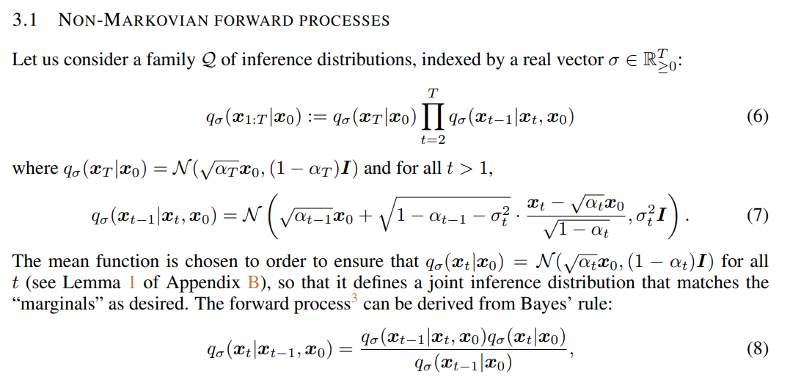
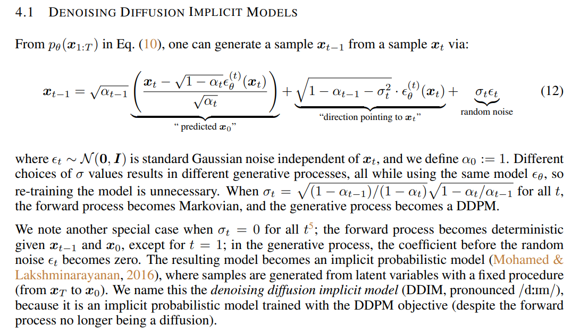
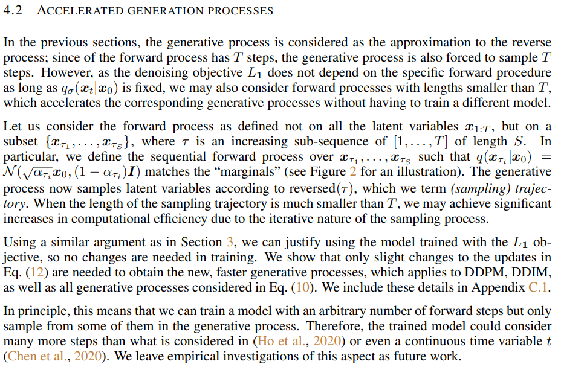

#### 2.2 code
- sample:
    ```
    def ddim_sample(
        self,
        model,
        x,
        t,
        clip_denoised=True,
        denoised_fn=None,
        model_kwargs=None,
        eta=0.0,
    ):
        """
        Sample x_{t-1} from the model using DDIM.

        Same usage as p_sample().
        """
        out = self.p_mean_variance(
            model,
            x,
            t,
            clip_denoised=clip_denoised,
            denoised_fn=denoised_fn,
            model_kwargs=model_kwargs,
        )
        # Usually our model outputs epsilon, but we re-derive it
        # in case we used x_start or x_prev prediction.
        eps = self._predict_eps_from_xstart(x, t, out["pred_xstart"])
        alpha_bar = _extract_into_tensor(self.alphas_cumprod, t, x.shape)
        alpha_bar_prev = _extract_into_tensor(self.alphas_cumprod_prev, t, x.shape)
        sigma = (
            eta
            * th.sqrt((1 - alpha_bar_prev) / (1 - alpha_bar))
            * th.sqrt(1 - alpha_bar / alpha_bar_prev)
        )
        # Equation 12.
        noise = th.randn_like(x)
        mean_pred = (
            out["pred_xstart"] * th.sqrt(alpha_bar_prev)
            + th.sqrt(1 - alpha_bar_prev - sigma ** 2) * eps
        )
        nonzero_mask = (
            (t != 0).float().view(-1, *([1] * (len(x.shape) - 1)))
        )  # no noise when t == 0
        sample = mean_pred + nonzero_mask * sigma * noise
        return {"sample": sample, "pred_xstart": out["pred_xstart"]}
    ```
    ```
    # 加速采样
    def space_timesteps(num_timesteps, section_counts):
        """
        Create a list of timesteps to use from an original diffusion process,
        given the number of timesteps we want to take from equally-sized portions
        of the original process.

        For example, if there's 300 timesteps and the section counts are [10,15,20]
        then the first 100 timesteps are strided to be 10 timesteps, the second 100
        are strided to be 15 timesteps, and the final 100 are strided to be 20.

        If the stride is a string starting with "ddim", then the fixed striding
        from the DDIM paper is used, and only one section is allowed.

        :param num_timesteps: the number of diffusion steps in the original
                            process to divide up.
        :param section_counts: either a list of numbers, or a string containing
                            comma-separated numbers, indicating the step count
                            per section. As a special case, use "ddimN" where N
                            is a number of steps to use the striding from the
                            DDIM paper.
        :return: a set of diffusion steps from the original process to use.
        """
        if isinstance(section_counts, str):
            if section_counts.startswith("ddim"):
                desired_count = int(section_counts[len("ddim") :])
                for i in range(1, num_timesteps):
                    if len(range(0, num_timesteps, i)) == desired_count:
                        return set(range(0, num_timesteps, i))
                raise ValueError(
                    f"cannot create exactly {num_timesteps} steps with an integer stride"
                )
            section_counts = [int(x) for x in section_counts.split(",")]
        size_per = num_timesteps // len(section_counts)
        extra = num_timesteps % len(section_counts)
        start_idx = 0
        all_steps = []
        for i, section_count in enumerate(section_counts):
            size = size_per + (1 if i < extra else 0)
            if size < section_count:
                raise ValueError(
                    f"cannot divide section of {size} steps into {section_count}"
                )
            if section_count <= 1:
                frac_stride = 1
            else:
                frac_stride = (size - 1) / (section_count - 1)
            cur_idx = 0.0
            taken_steps = []
            for _ in range(section_count):
                taken_steps.append(start_idx + round(cur_idx))
                cur_idx += frac_stride
            all_steps += taken_steps
            start_idx += size
        return set(all_steps)
    ```
#### 2.3 result:
- ddpm

    cifar10_uncond_50M_500K.pt, 自己训练的模型效果很差（迭代次数不够）
    ```
    "--diffusion_steps 4000 --noise_schedule cosine"
    ```

    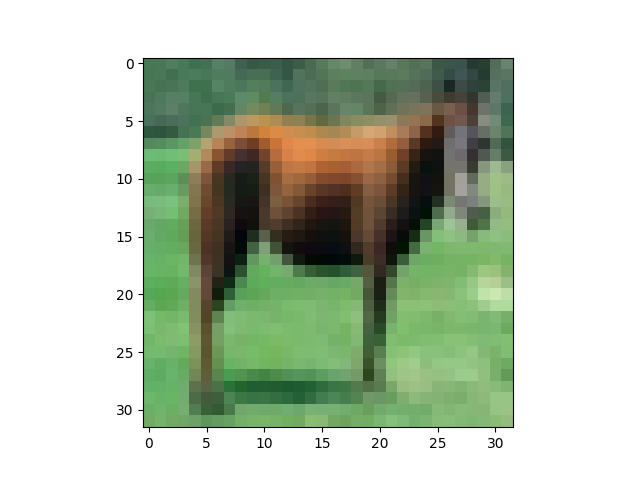

- ddim:
    cifar10_uncond_50M_500K.pt
    very faster:
    ```
    "--diffusion_steps 4000 --noise_schedule cosine --timestep_respacing ddim250 --use_ddim True"
    ```
    


### 3. Controlnet
#### 3.1 model:
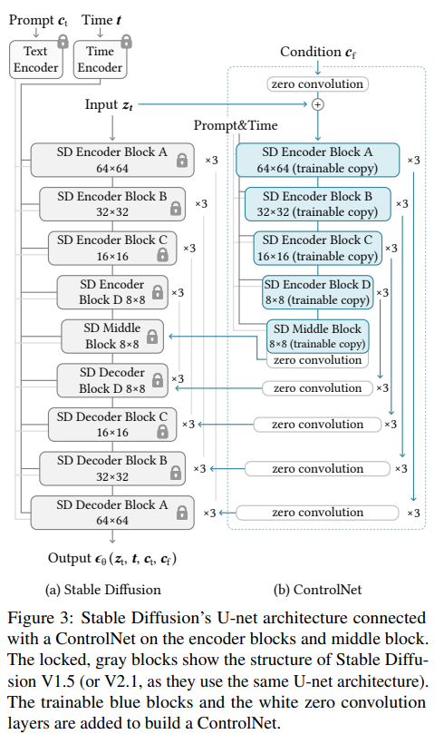

#### 3.2 model code
- model:
    ```
    # pre_train
    text_encoder_cls = import_model_class_from_model_name_or_path(args.pretrained_model_name_or_path, args.revision)

    # Load scheduler and models
    noise_scheduler = DDPMScheduler.from_pretrained(args.pretrained_model_name_or_path, subfolder="scheduler")
    text_encoder = text_encoder_cls.from_pretrained(
        args.pretrained_model_name_or_path, subfolder="text_encoder", revision=args.revision, variant=args.variant
    )
    vae = AutoencoderKL.from_pretrained(
        args.pretrained_model_name_or_path, subfolder="vae", revision=args.revision, variant=args.variant
    )
    unet = UNet2DConditionModel.from_pretrained(
        args.pretrained_model_name_or_path, subfolder="unet", revision=args.revision, variant=args.variant
    )
    vae.requires_grad_(False)
    unet.requires_grad_(False)
    text_encoder.requires_grad_(False)
    # controlnet:
    if args.controlnet_model_name_or_path:
        logger.info("Loading existing controlnet weights")
        controlnet = ControlNetModel.from_pretrained(args.controlnet_model_name_or_path)
    else:
        logger.info("Initializing controlnet weights from unet")
        controlnet = ControlNetModel.from_unet(unet)
    ```

- dataset:
    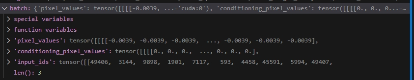

- training:
    ```
    latents = vae.encode(batch["pixel_values"].to(dtype=weight_dtype)).latent_dist.sample()
    latents = latents * vae.config.scaling_factor
    # Sample noise that we'll add to the latents
    noise = torch.randn_like(latents)
    bsz = latents.shape[0]
    # Sample a random timestep for each image
    timesteps = torch.randint(0, noise_scheduler.config.num_train_timesteps, (bsz,), device=latents.device)
    timesteps = timesteps.long()

    # Add noise to the latents according to the noise magnitude at each timestep
    # (this is the forward diffusion process)
    noisy_latents = noise_scheduler.add_noise(latents, noise, timesteps)

    # Get the text embedding for conditioning
    encoder_hidden_states = text_encoder(batch["input_ids"])[0]

    controlnet_image = batch["conditioning_pixel_values"].to(dtype=weight_dtype)

    down_block_res_samples, mid_block_res_sample = controlnet(
        noisy_latents,
        timesteps,
        encoder_hidden_states=encoder_hidden_states,
        controlnet_cond=controlnet_image,
        return_dict=False,
    )

    # Predict the noise residual
    model_pred = unet(
        noisy_latents,
        timesteps,
        encoder_hidden_states=encoder_hidden_states,
        down_block_additional_residuals=[
            sample.to(dtype=weight_dtype) for sample in down_block_res_samples
        ],
        mid_block_additional_residual=mid_block_res_sample.to(dtype=weight_dtype),
    ).sample
    ```

- loss
    ```
    if noise_scheduler.config.prediction_type == "epsilon":
        target = noise
    elif noise_scheduler.config.prediction_type == "v_prediction":
        target = noise_scheduler.get_velocity(latents, noise, timesteps)
    else:
        raise ValueError(f"Unknown prediction type {noise_scheduler.config.prediction_type}")
    loss = F.mse_loss(model_pred.float(), target.float(), reduction="mean")
    ```

- sample:
    ```
    controlnet = accelerator.unwrap_model(controlnet)

    pipeline = StableDiffusionControlNetPipeline.from_pretrained(
        args.pretrained_model_name_or_path,
        vae=vae,
        text_encoder=text_encoder,
        tokenizer=tokenizer,
        unet=unet,
        controlnet=controlnet,
        safety_checker=None,
        revision=args.revision,
        variant=args.variant,
        torch_dtype=weight_dtype,
    )
    pipeline.scheduler = UniPCMultistepScheduler.from_config(pipeline.scheduler.config)
    pipeline = pipeline.to(accelerator.device)
    pipeline.set_progress_bar_config(disable=True)
    image_logs = []

    for validation_prompt, validation_image in zip(validation_prompts, validation_images):
        validation_image = Image.open(validation_image).convert("RGB")

        images = []

        for _ in range(args.num_validation_images):
            with torch.autocast("cuda"):
                image = pipeline(
                    validation_prompt, validation_image, num_inference_steps=20, generator=generator
                ).images[0]

            images.append(image)

        image_logs.append(
            {"validation_image": validation_image, "images": images, "validation_prompt": validation_prompt}
        )
    ```

### 3. DreamBooth

#### 3.1 model:
- produce images:
    ```
    num_new_images = args.num_class_images - cur_class_images
    logger.info(f"Number of class images to sample: {num_new_images}.")

    sample_dataset = PromptDataset(args.class_prompt, num_new_images)
    sample_dataloader = torch.utils.data.DataLoader(sample_dataset, batch_size=args.sample_batch_size)

    sample_dataloader = accelerator.prepare(sample_dataloader)
    pipeline.to(accelerator.device)

    for example in tqdm(
        sample_dataloader, desc="Generating class images", disable=not accelerator.is_local_main_process
    ):
        images = pipeline(example["prompt"]).images

        for i, image in enumerate(images):
            hash_image = insecure_hashlib.sha1(image.tobytes()).hexdigest()
            image_filename = class_images_dir / f"{example['index'][i] + cur_class_images}-{hash_image}.jpg"
            image.save(image_filename)
    ```
- dataset:
    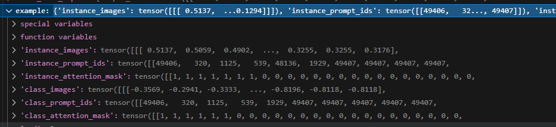
    

- loss:
    ```
    # Predict the noise residual
    model_pred = unet(
        noisy_model_input, timesteps, encoder_hidden_states, class_labels=class_labels
    ).sample
    # Get the target for loss depending on the prediction type
    if noise_scheduler.config.prediction_type == "epsilon":
        target = noise
    elif noise_scheduler.config.prediction_type == "v_prediction":
        target = noise_scheduler.get_velocity(model_input, noise, timesteps)
    else:
        raise ValueError(f"Unknown prediction type {noise_scheduler.config.prediction_type}")

    if args.with_prior_preservation:
        # Chunk the noise and model_pred into two parts and compute the loss on each part separately.
        model_pred, model_pred_prior = torch.chunk(model_pred, 2, dim=0)
        target, target_prior = torch.chunk(target, 2, dim=0)

        # Compute instance loss
        loss = F.mse_loss(model_pred.float(), target.float(), reduction="mean")

        # Compute prior loss
        prior_loss = F.mse_loss(model_pred_prior.float(), target_prior.float(), reduction="mean")

        # Add the prior loss to the instance loss.
        loss = loss + args.prior_loss_weight * prior_loss
    else:
        loss = F.mse_loss(model_pred.float(), target.float(), reduction="mean")
    ```
### 4. Blip-Diffusion
#### 4.1 model:
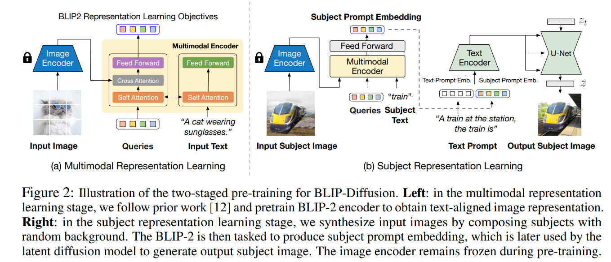
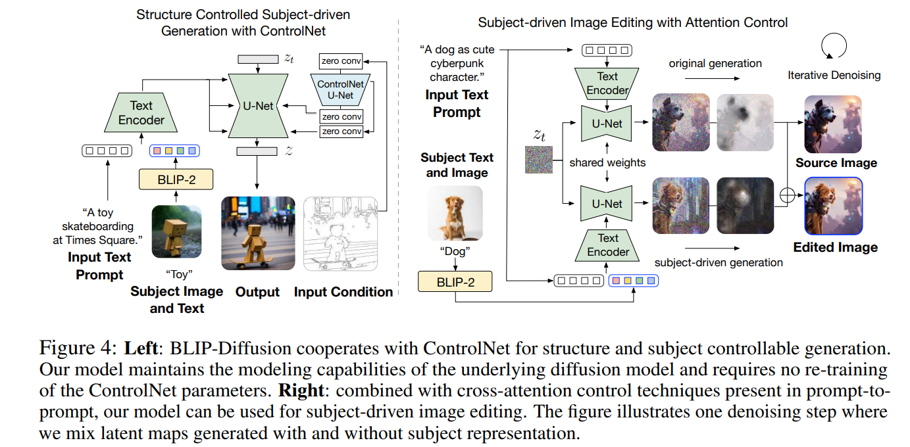

### 4.2 model code:
- model 
    ```
    latents = self.vae.encode(samples["tgt_image"].half()).latent_dist.sample()
    latents = latents * 0.18215

    # Sample noise that we'll add to the latents
    noise = torch.randn_like(latents)
    bsz = latents.shape[0]
    # Sample a random timestep for each image
    timesteps = torch.randint(
        0,
        self.noise_scheduler.config.num_train_timesteps,
        (bsz,),
        device=latents.device,
    )
    timesteps = timesteps.long()

    # Add noise to the latents according to the noise magnitude at each timestep
    # (this is the forward diffusion process)
    noisy_latents = self.noise_scheduler.add_noise(latents, noise, timesteps)
    ctx_embeddings = self.forward_ctx_embeddings(
        input_image=samples["inp_image"], text_input=samples["subject_text"]
    )

    # Get the text embedding for conditioning
    input_ids = self.tokenizer(
        samples["caption"],
        padding="do_not_pad",
        truncation=True,
        max_length=self.tokenizer.model_max_length,
        return_tensors="pt",
    ).input_ids.to(self.device)
    encoder_hidden_states = self.text_encoder(
        input_ids=input_ids,
        ctx_embeddings=ctx_embeddings,
        ctx_begin_pos=[self._CTX_BEGIN_POS] * input_ids.shape[0],
    )[0]

    # Predict the noise residual
    noise_pred = self.unet(
        noisy_latents.float(), timesteps, encoder_hidden_states
    ).sample

    loss = F.mse_loss(noise_pred.float(), noise.float(), reduction="mean")

    return {"loss": loss}
    ```
- controlnet
    ```
    def _predict_noise(
        self,
        t,
        latent_model_input,
        text_embeddings,
        width=512,
        height=512,
        cond_image=None,
    ):
        if hasattr(self, "controlnet"):
            cond_image = prepare_cond_image(
                cond_image, width, height, batch_size=1, device=self.device
            )

            down_block_res_samples, mid_block_res_sample = self.controlnet(
                latent_model_input,
                t,
                encoder_hidden_states=text_embeddings,
                controlnet_cond=cond_image,
                # conditioning_scale=controlnet_condition_scale,
                return_dict=False,
            )
        else:
            down_block_res_samples, mid_block_res_sample = None, None

        noise_pred = self.unet(
            latent_model_input,
            timestep=t,
            encoder_hidden_states=text_embeddings,
            down_block_additional_residuals=down_block_res_samples,
            mid_block_additional_residual=mid_block_res_sample,
        )["sample"]

        return noise_pred
    ```

### 5. ImageReward
#### 5.1 model:
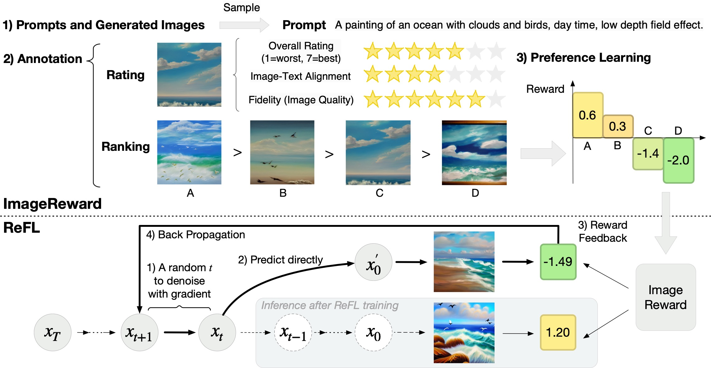
#### 5.2 reward model
- model:
    ```
    class ImageReward(nn.Module):
        def __init__(self, device='cpu'):
            super().__init__()
            self.device = device
            
            self.blip = blip_pretrain(pretrained=config['blip_path'], image_size=config['BLIP']['image_size'], vit=config['BLIP']['vit'])
            self.preprocess = _transform(config['BLIP']['image_size'])
            self.mlp = MLP(config['ImageReward']['mlp_dim'])
            
            if opts.fix_base:
                self.blip.requires_grad_(False)
            
            for name, parms in self.blip.named_parameters():
                if '_proj' in name:
                    parms.requires_grad_(False)
            
            # fix certain ratio of layers
            self.image_layer_num = 24 if config['BLIP']['vit'] == 'large' else 12
            if opts.fix_rate > 0:
                text_fix_num = "layer.{}".format(int(12 * opts.fix_rate))
                image_fix_num = "blocks.{}".format(int(self.image_layer_num * opts.fix_rate))
                for name, parms in self.blip.text_encoder.named_parameters():
                    parms.requires_grad_(False)
                    if text_fix_num in name:
                        break
                for name, parms in self.blip.visual_encoder.named_parameters():
                    parms.requires_grad_(False)
                    if image_fix_num in name:
                        break
        def forward(self, batch_data):
            # encode data
            if opts.rank_pair:
                batch_data = self.encode_pair(batch_data)
            else:
                batch_data = self.encode_data(batch_data)
            
            # forward
            emb_better, emb_worse = batch_data['emb_better'], batch_data['emb_worse']
            
            reward_better = self.mlp(emb_better)
            reward_worse = self.mlp(emb_worse)
            reward = torch.concat((reward_better, reward_worse), dim=1)
            
            return reward
    ```

- dataset:
    ```
    # reward
    {
        "id": "007127-0069",
        "prompt": "The church of misery, cyberpunk, dark, digital art, night, scary, creepy",
        "generations": [
            "part-007127/images/0069/6e05a53e-8587-46ad-b315-d7a95b4658ab.webp",
            "part-007127/images/0069/20083954-04e0-4b1e-b64c-513efab26074.webp",
            "part-007127/images/0069/962b925d-5268-41e5-91e9-1d1dd88be88a.webp",
            "part-007127/images/0069/01cf047c-0ac2-4bfe-a9bf-39d0e12a7a7c.webp",
            "part-007127/images/0069/4b82833b-75d7-4bbf-943f-69ca081cb08f.webp",
            "part-007127/images/0069/4b1cb3aa-5b86-4739-8ce1-86807bc15b35.webp",
            "part-007127/images/0069/d38ec324-77cd-4d78-95e0-e173876b616d.webp",
            "part-007127/images/0069/5c45d903-eccd-48e6-beda-3f35f3261b65.webp"
        ],
        "ranking": [
            3,
            1,
            5,
            4,
            3,
            4,
            1,
            2
        ]
    }
    def make_data(self):
        data_items = []
        
        bar = tqdm(range(len(self.data)), desc=f'making dataset: ')
        for item in self.data:
            img_set = []
            for generations in item["generations"]:
                img_path = os.path.join(config['image_base'], generations)
                pil_image = Image.open(img_path)
                image = self.preprocess(pil_image)
                img_set.append(image)
                
            text_input = self.tokenizer(item["prompt"], padding='max_length', truncation=True, max_length=35, return_tensors="pt")
            labels = item["ranking"]
            for id_l in range(len(labels)):
                for id_r in range(id_l+1, len(labels)):
                    dict_item = {}
                    dict_item['clip_text'] = clip.tokenize(item["prompt"], truncate=True)
                    dict_item['text_ids'] = text_input.input_ids
                    dict_item['text_mask'] = text_input.attention_mask
                    if labels[id_l] < labels[id_r]:
                        dict_item['img_better'] = img_set[id_l]
                        dict_item['img_worse'] = img_set[id_r]
                    elif labels[id_l] > labels[id_r]:
                        dict_item['img_better'] = img_set[id_r]
                        dict_item['img_worse'] = img_set[id_l]
                    else:
                        continue
                    data_items.append(dict_item)
            bar.update(1)
            
        return data_items
    ```

- loss:
    ```
    def loss_func(reward):
        target = torch.zeros(reward.shape[0], dtype=torch.long).to(reward.device)
        loss_list = F.cross_entropy(reward, target, reduction='none')
        loss = torch.mean(loss_list)
        reward_diff = reward[:, 0] - reward[:, 1]
        acc = torch.mean((reward_diff > 0).clone().detach().float())
        return loss, loss_list, acc
    ```

#### 5.2 refl:
- model:
    ```
    sd
    ```

- dataset:
    ```
    # ReLF
    def preprocess_train(examples):
        examples["input_ids"] = tokenize_captions(examples)
        examples["rm_input_ids"] = self.reward_model.blip.tokenizer(examples[caption_column], padding='max_length', truncation=True, max_length=35, return_tensors="pt").input_ids
        examples["rm_attention_mask"] = self.reward_model.blip.tokenizer(examples[caption_column], padding='max_length', truncation=True, max_length=35, return_tensors="pt").attention_mask
        return examples
    ```

- loss
    ```
    with self.accelerator.accumulate(self.unet):
        encoder_hidden_states = self.text_encoder(batch["input_ids"])[0]
        latents = torch.randn((args.train_batch_size, 4, 64, 64), device=self.accelerator.device)
        
        self.noise_scheduler.set_timesteps(40, device=self.accelerator.device)
        timesteps = self.noise_scheduler.timesteps

        mid_timestep = random.randint(30, 39)

        for i, t in enumerate(timesteps[:mid_timestep]):
            with torch.no_grad():
                latent_model_input = latents
                latent_model_input = self.noise_scheduler.scale_model_input(latent_model_input, t)
                noise_pred = self.unet(
                    latent_model_input,
                    t,
                    encoder_hidden_states=encoder_hidden_states,
                ).sample
                latents = self.noise_scheduler.step(noise_pred, t, latents).prev_sample
        
        latent_model_input = latents
        latent_model_input = self.noise_scheduler.scale_model_input(latent_model_input, timesteps[mid_timestep])
        noise_pred = self.unet(
            latent_model_input,
            timesteps[mid_timestep],
            encoder_hidden_states=encoder_hidden_states,
        ).sample
        pred_original_sample = self.noise_scheduler.step(noise_pred, timesteps[mid_timestep], latents).pred_original_sample.to(self.weight_dtype)
        
        pred_original_sample = 1 / self.vae.config.scaling_factor * pred_original_sample
        image = self.vae.decode(pred_original_sample.to(self.weight_dtype)).sample
        image = (image / 2 + 0.5).clamp(0, 1)

        # image encode
        def _transform():
            return Compose([
                Resize(224, interpolation=BICUBIC),
                CenterCrop(224),
                Normalize((0.48145466, 0.4578275, 0.40821073), (0.26862954, 0.26130258, 0.27577711)),
            ])
        
        rm_preprocess = _transform()
        image = rm_preprocess(image).to(self.accelerator.device)
        
        rewards = self.reward_model.score_gard(batch["rm_input_ids"], batch["rm_attention_mask"], image)
        loss = F.relu(-rewards+2)
        loss = loss.mean() * args.grad_scale

        # Gather the losses across all processes for logging (if we use distributed training).
        avg_loss = self.accelerator.gather(loss.repeat(args.train_batch_size)).mean()
        train_loss += avg_loss.item() / args.gradient_accumulation_steps

        # Backpropagate
        self.accelerator.backward(loss)
        if self.accelerator.sync_gradients:
            self.accelerator.clip_grad_norm_(self.unet.parameters(), args.max_grad_norm)
        self.optimizer.step()
        self.lr_scheduler.step()
        self.optimizer.zero_grad()

    def score_gard(self, prompt_ids, prompt_attention_mask, image):

        image_embeds = self.blip.visual_encoder(image)
        # text encode cross attention with image
        image_atts = torch.ones(image_embeds.size()[:-1],dtype=torch.long).to(self.device)
        text_output = self.blip.text_encoder(prompt_ids,
                                                    attention_mask = prompt_attention_mask,
                                                    encoder_hidden_states = image_embeds,
                                                    encoder_attention_mask = image_atts,
                                                    return_dict = True,
                                                )
        
        txt_features = text_output.last_hidden_state[:,0,:] # (feature_dim)
        rewards = self.mlp(txt_features)
        rewards = (rewards - self.mean) / self.std
        
        return rewards
    ```


    
